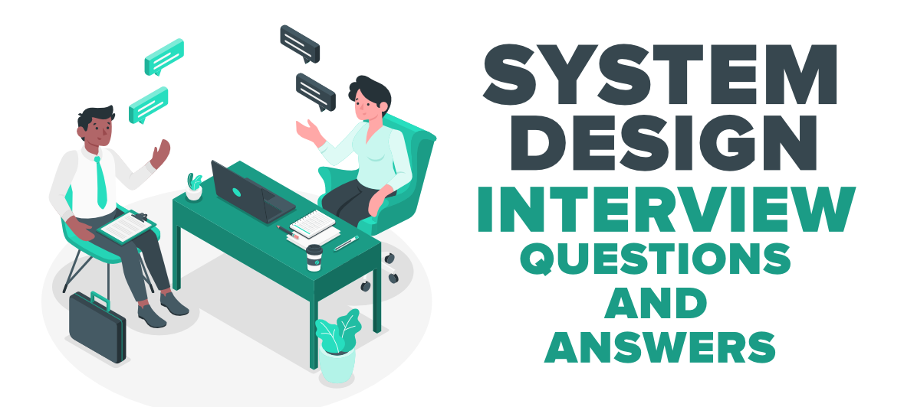
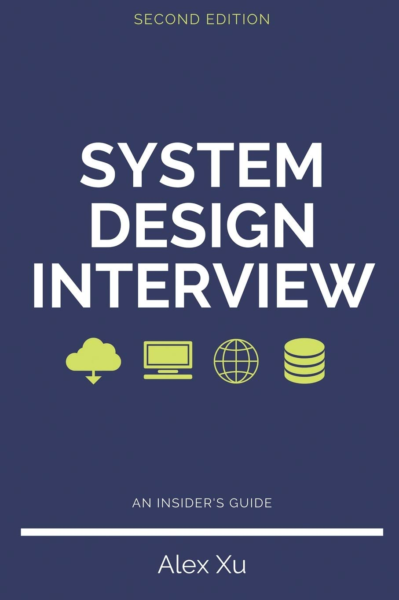

# Câu hỏi phỏng vấn System Design

We are delighted that you have decided to join us in learning the system design interviews.
System design interview questions are the most difficult to tackle among all the technical interviews. The questions require the interviewees to design an architecture for a software system, which could be a news feed, Google search, chat system, etc. These questions are intimidating, and there is no certain pattern to follow. The questions are usually very big scoped and vague. The processes are open-ended and unclear without a standard or correct answer.

Companies widely adopt system design interviews because the communication and problemsolving skills tested in these interviews are similar to those required by a software engineer’s daily work. An interviewee is evaluated based on how she analyzes a vague problem and how she solves the problem step by step. The abilities tested also involve how she explains the idea, discusses with others, and evaluates and optimizes the system. In English, using “she” flows better than “he or she” or jumping between the two. To make reading easier, we use the feminine pronoun throughout this book. No disrespect is intended for male engineers. 

The system design questions are open-ended. Just like in the real world, there are many differences and variations in the system. The desired outcome is to come up with an architecture to achieve system design goals. The discussions could go in different ways depending on the interviewer. Some interviewers may choose high-level architecture to cover all aspects; whereas some might choose one or more areas to focus on. Typically, system requirements, constraints and bottlenecks should be well understood to shape the direction of both the interviewer and interviewee. 

The objective of this book is to provide a reliable strategy to approach the system design questions. The right strategy and knowledge are vital to the success of an interview.

This book provides solid knowledge in building a scalable system. The more knowledge gained from reading this book, the better you are equipped in solving the system design questions.

This book also provides a step by step framework on how to tackle a system design question. It provides many examples to illustrate the systematic approach with detailed steps that you can follow. With constant practice, you will be well-equipped to tackle system design interview questions.

# Nguồn

