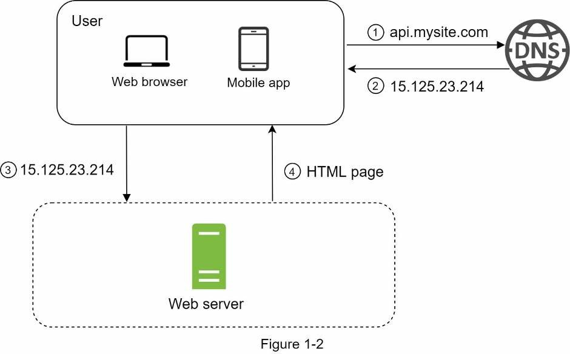
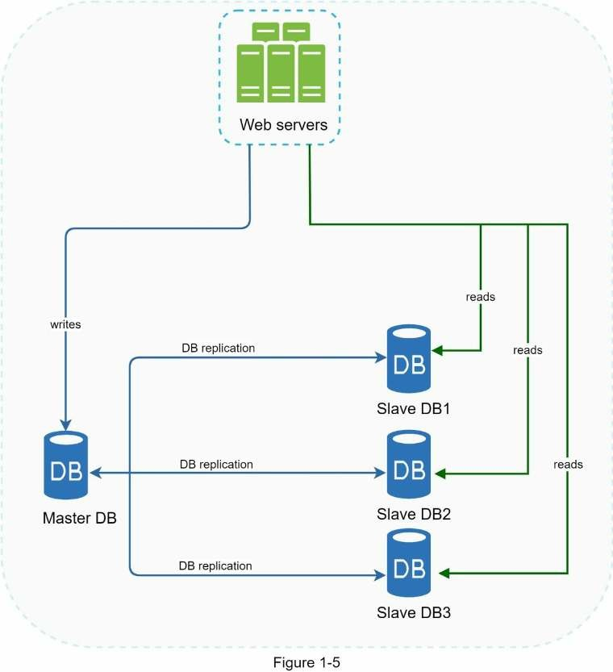
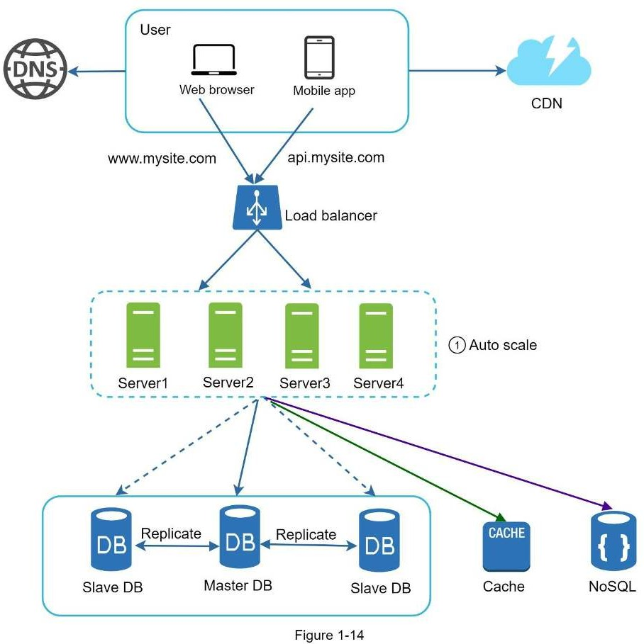

# Chapter 1: Thiết Kế Hệ Thống Cho Hàng Triệu Người Dùng

*Thiết kế hệ thống hỗ trợ hàng triệu người dùng là một thử thách không nhỏ, nó đòi hỏi sự cải tiến liên tục và không ngừng. Trong chương này, ta sẽ xây dựng một hệ thống hỗ trợ người dùng duy nhất và dần dần mở rộng cho hàng triệu người dùng. Sau chương này, bạn sẽ nắm vững các kỹ thuật để vượt qua bài phỏng vấn thiết kế hệ thống.*

## Thiết lập hệ thống đơn

Hành trình vạn dặm nào cũng bắt đầu từ những bước đi đầu tiên, và thiết kế hệ thống cũng vậy. Khi bắt đầu, ta sẽ chạy tất cả mọi thứ trên một server duy nhất. Hình bên dưới minh hoạ việc thiết lập một server để chạy tất cả mọi thứ trên đó: ứng dụng web, cơ sở dữ liệu, cache,...


Để hiểu thiết lập này, ta sẽ tìm hiểu về luồng yêu cầu và nguồn lưu lượng truy cập. Trước tiên ta sẽ xem luồng yêu cầu.



1. Người dùng truy cập vào website thông qua tên miền, vd như api.mysite.com. Tên miền của trang web được cung cấp từ DNS, DNS (Domain Name System) là dịch vụ trả phí bên thứ 3 giúp cung cấp tên miền và nó không được lưu trữ trên server của ta.
2. Địa chỉ Internet Protocol (IP) được trả về từ trình duyệt hoặc ứng dụng di động. Trong ví dụ: địa chỉ IP được trả về là 15.125.23.214.
3. Sau khi có được địa chỉ IP, Giao thức truyền tải siêu văn bản (HTTP) sẽ được gửi trực tiếp đến web server của bạn.
4. Web server trả về trang HTML hoặc JSON trong trích xuất phản hồi.

Bây giờ, ta sẽ xem xét nguồn lưu lượng truy cập. Lưu lượng truy cập web server đến từ hai nguồn là: ứng dụng web và ứng dụng di động.

- Ứng dụng web: nó kết hợp các ngôn ngữ server-side (Java, Python,...) để xử lý các logic nghiệp vụ, lưu trữ,.. và ngôn ngữ client-side (HTML, JS) cho biểu diễn ứng dụng.
- Ứng dụng di động: Giao thức HTTP là giao thức giao tiếp giữa ứng dụng di động và web server. JSON được dùng phổ biến cho định dạng API phản hồi để chuyển đổi dữ liệu một cách đơn giản. Ví dụ phản hồi JSON có dạng như sau:


## Cơ sở dữ liệu

Khi lượng người dùng dần tăng lên, một server là không đủ, ta cần nhiều hơn: một server cho truy cập từ web/mobile, và một server khác cho cơ sở dữ liệu. Tách biệt server truy cập (web tier) và server cơ sở dữ liệu (data tier) cho phép chúng mở rộng một cách độc lập.


### Chọn cơ sở dữ liệu ?

Bạn có thể chọn giữa loại SQL truyền thống hoặc NoSQL. Ta sẽ xem xét sự khác biệt giữa chúng.

Cơ sở dữ liệu quan hệ (SQL) còn được gọi là RDBMS (Relational database management system). Ta có các cái tên phổ biến như MySQL, Oracle, PostgreSQL,... SQL biểu diễn và lưu trữ dữ liệu trong các bảng và hàng. Bạn có thể thực hiện thao tác *join* giữa các bảng khác nhau trong SQL.

Cơ sở dữ liệu phi quan hệ (NoSQL) có các tên phổ biến như MongoDB, Cassandra, Neo4j, Redis,...Có 4 loại cơ sở dữ liệu phi quan hệ là: dạng key-value, hướng tài liệu (document), hướng cột (column) và hướng đồ thị (graph). Thao tác join không được hỗ trợ trong NoSQL.

Với hầu hết dev, SQL là lưu chọn tốt hơn bởi vì nó đã hơn 40 năm phát triển, nó có nhiều tài liệu và cộng đồng lớn mạnh. Tuy nhiên, trong các trường hợp đặc biệt ta có thể chọn NoSQL thay thế. Vd như:
- Ứng dụng yêu cầu độ trễ rất thấp
- Dữ liệu phi cấu trúc hoặc không có quan hệ với nhau.
- Bạn chỉ cần serialize và deserialize dữ liệu (JSON, XML,...) 
- Bạn cần lưu trữ một lượng khổng lồ dữ liệu.

## Mở rộng theo chiều dọc và theo chiều ngang

Mở rộng theo chiều dọc ám chỉ đến "scale-up"(làm cho hệ thống lớn hơn), nghĩa là quá trình thêm các phần cứng (CPU, RAM, ...) vào server của bạn. Mở rộng theo chiều ngang, ám chỉ đến "scale-out"(thêm thành phần vào hệ thống), cho phép ta thêm nhiều hơn một server vào nguồn tài nguyên của bạn.

Khi lưu lượng truy cập thấp, mở rộng theo chiều dọc là giải pháp tuyệt vời vì nó đơn giản hoá vấn đề. Thật không may, nó đi kèm với những hạn chế nghiêm trọng:
- Mở rộng theo chiều dọc có giới hạn vì ta không thể thêm vô hạn CPU và bộ nhớ vào một server
- Mở rộng theo chiều dọc không có chuyển đổi tự động và dự phòng. Nếu server sập thì cả ứng dụng và web sẽ sập hoàn toàn.

Mở rộng theo chiều ngang phù hợp hơn với mở rộng ứng dụng quy mô lớn so với mở rộng theo chiều dọc.

Trong thiết kế trước, người dùng được kết nối trực tiếp với web server. Người dùng sẽ không thể truy cập trang web nếu server ngoại tuyến. Trong trường hợp khác, nếu nhiều người dùng truy cập web server đồng thời khiến server trở nên quá tải, dẫn đến phản hồi người dùng chậm hoặc không thể kết nối được server. Lúc này, cân bằng tải là một kỹ thuật tốt nhất để giải quyết vấn đề này.

## Bộ cân bằng tải

Bộ cân bằng tải (Load Balancer) phân phối đồng đều lưu lượng truy cập đến giữa các web server được xác định trong bộ cân bằng tải. Xem hình cách hoạt động của bộ cân bằng tải:


Như hình trên, người dùng kết nối trực tiếp với địa chỉ IP công khai của bộ cân bằng tải. Với thiết lập trên, web server không thể tiếp cận trực tiếp bởi client. Để bảo mật tốt hơn, IP riêng tư được dùng để giao tiếp giữa các server. Một IP riêng tư là một IP có thể tiếp cận giữa các server trong cùng mạng những không thể tiếp cận từ internet bên ngoài. Bộ cân bằng tải giao tiếp với các web server thông qua IP riêng tư.

Ở hình trên, sau bộ cân bằng tải là hai web server, như vậy là ta đã giải quyết được vấn đề chuyển đổi tự động và cải thiện tính khả dụng của web. Chi tiết được giải thích bên dưới:
- Nếu server 1 ngoại tính, truy cập sẽ được chuyển sang server 2. Điều này ngăn chặn việc website sập. Ta cũng sẽ thêm một web server khoẻ manh mới vào để cân bằng tải.
- Nếu lưu lượng truy cập web tăng mạnh, hai server là không đủ để xử lý, bộ cân bằng tải có thể xử lý vấn đề này một cách gọn gàng. Bạn chỉ cần thêm server vào nhóm web server bộ cận bằng tải sẽ tự đổi gửi yêu cầu đến nó.

Bây giờ ở web tier đã ổn vậy còn data tier. Thiết kế hiện tại chỉ có một cơ sở dữ liệu, và nó không hỗ trợ cho chuyển đổi tự động và dự phòng. Bản sao cơ sở dữ liệu là một kỹ thuật chung cho giải quyết vấn đề này. 

## Bản sao cơ sở dữ liệu

Từ Wikipedia: "Bản sao cơ sở dữ liệu có thể được sử dụng trong hệ thống quản lý nhiều cơ sở dữ liệu, thông thường nó sẽ là mối quan hệ master/slave giữa bản gốc (master) và bản copy (slave)*

Cơ sở dữ liệu master chỉ hỗ trợ thao tác ghi. Còn các cơ sở dữ liệu slave lấy dữ liệu sao chép từ cơ sở dữ liệu master và chỉ cung cấp thao tác đọc. Tất cả lệnh chỉnh sửa dữ liệu như INSERT, DELETE và UPDATE sẽ được gửi vào cơ sở dữ liệu master. Phần lớn ứng dụng đều yêu cầu truy cập đọc nhiều hơn ghi, do đó số lượng cơ sở dữ liệu slave trong hệ thống nhiều hơn cơ sở dữ liệu master. 



Lợi thế của bản sao cơ sở dữ liệu.
- Hiệu suất tốt hơn: trong mô hình master-slave, mọi thao tác ghi và cập nhật xảy ra ở master, trong khi đó, thao tác đọc được phân phối trên toàn bộ slave. Mô hình này giúp cải thiện hiệu suất vì cho phép các truy vấn được xử lý song song.
- Độ tin cậy: Nếu một trong số cơ sở dữ liệu bị huỷ bởi các thiên tai như bão, lũ động đất, dữ liệu vẫn có thể phục hồi. Bạn sẽ không cần lo lắng về mất dữ liệu vì nó được sao chép trên nhiều vị trí.
- Tính khả dụng cao: Vì dữ liệu được sao chép trên nhiều nơi, website của bạn vẫn hoạt động nếu một cơ sở dữ liệu ngoại tuyến vì bạn có thể truy cập vào cơ sở dữ liệu khác.

Ở phần trước, ta đã thảo luận về bộ cân bằng tải giúp cải thiện hiệu suất thế nào. Bây giờ ta sẽ có câu hỏi tương tự: "Nếu một cơ sở dữ liệu ngoại tuyến ?" Kiến trúc ở trên có thể xử lý trường hợp này không:
- Nếu chỉ có một cơ sở dữ liệu slave khả dụng và nó trở nên ngoại tuyến, thì tạm thời các thao tác đọc sẽ hướng tới cơ sở dữ liệu master. Ngay sau khi vấn đề được phát hiện, cơ sở dữ liệu slave mới thay thế cho cái cũ. Trong trường hợp nhiều cơ sở dữ liệu slave khả dụng, thao tác đọc sẽ được điều hướng sang các cơ sở dữ liệu này. Một server cơ sở dữ liệu mới sẽ thay thế cái cũ.
- Nếu cơ sở dữ liệu master ngoại tuyến, một cơ sơ dữ liệu slave sẽ được thăng chức lên là master. Tạm thời tất cả thao tác đến cơ sở dữ liệu sẽ được thực thi trên master mới. Một cơ sở dữ liệu slave mới sẽ sao chép dữ liệu ngay lập tức. Thực tế thì việc thăng cấp lên master mới sẽ phức tạp hơn vì dữ liệu trong slave có thể không được cập nhật. Dữ liệu bị thiếu cần được cập nhật bằng cách chạy các tập lệnh khôi phục dữ liệu. Mặc dù một số phương pháp sao chép như multi-master và sao chép vòng tròn có thể hữu ích, nhưng những thiết lập đó phức tạp hơn, và các cuộc thảo luận về điều đó nằm ngoài phạm vi bài viết này. Bạn có thể tham khảo ở danh mục tư liệu tham khảo.

Hình bên dưới hiển thị cách thêm bộ cân bằng tải vào bản sao cơ sở dữ liệu.


Từ hình trên ta có thể thấy:
- Một người dùng lấy địa chỉ IP của bộ cân bằng tải từ DNS.
- Người dùng kết nối với bộ cân bằng tải từ địa chỉ IP này.
- HTTP yêu cầu chuyển hướng đến Server 1 hoặc Server 2.
- Web server đọc dữ liệu người dùng từ cơ sở dữ liệu slave.
- Web server hướng bất kỳ thao tác chỉnh sửa dữ liệu nào đến cơ sở dữ liệu master. Các thao tác này có thể là thêm, sửa và xoá.

Bây giờ, bạn đã hiểu rõ về cả tier web và data, đã đến lúc cải thiện thời gian load/response. Điều này có thể được thực hiện bằng cách thêm một lớp bộ nhớ cache và chuyển nội dung tĩnh (file JavaScript / CSS / hình ảnh / video) sang CDN.

## Cache

Cache là nơi lưu trữ tạm thời để lưu trữ kết quả của phản hồi được truy cập thường xuyên trong bộ nhớ dữ liệu để các yêu cầu tiếp theo được phản hồi nhanh hơn. Như ở hình 1-6, mỗi lần trang web tải lại, một hoặc nhiều cơ sở dữ liệu được gọi để tìm nạp dữ liệu. Hiệu suất ứng dụng có thể bị ảnh hưởng này bởi các lệnh gọi trùng lặp này. Cache có thể giải quyết vấn đề trên.

### Cache tier

Cache tier là lớp lưu trữ dữ liệu tạm thời, nhanh hơn cơ sở dữ liệu. Lợi ích của một cache tier riêng biệt là cải thiện hiệu suất hệ thống, giảm tải cho cơ sở dữ liệu và có thể mở rộng cache độc lập. Hình bên dưới mô tả thiết lập một cache server:


Sau khi nhận yêu cầu, web server kiểm tra nếu cache là khả dụng cho phản hồi. Nếu cache có, gửi dữ liệu về lại cho client. Còn không, truy vấn đến cơ sở dữ liệu và lưu phản hồi vào cache rồi gửi về client. Chiến lược caching này được gọi là read-through cache. 

Tương tác với server cache rất đơn giản vì hầu hết các server cache đều cung cấp các APIs cho hầu hết ngôn ngữ lập chình. Đoạn code sau minh hoạ Memcached APIs:

```js
SECONDS = 1
cache.set('myKey', 'hi there', 3600 * SECONDS)
cache.get('myKey)
```

Các vấn đề khi sử dụng cache:
- Quyết định khi nào sử dụng cache. Cân nhắc sử dụng cache khi thường xuyên đọc dữ liệu và ít chỉnh sửa. Vì dữ liệu cache được lưu trữ ở bộ nhớ không ổn định, server cache không phải ý tưởng tốt cho dữ liệu lâu dài. Ví dụ, nếu một server cache khởi động lại, tất cả dữ liệu sẽ bị mất, do đó dữ liệu quan trọng nên được lưu trữ ở bộ nhớ dài lâu.
- Chính sách hết hạn. Mỗi lần dữ liệu cache hết hạn, nó sẽ bị xoá khỏi cache. Khi không có chính sách hết hạn, dữ liệu được lưu trong cache sẽ được lưu vĩnh viễn. Lời khuyên là đừng để ngày hết hạn quá ngắn vì hệ thống phải tải dữ liệu từ cơ sở dữ liệu nhiều lần. Bên cạnh đó cũng không nên đặt ngày hết hạn quá lâu vì dữ liệu có thể cũ.
- Tính nhất quán: liên quan đến việc giữ dữ liệu lưu trữ và cache đồng bộ. Không nhất quán có thể xảy ra khi thao tác chỉnh sửa dữ liệu trong cơ sở dữ liệu và cache không nằm trong một giao dịch đơn nhất. Khi mở rộng trên nhiều khu vực địa lý, duy trì tính nhất quán giữa cơ sở dữ liệu và cache là một thử thách.  Chỉ tiến hơn đọc bài "Scaling Memcache ở Facebook"
- Giảm thiểu thất bại: Một server cache duy nhất có thể là một SPOF (single point of failure). Theo định nghĩa từ Wikipedia: "Một điểm lỗi duy nhất (SPOF) là một phần của hệ thống, nếu nó bị lỗi, toàn bộ hệ thống sẽ ngừng hoạt động". Như vậy, nhiều server cache trên các data center khác nhau sẽ tránh được SPOF. Một cách tiếp cận khác là cung cấp quá mức bộ nhớ cần thiết theo tỷ lệ phần trăm nhất định, điều này cung cấp một bộ đệm khi mức sử dụng bộ nhớ tăng lên.


- Chính sách loại bỏ. Khi bộ nhớ cache đầy, bất kỳ yêu cầu nào để thêm vào bộ nhớ cache có thể khiến các mục dữ liệu hiện tại trong cache bị xoá. Đây được gọi là cache eviction. LRU (Least recently-used) là chính sách phổ biến để xoá cache. Các chính sách khác ít được sử dựng như LFU, FIFO có thể được áp dụng có các mục đích sử dụng và trường hợp khác nhau.

## CDN

Một CDN là một mạng lưới máy chủ phân tán theo khu vực địa lý được dùng để phân phối nội dung tĩnh. Nội dung tĩnh có thể là hình ảnh, video, file CSS, file JS,...

Caching nội dụng động là một khái niệm mới và nằm ngoài phạm vi bài viết này. Nó cho phép lưu vào cache của trang HTML dựa trên đường dẫn yêu cầu, chuỗi truy vấn, cookie và header của yêu cầu. Muốn biết thêm hãy tham khảo tài liệu ở cuối bài viết. Bây giờ ta quay lại caching nội dụng tĩnh với CDN.

Làm thế nào CDN làm việc ở high-level: khi một người dùng vào website, server CDN gần với người dùng nhất sẽ phân phối nội dung tĩnh. Tức, người dùng càng ở xa server CDN, thì tải web càng chậm. Ví dụ, các server CDN ở San Francisco, còn người dùng ở Los Angeles sẽ nhận nội dung nhanh hơn người dùng ở châu Âu. Hình bên dưới mô tả cách CDN cải thiện tốc độ tải.


Hình minh hoạ luồng làm việc của CDN


1. Khi người dùng lấy `image.png` bằng cách dùng URL của ảnh. Tên miền của URL được cung cấp bởi CDN. Hai URL ảnh sao cùng được dùng để minh hoạ cách URL của ảnh trên trang Amazon và trên Akamai CDN:
- https://mysite.cloudfront.net/logo.jpg
- https://mysite.akamai.com/image-manager/img/logo.jpg
2. Nếu server CDN không có image.png trong cache, nó sẽ yêu cầu file từ một web server gốc hoặc bộ lưu trữ trực tuyến như Amazon S3.
3. Bên gốc trả về `image.png` cho server CDN, bao gồm cả header HTTP là Time-to-Live để mô tả thời hạn sử dụng của ảnh trong cache.
4. CDN lưu ảnh vào cache và trả về cho người dùng A. Ảnh sẽ ở trong cache cho đến khi TTL hết hạn.
5. Người dùng B gửi yêu cầu đến cùng ảnh đó.
6. Ảnh được trả về từ cache nếu TTL vẫn chưa hết hạn.

### Các vấn đề khi sử dụng CDN.

- Chi phí: CDN được cung cấp bởi bên thứ ba, và bạn bị tính phí truyền dữ liệu ra vào CDN. Caching các nội dung không được sử dụng thường xuyên không mang lại lợi ích đáng kể, nên cần cân nhắc khi dùng CDN.
- Đặt thời hạn bộ nhớ cache thích hợp: Đối với nội dung nhạy cảm về thời gian, đặt thời hạn cache là rất quan trọng. Thời hạn cache không nên quá ngắn hoặc quá dài. Nếu quá dài, nội dung có thể không còn mới nữa. Nếu quá ngắn, nó có thể gây ra trùng lặp và tải lại nội dung từ server gốc vào CDN.
- Dự phòng CDN: Bạn nên xem xét cách trang web/ứng dụng của mình đối phó với lỗi CDN. Nếu có sự cố ngắt CDN tạm thời, client sẽ có thể phát hiện ra sự cố và yêu cầu tài nguyên từ server gốc.
- Tệp không hợp lệ: Bạn có thể xóa một tệp khỏi CDN trước khi nó hết hạn bằng cách thực hiện một trong các thao tác sau:
    • Vô hiệu hóa đối tượng CDN bằng cách sử dụng các API do nhà cung cấp CDN cung cấp.
    • Sử dụng phiên bản tạo đối tượng để cung cấp một phiên bản khác của đối tượng. Để tạo một phiên bản đối tượng, bạn có thể thêm một tham số vào URL, chẳng hạn như số phiên bản. Ví dụ: phiên bản số 2 được thêm vào chuỗi truy vấn: `image.png?v=2`.


1. Các tài nguyên tĩnh như (CSS, JS, ảnh,...) sẽ không được phục vụ trên web server. Chúng được nạp từ CDN để cải thiện hiệu suất.
2. Cơ sở dữ liệu sẽ tải nhẹ nhàng hơn nhờ dữ liệu cache.

## Stateless web tier

Giờ là lúc để nói về mở rộng web tier theo chiều ngang. Để thực hiện, ta cần chuyển đổi trạng thái của web tier. Đâu là một thách thức cho lưu trữ dữ liệu phiên (session) trong bộ nhớ lâu dài như SQL hay NoSQL. Mỗi web server trong cụm có thể truy cập trạng thái dữ liệu từ cơ sở dữ liệu. Điều này gọi là stateless web tier.

### Stateful architecture

Vài điểm khác nhau giữa server stateful và server stateless. Một server stateful nhớ dữ liệu (trạng thái) của client từ yêu cầu này sang yêu cầu kế tiếp. Mọt server stateless không cần nhớ trạng thái đó.


Trong hình trên, dữ liệu phiên của người dùng A và cả ảnh người dùng được lưu ở server 1. Để xác nhận người dùng A, các yêu cầu HTTP phải đến server 1. Nếu một yêu cầu đến server khác như server 2, yêu cầu sẽ nhận lỗi vì phiên của A không có ở server 2. Tương tự yêu cầu HTTP xác thực người dùng B phải đến server 2 và người dùng C phải đến server 3.

Vấn đề là các yêu cầu từ cùng một client phải đến cùng một server. Điều này với lượng phiên cố đinh, có thể thực hiện trong cân bằng tải, tuy nhiên nó làm tăng chi phí. Việc thêm hay bỏ server sẽ phức tạp hơn và xử lý lỗi ở server cũng là một thách thức không nhỏ.

### Stateless architecture


Trong kiến trúc stateless, các yêu cầu HTTP từ người dùng có thể đến bất kỳ web server nào, nó nạp trạng thái dữ liệu từ bộ chia sẽ dữ liệu (shared storage). Trạng thái dữ liệu được lưu ở bộ chia sẻ dữ liệu nằm bên ngoài web server. Một hệ thống stateless đơn giản hơn, mạnh mẽ hơn và dễ mở rộng hơn.



Trong hình trên ta chuyển phiên dữ liệu ra ngoài web tier và lưu nó ở bộ lưu trữ cố định. Bộ chia sẻ dữ liệu có thể là RDBMS, Redis hay NoSQL,... NoSQL là lựa chọn dễ dàng nhất cho mở rộng. Aato-scaling nghĩa là quá trình tự động thêm hay xoá web server dựa trên lưu lượng tải. Sau khi trạng thái dữ liệu bị xoá khỏi web server, auto-scaling sẽ làm việc.

Website của bạn dần mở rộng và thu hút lượng lớn người dùng quốc tế. Để cải thiện tính khả dụng và cung cấp trải nghiệm tốt hơn trên mọi miền địa lý, việc hỗ trợ nhiều trung tâm dữ liệu là cấp thiết.

## Data centers

Trong hình bên dưới là ví dụ với hai data center. Trong các hoạt động thông thường, người dùng sẽ được định tuyến theo địa lý, tiếng anh là geoDNS-routed, còn gọi là geo-routed, đến trung tâm dữ liệu gần nhất với lưu lượng phân chia là:
`x%` ở Đông Mỹ và `(100 – x)%` ở Tây Mỹ.

geoDNS là một dịch vụ DNS cho phép phân giải tên miền thành địa chỉ IP dựa trên vị trí người dùng.


Trong trường hợp bất kỳ trung tâm dữ liệu nào ngừng hoạt động, ta sẽ hướng tất cả lưu lượng truy cập đến trung tâm dữ liệu còn hoạt động tốt. Trong hình trên, trung tâm dữ liệu 2 (US-West) đang ngoại tuyến và 100% lưu lượng được chuyển đến trung tâm dữ liệu 1 (US-East).


Các thách thức kỹ thuật cần giải quyết để thiết lập đa trung tâm dữ liệu:
- Điều hướng lưu lượng truy cập: Cần có các công cụ hiệu quả để hướng lưu lượng truy cập đến đúng trung tâm dữ liệu. GeoDNS có thể được dùng để điều hướng lưu lượng đến trung tâm dữ liệu gần nhất dựa trên vị trí người dùng.
- Đồng bộ dữ liệu: Người dùng từ nhiều vùng miền khác nhau có thể sử dụng cơ sở dữ liệu hoặc bộ nhớ đệm cục bộ khác nhau. Trong trường hợp chuyển đổi dự phòng, lưu lượng truy cập có thể bị chuyển đến trung tâm dữ liệu nơi dữ liệu không có sẵn. Một chiến lược phổ biến là sao chép dữ liệu trên nhiều trung tâm dữ liệu. Một nghiên cứu trước đây
cho thấy cách Netflix triển khai nhân rộng trung tâm đa dữ liệu không đồng bộ
- Kiểm thử và triển khai: Với thiết lập đa trung tâm dữ liệu, điều quan trọng là phải kiểm tra trang web/ứng dụng của bạn tại các vị trí khác nhau. Các công cụ triển khai tự động rất quan trọng để giữ cho các dịch vụ nhất quán thông qua tất cả các trung tâm dữ liệu.

Để có thể mở rộng hệ thống được xa hơn, ta cần tách rời các thành phần của hệ thống để nó có thể mở rộng độc lập. Message queue là một kỹ thuật được sử dụng trong thế giới thực để giải quyết vấn đề này.

## Message Queue

Message queue là một thành phần bền vững, được lưu trữ trong bộ nhớ, hỗ trợ giao tiếp bất đồng bộ. Nó phục vụ như một bộ đệm và phân phối các yêu cầu bất đồng bộ. Kiến trúc cơ bản của message queue rất đơn giản. Dịch vụ input gọi là **publishers** hoặc producers tạo thông điệp và công khai nó lên message queue. Các dịch vụ hoặc server khác được gọi là **subscribers** hoặc consumers kết nối đến queue và thực hiện các hành động được xác định bởi thông điệp.


Việc tách rời làm message queue trở thành một kiến trúc tuyệt vời để xây dựng các ứng dụng có độ tin cậy và khả năng mở rộng cao. Với message queue, publisher có thể tạo thông điệp trên queue để subscriber hiện tại chưa có mặt có thể xử lý nó sau đó. Subscriber cũng có thể đọc thông điệp ngay cả khi publisher không có mặt.

Theo dõi các trường hợp sau: ứng dụng của bạn hỗ trợ chỉnh sửa ảnh, bao gồm cắt, dán, đổi hình dạng, làm mờ,... Các tác vụ chỉnh sửa cần tốn thời gian để hoàn thành. Trong hình bên dưới, web server tải quá trình xử lý ảnh lên message queue. Worker xử lý ảnh nhận công việc từ message queue và thực hiện các tác vụ tuỳ chỉnh ảnh bất đồng bộ. Publisher và subscriber có thể được mở rộng quy mô một cách độc lập. Khi kích thước của queue trở nên lớn hơn, nhiều worker được thêm vào để giảm thời gian xử lý. Tuy nhiên, nếu queue trống trong hầu hết thời gian, số lượng worker có thể giảm.


### Logging, metric, automation

Khi làm việc với website việc chạy vài server, logging, metric và automation là không cần thiết. Tuy nhiên khi website dần lớn hơn, thì các công cụ trên là cần thiết.

- **Logging**: Nhật ký theo dõi lỗi (monitor error log) là rất quan trọng vì nó giúp xác định các lỗi và sự cố hệ thống. Bạn có thể theo dõi lỗi ở mỗi cấp server hoặc sử dụng các công cụ để tổng hợp chúng thành một dịch vụ trung tâm dễ dàng tìm kiếm và xem.
- **Metrics**: Việc thu thập các kiểu chỉ số khác nhau giúp chúng ta có được thông tin chi tiết về doanh nghiệp và hiểu được tình trạng hoạt động của hệ thống.
- Chỉ số level host: CPU, bộ nhớ, ổ đĩa,...
- Chỉ số level tổng hợp: hiệu suất cơ sở dữ liệu, bộ đệm,...
- Chỉ số level doanh nghiệp: doanh thu, mức độ hoạt động hằng ngày,...
- **Automation**: Khi hệ thống trở nên lớn và phức tạp, ta cần tạo các công cụ tự động xây dựng để cải thiện hiệu suất sản xuất. Tích hợp liên tục là một bài toán hay, trong đó mỗi lần check-in code đều được xác minh thông qua tự động hóa, cho phép các nhóm phát hiện sớm các vấn đề. Bên cạnh đó, việc tự động hóa quy trình xây dựng, kiểm tra, triển khai, v.v. có thể cải thiện đáng kể năng suất của nhà phát triển.

### Thêm message queue và các tool khác.

Cập nhật thiết kế như bên dưới, với giới hạn không gian, chỉ có một trung tâm dữ liệu được hiển thị trong hình.
1. Thiết kế bao gồm một message queue giúp hệ thống mềm mại hơn.
2. Các công cụ logging, monitoring, metrics và automation được thêm vào.


## Mở rộng cơ sở dữ liệu

Có hai cách tiếp cận: mở rộng theo chiều dọc và chiều ngang.

### Mở rộng theo chiều dọc.

Mở rộng theo chiều dọc (scale up) là mở rộng bằng cách thêm CPU, RAM, DISK vào máy đang hoạt động. Có một số máy chủ cơ sở dữ liệu mạnh mẽ như Amazon RDS (Relational Database Service), bạn có thể nhận được một máy chủ cơ sở dữ liệu với 24TB RAM. Loại máy chủ cơ sở dữ liệu mạnh mẽ này có thể lưu trữ và xử lý rất nhiều dữ liệu. Ví dụ: stackoverflow.com vào năm 2013 có hơn 10 triệu người truy cập hàng tháng, nhưng nó chỉ có 1 cơ sở dữ liệu chính. Tuy nhiên, mở rộng tỉ lệ theo chiều dọc có các nhược điểm:
- Việc thêm phần cứng có giới hạn. Nếu lượng người dùng quá lớn, một server là không đủ.
- Tăng nguy cơ SPOF.
- Chỉ phí tổng thể sẽ tăng. Các server mạnh mẽ là rất đắt.

### Mở rộng theo chiều ngang

Còn gọi là sharding, là việc thêm nhiều server hơn. Ảnh so sánh mở rộng theo chiều dọc và chiều ngang.


Sharding phân tách cơ sở dữ liệu lớn thành các phần nhỏ giúp dễ quản lý hơn, các phần này gọi là shards. Mỗi shard chia sẽ cùng lược đồ dữ liệu, mặc dù dữ liệu thực tế trên mỗi shard là duy nhất đối với shard đó.

Ảnh dưới là ví dụ của cơ sở dữ liệu được shard. Dữ liệu người dùng được cấp phát từ server cơ sở dữ liệu dựa trên user ID. Bất cứ khi nào truy cập dữ liệu, hàm băm sẽ được dùng để tìm shard tương ứng. Trong ví dụ này, `user_id%4` được dùng cho hàm băm. Nếu kết quả là 0, shard 0 được dùng để lưu và nạp dữ liệu. Nếu là 1, shard 1 được dùng. Tương tự với các shard khác.


Các bảng người dùng trong cơ sở dữ liệu


Nhân tố quan trọng khi triển khai sharding là lựa chọn sharding key. Sharding key còn gọi là partition key bao gồm một hoặc nhiều cột xác định dữ liệu được phân phối thế nào. Trong hình trên, "user_id" là sharding key. Một sharding key cho phép bạn truy vấn và chỉnh sửa dữ liệu hiệu quả bởi truy vấn rẽ nhánh đến cơ sở dữ liệu phù hợp. Khi chọn sharding key, một trong các tiêu chí quan trọng để chọn key cho là có thể phân bố dữ liệu đồng đều.

Sharding là kỹ thuật tuyệt vời cho mở rộng cơ sở dữ liệu nhưng nó không phải là giải pháp hoàn hảo. Nó đưa ra những thách thức mới và phức tạp đối với hệ thống: 

- **Resharding data**: khi
    1. Một shard đơn không chứa dữ liệu được nữa vì sự gia tăng nhanh chóng.
    2. Một số shard nhất định có thể bị cạn kiệt shard nhanh hơn các shard khác do phân phối dữ liệu không đồng điều. Khi cạn kiệt, nó yêu cầu cập nhật hàm sharding và chuyển dữ liệu xung quanh. 
- **Celebrity problem**: còn gọi là vấn đề hotspot key. Truy cập quá mức vào một shard cụ thể có thể gây quá tải server. Ví dụ như với ứng dụng mạng xã hội, Katy Perry, Justin Bieber và Lady Gaga đều trên cùng một shard, shard đó sẽ bị overwhelmed cho thao tác đọc. Để giải quyết vấn đề này ta cần phải phân bổ một shard cho từng người nổi tiếng. Mỗi shard thậm chí có thể yêu cầu phân vùng thêm.
- **Join và de-normalization**: Một khi cơ sở dữ liệu đã được chia nhỏ trên nhiều server, rất khó để thực hiện các thao tác JOIN trên các shard. Một giải pháp phổ biến là chuẩn hóa cơ sở dữ liệu để các truy vấn có thể được thực hiện trong một bảng duy nhất.

Trong hình bên dưới, cơ sở dữ liệu shard hỗ trợ lượng truy cập dữ liệu tăng nhanh. Cùng thời điểm, mọt số hàm phi quan hệ được chuyển vào bộ dữ liệu NoSQL để giảm tải cơ sở dữ liệu. 


## Hàng triệu người dùng và xa hơn thế nữa

Mở rộng hệ thống là một vòng lặp vô tận. Mỗi lần lặp ta sẽ học được một điều gì đó mới. Cần điều chỉnh nhiều hơn với các chiến lược mới để mở rộng ra hàng triệu người dùng. Ví dụ: bạn có thể cần tối ưu hoá hệ thống của mình và tách hệ thống thành các dịch vụ nhỏ đồng đều hơn. Tất cả kỹ thuật đã học ở chương này cung cấp một nền tảng tốt để giải quyết các vấn đề mới. Ở cuối chương, ta có bản tốm tắt về những gì đã học:
- Kiến trúc web stateless
- Xây dựng bộ dự phòng ở mọi nơi
- Bộ nhớ đệm càng nhiều càng tốt
- Hỗ trợ đa trung tâm dữ liệu
- Lưu tài nguyên tĩnh trên CDN
- Mở rộng dữ liệu bằng sharding
- Tách các tier trên nhiều thiết bị
- Giám sát hệ thống và sử dụng các công cụ tự động hóa

# Tham khảo

* [1] [Hypertext Transfer Protocol](https://en.wikipedia.org/wiki/Hypertext_Transfer_Protocol)
* [2] [Should you go Beyond Relational Databases?](https://blog.teamtreehouse.com/should-you-go-beyond-relational-databases)
* [3] [Replication](https://en.wikipedia.org/wiki/Replication_(computing))
* [4] [Multi-master replication](https://en.wikipedia.org/wiki/Multi-master_replication)
* [5] [NDB Cluster Replication: Multi-Master and Circular Replication]
https://dev.mysql.com/doc/refman/5.7/en/mysql-cluster-replication-multi-master.html
* [6] [Caching Strategies and How to Choose the Right One](https://codeahoy.com/2017/08/11/caching-strategies-and-how-to-choose-the-right-one/)
* [7] R. Nishtala, "Facebook, Scaling Memcache at," 10th USENIX Symposium on Networked
Systems Design and Implementation (NSDI ’13).
* [8] [Single point of failure](https://en.wikipedia.org/wiki/Single_point_of_failure)
* [9] [Amazon CloudFront Dynamic Content Delivery](https://aws.amazon.com/cloudfront/dynamic-content/)
* [10] [Configure Sticky Sessions for Your Classic Load Balancer](https://docs.aws.amazon.com/elasticloadbalancing/latest/classic/elb-sticky-sessions.html)
* [11] [Active-Active for Multi-Regional Resiliency](https://netflixtechblog.com/active-active-for-multi-regional-resiliency-c47719f6685b)
* [12] [Amazon EC2 High Memory Instances](https://aws.amazon.com/ec2/instance-types/high-memory/)
* [13] [What it takes to run Stack Overflow](http://nickcraver.com/blog/2013/11/22/what-it-takes-to-run-stack-overflow)
* [14] [What The Heck Are You Actually Using NoSQL For](http://highscalability.com/blog/2010/12/6/what-the-heck-are-you-actually-using-nosqlfor.htm)