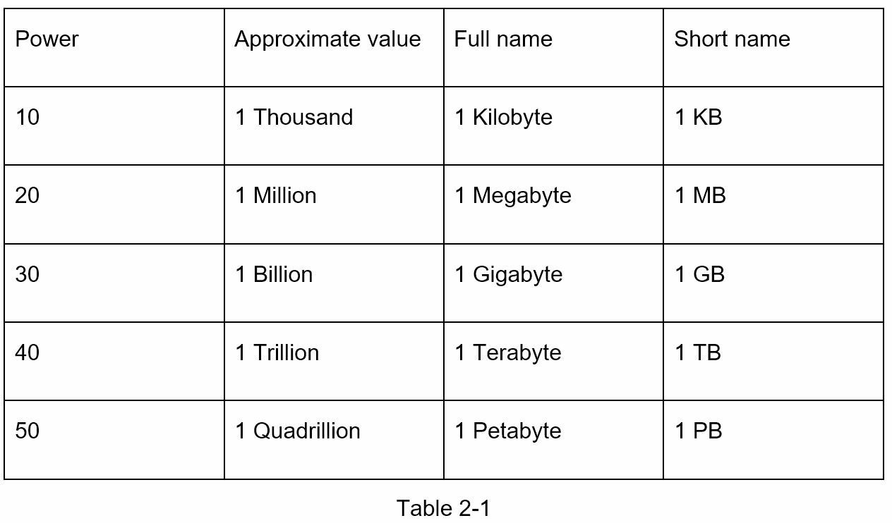

# Chapter 2: Tính Nhẩm Ước Lượng

Trong phỏng vấn thiết kế hệ thống, thỉnh thoảng bạn sẽ được yêu cầu phải tính toán ước lượng năng lực hệ thống hoặc hiệu suất bằng cách sử dụng ước tính **back-of-the-envelope**(một thuật ngữ chỉ việc tính nhẩm hoặc tính nhanh). Theo Jeff Dean, Senior ở Google:

> Các phép tính nhanh là những ước tính được tạo ra bằng cách kết hợp các suy nghĩ thử nghiệm và các con số hiệu suất chung để có đánh giá tốt về thiết kế sẽ đáp ứng yêu cầu của bạn.

Bạn cần có hiểu biết cơ bản về khả năng mở rộng và ước tính nhanh. Các khái niệm sau đây cần hiểu rõ: luỹ thừa hai, độ trễ và số khả dụng.

### Luỹ thừa hai

Mặc dù dữ liệu có thể trở nên khổng lồ khi xử lý các hệ thống phân tán, nhưng tất cả việc tính toán đều tóm gọn lại những điều cơ bản. Để có được các phép tính chính xác, điều quan trọng là phải biết đơn vị khối dữ liệu sử dụng luỹ thừa 2. Một byte là một chuỗi 8 bit. Một ký tự ASCII sử dụng một byte bộ nhớ (8 bit). Dưới đây là bảng đơn vị dữ liệu:

### Độ trễ 