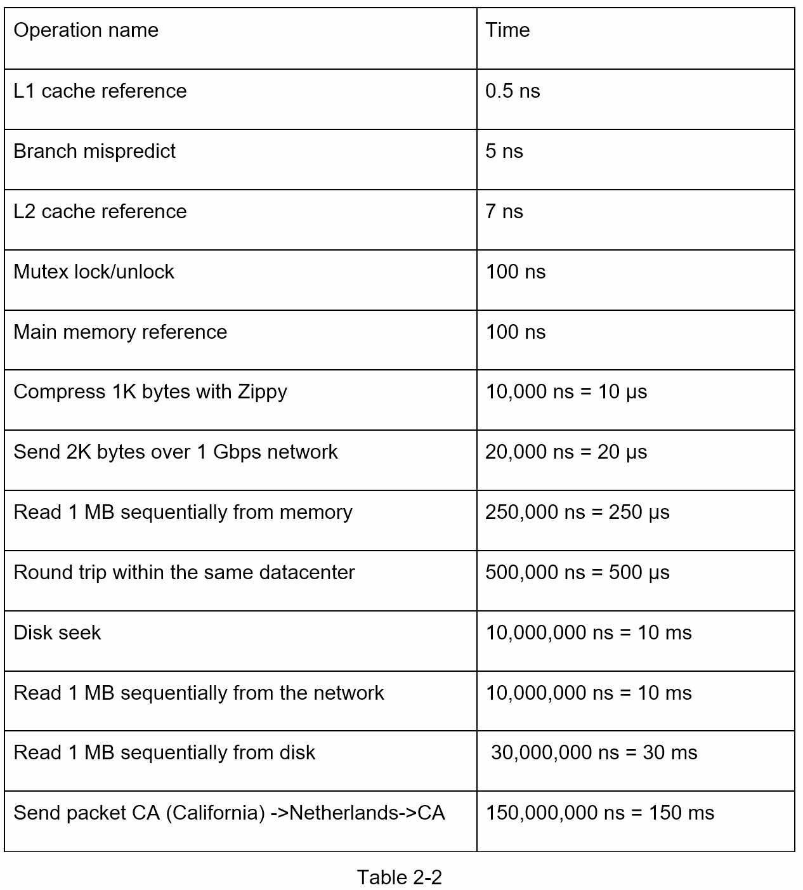

# Chapter 2: Ước Lượng Nhanh Các Con Số

Trong phỏng vấn thiết kế hệ thống, thỉnh thoảng bạn sẽ được yêu cầu phải tính toán ước lượng năng lực hoặc hiệu suất hệ thống bằng cách sử dụng ước tính **back-of-the-envelope**(một thuật ngữ chỉ việc tính nhẩm hoặc tính nhanh). Theo Jeff Dean, Senior ở Google:

> Các phép tính nhanh là những ước tính được tạo ra bằng cách kết hợp các suy nghĩ giả định và các con số hiệu suất chung để có đánh giá đúng đắn về thiết kế sẽ đáp ứng yêu cầu của bạn.

Bạn cần có hiểu biết cơ bản về khả năng mở rộng và ước tính nhanh. Các khái niệm sau đây cần hiểu rõ: luỹ thừa hai, độ trễ và số khả dụng.

### Luỹ thừa hai

Mặc dù dữ liệu có thể trở nên khổng lồ khi xử lý các hệ thống phân tán, nhưng tất cả việc tính toán đều chung quy lại thành những gì cơ bản. Để có được các phép tính chính xác, việc quan trọng là phải hiểu đơn vị khối dữ liệu sử dụng luỹ thừa 2. Một byte là một chuỗi 8 bit. Một ký tự ASCII sử dụng một byte bộ nhớ (8 bit). Dưới đây là bảng đơn vị dữ liệu:

### Độ trễ 

Dr.Dean của Google đã tiết lộ độ trễ các kiểu thao tác trên máy tính vào năm 2010 [1]. Một số con số đã lỗi thời khi máy tính trở nên nhanh và mạnh mẽ hơn. Tuy nhiên, những con số đó vẫn có thể cho chúng ta biết về độ nhanh và chậm của các hoạt động khác nhau trên máy tính.

Lưu ý

* ns = nanosecond, µs = microsecond, ms = millisecond
* 1 ns = 10^-9 seconds
* 1 µs= 10^-6 seconds = 1,000 ns
* 1 ms = 10^-3 seconds = 1,000 µs = 1,000,000 ns

Một kỹ sư phần mềm Google xây dựng một công cụ cho biểu diễn các con số của Dr. Dean. Công cụ cũng xem xét đến yếu tố thời gian. Hình 2-1 bên dưới hiển thị độ trễ ở năm 2020 [3].

Từ ảnh trên ta thấy được:
- Bộ nhớ nhanh còn ổ đĩa thì chậm hơn.
- Tránh tìm kiếm trên đĩa, nếu có thể.
- Các thuật toán nén đơn giản rất nhanh.
- Nén dữ liệu trước khi gửi qua internet nếu có thể.
- Các trung tâm dữ liệu thường ở các khu vực khác nhau và cần có thời gian để gửi dữ liệu giữa chúng.

### Số khả dụng.

Tính khả dụng cao là khả năng một hệ thống có thể hoạt động liên tục trong một thời gian dài mong muốn. Tính khả dụng cao được tính theo tỷ lệ phần trăm, với 100% nghĩa là dịch vụ không có thời gian ngừng hoạt động.

Service level agreement (SLA) là một thuật ngữ thường được sử dụng cho các nhà cung cấp dịch vụ. Nó là thỏa thuận giữa bạn (nhà cung cấp dịch vụ) và khách hàng của bạn và thỏa thuận này nhằm xác định chính thức mức thời gian hoạt động mà dịch vụ của bạn sẽ cung cấp. Các nhà cung cấp dịch vụ đám mây Amazon [4], Google [5] và Microsoft [6] đặt SLA của họ ở mức 99,9% trở lên. Theo truyền thống, thời gian hoạt động được đo bằng số chín. Càng nhiều số chín, càng tốt. Như thể hiện trong Bảng 2-3, số lượng số chín tỉ lệ nghịch với thời gian ngừng hoạt động dự kiến của hệ thống.

### Ví dụ ước lượng nhanh hệ thống Twitter

Ta sẽ thử ước lượng nhanh về QPS và yêu cầu lưu trữ với một hệ thống tương tự như Twitter.

Giả sử
- 300 triệu người dùng hoạt động mỗi tháng
- 50% người dùng hoạt động mỗi ngày
- Trung bình một người đăng 2 tweet mỗi ngày
- 10% số tweet chứa các media (ảnh, video)
- Dữ liệu lưu trữ trong 5 năm

Ước lượng
- QPS(query per second) - số truy vấn mỗi giây:
    + Số người hoạt động mỗi ngày = 300 triệu * 50% = 150 triệu
    + Tweet QPS = 150 triệu * 2 tweet/ 24h / 3600 s ~ 3500
    + Peek QPS = 2 * QPS ~ 7000
- Lưu trữ dữ liệu
    + Kích thước trung bình của tweet
        * tweet_id  64 bytes
        * text      140 bytes
        * media     1 MB
    + Lưu trữ media: 150 triệu * 2 * 10% * 1 MB = 30 TB mỗi ngày
    + Trong 5 năm: 30 TB * 365 * 5 ~ 55 PB

### Tips

Ước tính nhanh bao gồm tất cả về quy trình. Quá trình giải quyết vấn đề quan trọng hơn là kết quả. Người phỏng vấn có thể kiểm tra kỹ năng giải quyết vấn đề của bạn. Dưới đây là một số mẹo để làm theo:
- Làm tròn và Xấp xỉ. Rất khó để thực hiện các phép toán phức tạp trong cuộc phỏng vấn. Ví dụ, kết quả của "99987 / 9.1" là gì? Không cần phải dành thời gian quý báu để giải những bài toán phức tạp như vậy. Ở đây người ta không mong đợi con số chính xác. Sử dụng làm tròn số và ước lượng sẽ có ích cho bạn. Câu hỏi chia có thể được đơn giản hóa như sau: "100.000 / 10".
- Viết ra các giả định của bạn. Bạn nên viết ra các giả định của mình để tham khảo về sau.
- Viết tên các đơn vị của bạn. Khi bạn viết ra "5", nó có nghĩa là 5 KB hay 5 MB? Bạn có thể nhầm lẫn. Viết ra các đơn vị như "5 MB" giúp loại bỏ sự mơ hồ.
- Các ước tính nhanh thường hỏi về: QPS, QPS cao nhất, dung lượng lưu trữ, bộ nhớ cache, số lượng máy chủ,... Bạn có thể thực hành các phép tính này khi chuẩn bị cho một cuộc phỏng vấn. Tập luyện giúp hoàn hảo hơn.

## Tham khảo

[1] J. Dean.Google Pro Tip: Use Back-Of-The-Envelope-Calculations To Choose The Best Design: http://highscalability.com/blog/2011/1/26/google-pro-tip-use-back-of-the-envelopecalculations-to-choo.html

[2] System design primer: https://github.com/donnemartin/system-design-primer

[3] Latency Numbers Every Programmer Should Know: https://colin-scott.github.io/personal_website/research/interactive_latency.html

[4] Amazon Compute Service Level Agreement: https://aws.amazon.com/compute/sla/

[5] Compute Engine Service Level Agreement (SLA): https://cloud.google.com/compute/sla

[6] SLA summary for Azure services: https://azure.microsoft.com/enus/support/legal/sla/summary/
