# Thiết Kế Bộ Giới Hạn Truy Cập

Trong một hệ thống mạng, bộ giới hạn truy cập (rate limiter) là công cụ cho điều khiển lưu lượng truy cập được gửi đến bởi client hay một dịch vụ nào đó. Trong HTTP, bộ giới hạn truy cập sẽ giới hạn số lượng yêu cầu client được cho phép gửi trong một khoảng thời gian cụ thể. Nếu số lượng yêu cầu API vượt quá ngưỡng cho phép bởi bộ giới hạn, tất cả các lệnh gọi tiếp theo sẽ bị chặn. Ví dụ:
- Một người viết không thể viết hai bài một giây.
- Chỉ có thể tạo 10 tài khoản từ một địa chỉ IP.
- Chỉ có thể nhận thưởng 5 lần trên một tuần từ một thiết bị.

Trong bài hôm nay, ta sẽ trả lời câu hỏi thiết kế một bộ giới hạn truy cập. Trước tiên, ta sẽ xem qua các lợi ích khi sử dụng nó:
- Ngăn chặn cạn kiệt tài nguyên bởi tấn công DoS(Denial of Service) [1]. Hầu hết API công khai bởi các công ty lớn đều thực thi các kiểu giới hạn truy cập. Ví dụ, Twitter giới hạn số lượng tweet là 300 trong 3 giờ [2]. Google Docs giới hạn 300 người dùng trên 60 giây cho một lần yêu cầu đọc[3]. Một bộ giới hạn truy cập sẽ ngăn chặn các cuộc tấn công DoS, dù vô tình hay cố ý, bằng cách chặn các lệnh gọi vượt ngưỡng.
- Giảm chí phí. Việc giới hạn các yêu cầu vượt ngưỡng đồng nghĩa với ít server hơn và ít cấp phát tài nguyên hơn. Giới hạn truy cập là rất quan trọng với các công ty sử dụng API trả phí bên thứ 3. Ví dụ bạn bị tính phí cơ sở cho mỗi lần gọi cho các API bên ngoài như: kiểm tra tín dụng, thanh toán, truy xuất hồ sơ sức khỏe, ... Hạn chế số lượng yêu cầu là điều cần thiết để giảm chi phí.
- Ngăn chặn server bị sập. Để giảm tải cho server, bộ giới hạn được dùng để lọc các yêu cầu vượt ngưỡng gây ra bởi bot hoặc hành vi phá hoại từ người dùng.

## 1. Hiểu vấn đề và thiết lập phạm vi của thiết kế

Giới hạn truy cập có thể thực hiện bằng cách triển khai các thuật toán khác nhau, mỗi cái sẽ có ưu nhược riêng. Việc tương tác với người phỏng vấn sẽ giúp ứng viên hiểu rõ kiểu và phạm vi của bộ giới hạn mà họ cần xây dựng.

- **Ứng viên**: Kiểu triển khai của bộ giới hạn truy cập mà ta cần là gì? Nó sẽ là client-side hay server-side?
- **Người phỏng vấn**: Câu hỏi tốt đấy. Ta sẽ tập trung vào server-side.

- **Ứng viên**: Bộ giới hạn sẽ điều tiết yêu cầu dựa trên địa chỉ IP, ID người dùng hay một thuộc tính nào khác?
- **Người phỏng vấn**: Nó phải đủ linh hoạt để hỗ trợ các quy tắc điều tiết khác nhau.

- **Ứng viên**: Hệ thống của nó lớn cỡ nào? Một công ty startup hay một công ty lớn với đông đảo người dùng?
- **Người phỏng vấn**: Hệ phống phải xử lý một lượng lớn người dùng.

- **Ứng viên**: Hệ thống sẽ hoạt động trong môi trường phân tán?
- **Người phỏng vấn**: Đúng vậy.

- **Ứng viên**: Bộ giới hạn sẽ là một dịch vụ riêng biệt hay là được triển khai trong ứng dụng?
- **Người phỏng vấn**: Tuỳ bạn quyết định.

- **Ứng viên**: Ta có cần thông báo cho người dùng bị chặn (điều tiết) hay không?
- **Người phỏng vấn**: Dĩ nhiên.

Như vậy ta có các yêu cầu sau:
- Giới hạn chính xác các yêu cầu vượt ngưỡng.
- Độ trễ thấp. Bộ giới hạn truy cập không nên chậm hơn thời gian phản hồi HTTP.
- Sử dụng bộ nhớ ít nhất có thể.
- Có thể chia sẻ trên nhiều server hay tiến trình.
- Xử lý ngoại lệ. Hiển thị dọn dẹp ngoại lệ cho người dùng khi yêu cầu của họ bị điều tiết.
- Khả năng chịu lỗi cao. Bất kỳ sự cố nào với bộ giới hạn truy cập sẽ không ảnh hưởng đến toàn hệ thống.

## 2. Đề xuất thiết kế

**Nơi đặt bộ giới hạn truy cập?**

Ta có thể triển khai bộ giới hạn bằng cả server-side và client-side:
* Client-side: nhìn chung thì client là nơi không đáng tin cậy để thực thi bộ giới hạn truy cập, bởi vì các yêu cầu client có thể dễ dàng bị giả mạo bởi các tác nhân độc hại. Hơn nữa ta cũng không có quyền kiểm soát khi triển khai ở client.
* Server-side: Hình bên dưới cho ta thấy bộ giới hạn truy cập được đặt ở server-side.

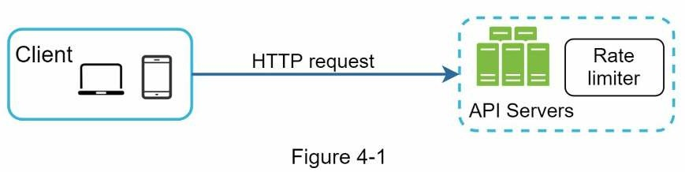

Bên cạnh đó ta cũng có một cách khác là đặt bộ giới hạn truy cập ở server API, để nó hoạt động giống như một middleware, thực hiện điều tiết yêu cầu đến API của bạn như hình bên dưới.

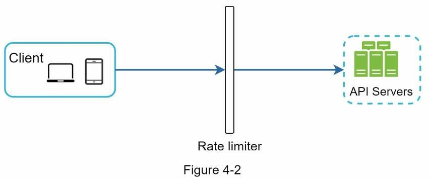

Giả sử API của ta cho phép 2 yêu cầu trên một giây, và client gửi 3 yêu cầu đến server trong một giây. Hai yêu cầu đầu tiên được định tuyến đến server. Nhưng yêu cầu thứ ba bị bộ giới hạn chặn lại và trả về HTTP Status code 429. Phản hồi HTTP 429 biểu hiện một người dùng gửi quá nhiều yêu cầu.


Các microservices [4] đang trở nên phổ biến và bộ giới hạn truy cập thường được dùng cho triển khai trong API gateway. API gateway là một dịch vụ quản lý hoàn toàn hỗ trợ giới hạn truy cập, chứng chỉ SSL, xác thực, IP được cho phép và nhiều hơn thế. Bây giờ ta đã biết API gateway là một dịch vụ hỗ trợ giới hạn truy cập.

Khi thiết kế bộ giới hạn truy cập, câu hỏi quan trọng nhất cần trả lời là: "Đâu là nơi bộ giới hạn nên triển khai, ở server-side hay là trong gateway". Không có một câu trả lời hoàn chỉnh, nó tuỳ thuộc vào công ty mà bạn đang làm việc, các công nghệ hiện tại, nguồn tài nguyên, độ ưu tiên của mục tiêu,... Ở đây ta có vài hướng dẫn phổ biến.
- Đánh giá công nghệ hiện tại của bạn, chẳng hạn như ngôn ngữ lập trình, cache,... Đảm bảo rằng ngôn ngữ lập trình hiện tại của bạn hiệu quả để thực hiện giới hạn truy cập ở phía server.
- Xác định thuật toán giới hạn truy cập phù hợp với nhu cầu doanh nghiệp. Khi bạn triển khai mọi thứ ở phía server, bạn có toàn quyền kiểm soát thuật toán. Tuy nhiên, sự lựa chọn có thể bị hạn chế nếu bạn dùng gateway bên thứ 3.
- Nếu bạn sử dụng kiến trúc microservice bao gồm các API gateway trong thiết kế để thực hiện xác thức, lập danh sách IP cho phép,... bạn có thể thêm bộ giới hạn truy cập vào API gateway.
- Việc xây dựng dịch vụ giới hạn truy cập của riêng bạn mất nhiều thời gian. Nếu bạn không có đủ tài nguyên để triển khai bộ giới hạn truy cập, thì API gateway thương mại là một lựa chọn tốt hơn.

### Thuật toán cho giới hạn truy cập

Giới hạn truy cập có thể thực hiện bằng cách triển khai các thuật toán khác nhau, mỗi cái sẽ có ưu nhược riêng. Mặc dù ở bài viết này không tập trung vào các thuật toán, nhưng việc hiểu chúng sẽ giúp chọn đúng thuật toán hoặc kết hợp các thuật toán để phù hợp với các trường hợp sử dụng của chúng ta. Dưới đây là danh sách các thuật toán phổ biến:
* Token bucket
* Leaking bucket
* Fixed window counter
* Sliding window log
* Sliding window counter

**Thuật toán token bucket**

Thuật toán token bucket được sử dụng rộng rải để giới hạn truy cập. Nó đơn giản, dễ hiểu và được dùng phổ biến, các công ty như Amazon [5] và Stripe [6] đều sử dụng thuật toán này để điều tiết yêu cầu API.

Thuật toán token bucket hoạt động như sau:
- Một bucket là một thùng chứa có dung lượng đã xác định trước. Các token là các đồng tiền được đặt vào theo định kỳ. Khi mà bucket đã đầy thì không có token nào được thêm vào. Như hình bên dưới, dung lượng bucket là 4. Mỗi giây, bộ nạp sẽ đặt 2 token vào. Khi bucket đầy các token tiếp theo sẽ bị tràn ra ngoài.

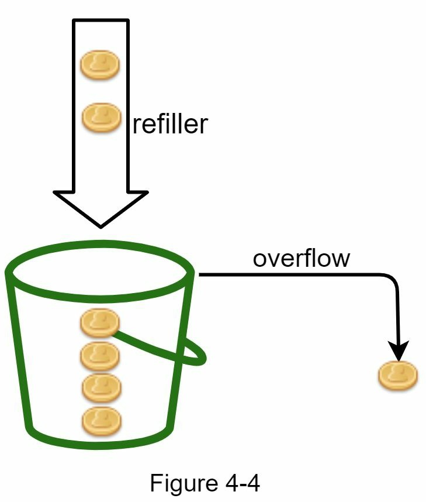

- Mỗi yêu cầu từ client ứng với một token. Khi yêu cầu đến ta kiểm tra trong bucket có đủ token không. 
    + Nếu đủ ta lấy một token cho mỗi yêu cầu, yêu cầu sẽ được xử lý tiếp.
    + Nếu không đủ, yêu cầu sẽ bị xoá.

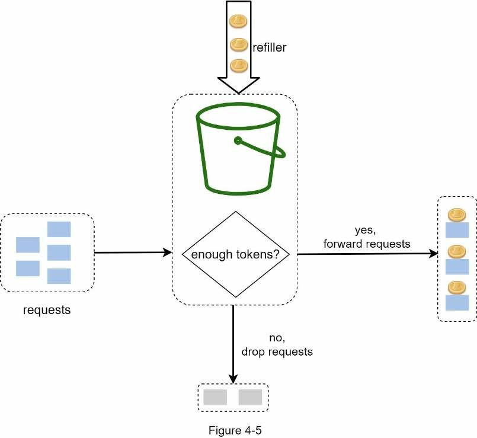

Hình bên dưới minh hoạ cách tiêu thụ và nạp token cũng như logic hoạt động của giới hạn truy cập.

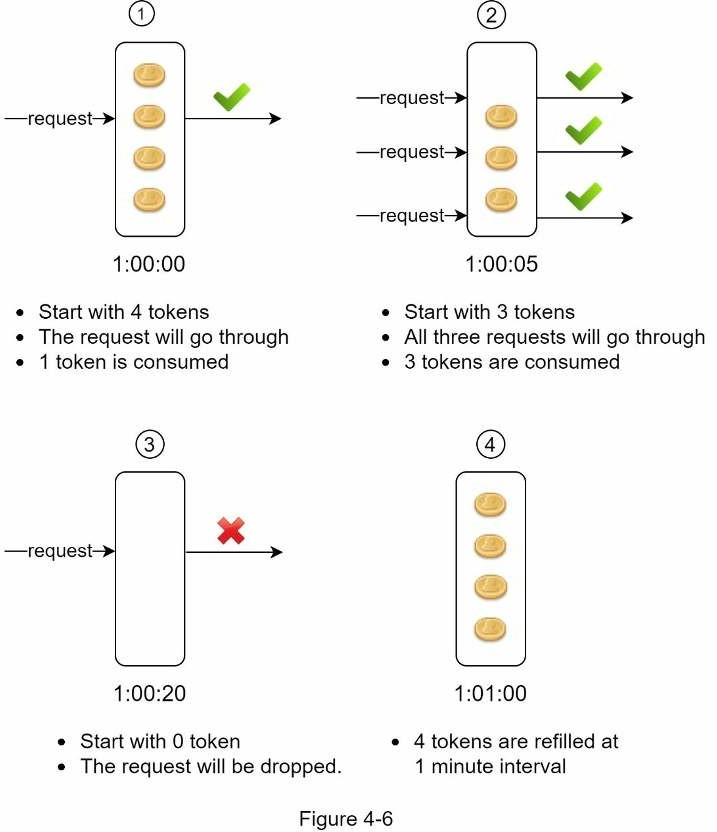

Thuật toán token bucket nhận vào hai tham số:
- Kích cỡ bucket: số lượng tối đa token ở trong một bucket.
- Chu kỳ cấp phát: là số token được đặt vào bucket trong một giây.

Vậy thì ta sẽ cần bao nhiêu bucket? Không có câu trả lời cố định, nó tuỳ thuộc vào quy tắc mà ta thiết lập giới hạn truy cập. Ở đây có một vài ví dụ:
- Nếu ta cần các bucket khác nhau cho các API endpoint khác nhau. Ví dụ: một người dùng được cho phép đăng một bài viết một giây, có 150 người bạn một ngày và thích 5 bài viết một giây thì sẽ cần tới 3 bucket.
- Nếu ta cần điều tiết các yêu cầu dựa trên địa chỉ IP thì mỗi địa chỉ IP cần một bucket.
- Nếu hệ thống chỉ cho phép tối đa 10,000 yêu cầu trên một giây ta sẽ cần một bucket toàn cục chung cho tất cả yêu cầu.

*Ưu điểm*
1. Dễ dàng triển khai
2. Lưu trữ hiệu quả
3. Cho phép một loạt truy cập trong chu kỳ ngắn. Yêu cầu có thể được thực hiện miễn là vẫn còn token.

*Nhược điểm*
1. Hai tham số trong thuật toán là kích cỡ bucket và chu kỳ cấp phát. Tuy nhiên khá khó khăn để điều chỉnh chúng đúng cách.

**Thuật toán leaking bucket**

Thuật toán này tương tự token bucket nhưng khác ở việc các yêu cầu được xử lý theo tần suất cố định. Nó thường dùng triển khai hàng đợi FIFO. Thuật toán hoạt động như sau:
- Khi một yêu cầu đến, hệ thống kiểm tra nếu hàng đợi vẫn còn chỗ nó sẽ được thêm vào hàng đợi.
- Ngược lại nó sẽ bị xoá.
- Yêu cầu được lấy từ hàng đợi và xử lý.

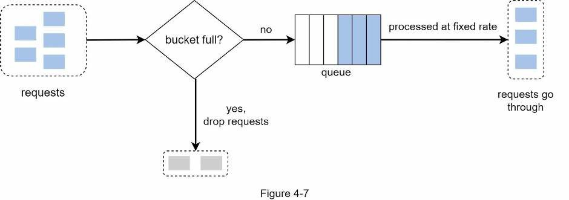

Thuật toán nhận về hai tham số:
- Kích cỡ bucket: bằng với kích cỡ hàng đợi. Hàng đợi giữ yêu cầu cần được xử lý trong một tần suất cố định.
- Tần suất thoát ra: nó xác định bao nhiêu yêu cầu sẽ được xử lý trong một tần suất cố định thường là giây.

*Ưu điểm*
1. Lưu trữ hiệu quả với kích cỡ hàng đợi giới hạn.
2. Yêu cầu được xử lý trong một khoảng cố định do đó phù hợp với các trường hợp sử dụng cần tần suất thoát ra ổn định.

*Nhược điểm*
1. Một loạt truy cập sẽ lấp đầy hàng đợi và với các yêu cầu cũ nếu chúng không được xử lý kịp thời, các yêu cầu gần nhất sẽ bị giới hạn truy cập.
2. Có hai tham số trong thuật toán. Và không dễ dàng để điều chỉnh chúng đúng cách.

**Thuận toán fixed window counter**

Thuật toán hoạt động như sau:
- Thuật toán chia dòng thời gian thành các cửa sổ thời gian cố định và gán một bộ đếm cho mỗi cửa sổ.
- Mỗi yêu cầu sẽ tăng bộ đếm lên một.
- Khi bộ đếm đạt đến ngưỡng đã được xác định trước, các yêu cầu mới sẽ bị loại bỏ cho đến khi cửa sổ thời gian mới bắt đầu.

Ta lấy ví dụ cụ thể. Ở hình bên dưới đơn vị thời gian là 1s, hệ thống cho phép tối đa 3 yêu cầu trên một giây. Từ cửa sổ thứ hai, nếu nhận được hơn 3 yêu cầu, các yêu cầu tiếp theo sẽ bị loại bỏ.

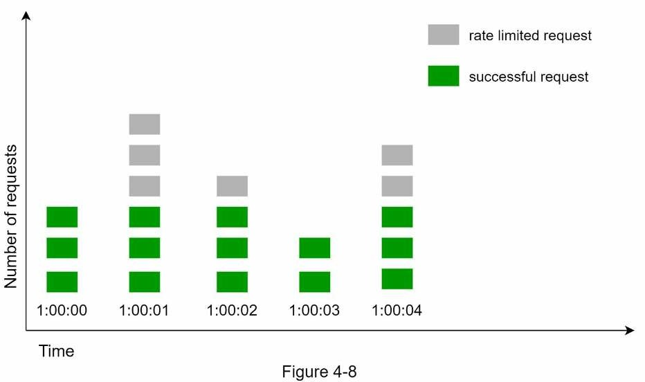

Một vấn đề lớn với thuật toán này là một loạt lưu lượng truy cập ở các cạnh của cửa sổ thời gian có thể gây ra nhiều yêu cầu hơn định mức cho phép. Hãy xem xét trường hợp sau:

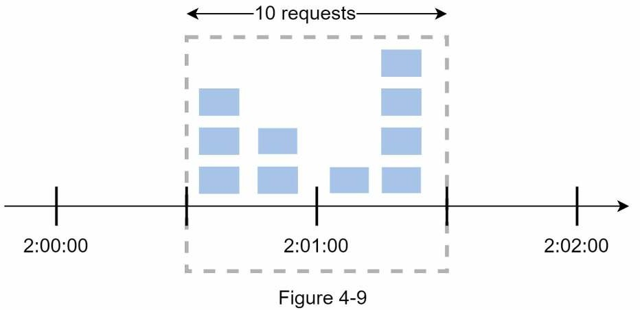

Trong hình trên hệ thống cho phép tối đa 5 yêu cầu mỗi phút, định mức khả dụng đặt lại gần bằng phút. Và có 5 yêu cầu trong khoảng thời gian từ 2:00:00 đến 2:01:00 và 5 yêu cầu khác trong khoảng 2:01:00 đến 2:02:00. Đối với khoảng thời gian một phút từ 2:00:30 đến 2:01:30, thì lại có 10 yêu cầu. Gấp đôi với số yêu cầu được cho phép.

*Ưu điểm*
1. Lưu trữ hiệu quả
2. Dễ hiểu
3. Đặt lại định mức khả dụng vào cuối cửa sổ đơn vị thời gian phù hợp với một số trường hợp sử dụng nhất định.

*Nhược điểm*
1. Lưu lượng truy cập tăng vọt ở các cạnh của cửa sổ có thể gây ra nhiều yêu cầu hơn định mức cho phép.

**Thuật toán Sliding window log**

Như đã thảo luận trước đây, thuật toán fixed window counter có một vấn đề lớn là: nó cho phép nhiều yêu cầu hơn đi qua các cạnh của cửa sổ. Thuật toán sliding window log khắc phục vấn đề đó. Nó hoạt động như sau:
- Thuật toán theo dõi các timestamp của yêu cầu. Dữ liệu timestamp thường được lưu trong bộ nhớ cache, chẳng hạn như các set được sắp xếp của Redis [8].
- Khi có yêu cầu mới, hãy xóa tất cả các timestamp đã lỗi thời. Timestamp lỗi thời được định nghĩa là những timestamp cũ hơn thời điểm bắt đầu của cửa sổ thời gian hiện tại.
- Thêm timestamp của yêu cầu mới vào log.
- Nếu kích thước log bằng hoặc thấp hơn số lượng cho phép, một yêu cầu được chấp nhận.
- Nếu không, nó bị từ chối.
Ta có hình minh hoạ như sau:

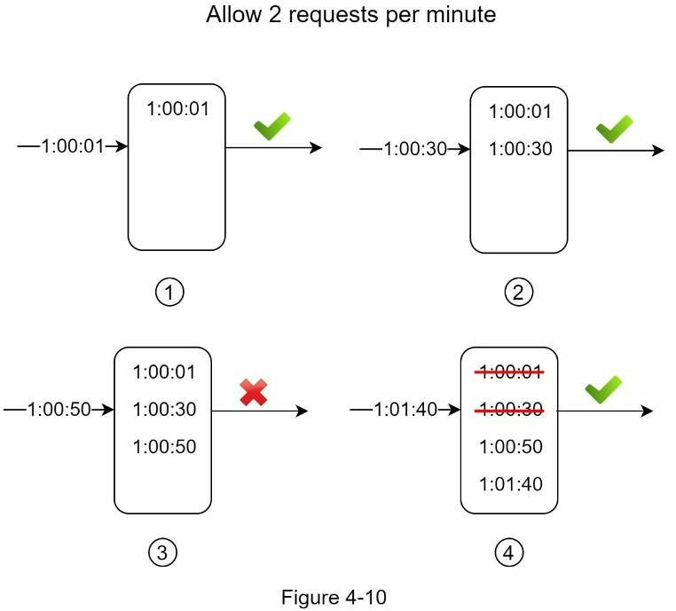

Ở ví dụ này, bộ giới hạn truy cập cho phép 2 yêu cầu mỗi phút. Thông thường, timestamp Linux được lưu ở log. Tuy nhiên, trong ví dụ này ta sử dụng biểu diễn thời gian dễ đọc hơn để dễ hiểu hơn.

- Log trống khi yêu cầu mới đến vào lúc 1:00:01. Do đó yêu cầu được cho phép.
- Một yêu cầu mới đến vào lúc 1:00:30, timestamp 1:00:30 được lưu vào log. Sau khi lưu, kích cỡ log là 2 không lớn hơn con số cho phép. Do đó, yêu cầu vẫn được cho phép.
- Yêu cầu mới đến vào lúc 1:00:50 và được thêm timestamp vào log. Sau khi chèn, kích cỡ log là 3, lớn hơn 2. Nên yêu cầu này bị từ chối, mặc dù timestamp vẫn còn trong log.
- Yêu cầu mới đến vào lúc 1:01:40. Các yêu cầu trong khoảng [1:00:40, 1:01:40] nằm trong một khung thời gian, nhưng yêu cầu được gửi đến trước 1:00:40 đã lỗi thời. Hai timestamp là 1:00:01 và 1:00:30 đều đã bị xoá khởi log. Do đó kích cỡ bây giờ là 2 nên yêu cầu được cho phép

*Ưu điểm*
1. Giới hạn truy cập được thực hiện bởi thuật toán này là rất chính xác. Trong bất kỳ cửa sổ luân phiên nào, các yêu cầu sẽ không vượt quá giới hạn truy cập.

*Nhược điểm*
1. Thuật toán tiêu thụ nhiều bộ nhớ vì ngay cả khi yêu cầu bị từ chối, timestamp của nó vẫn được lưu lại.

**Thuật toán sliding window counter**

Là cách tiếp cận kết hợp fixed window counter và sliding window log. Thuật toán có thể triển khai bằng hai cách khác nhau. Chúng ta sẽ chỉ giải thích một cách triển khai trong bài viết này thôi, cách còn lại sẽ được cung cấp tài liệu tham khảo ở cuối bài.

Ảnh dưới đây mô tả cách hoạt động của thuật toán

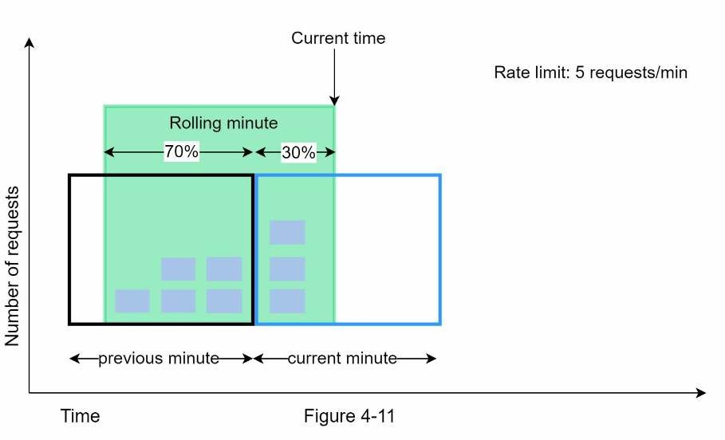

Giả sử bộ giới hạn truy cập cho phép tối đa 7 yêu cầu mỗi phút và có 5 yêu cầu trong phút trước và 3 yêu cầu trong phút hiện tại. Đối với một yêu cầu mới đến vị trí 30% trong phút hiện tại, số lượng yêu cầu trong cửa sổ luân phiên được tính bằng công thức sau:
> Số yêu cầu ở cửa sổ hiện tại + số yêu cầu ở cửa số trước * phần trăm chồng chéo của cửa sổ luân phiên và cửa sổ trước đó.

Sử dụng công thức trên ta có `3 + 5 * 0.7% = 6.5` yêu cầu. Tuỳ vào trường hợp mà con số có thể được làm tròn lên hoặc xuống. Ở đây ta làm tròn xuống còn 6.

Vì bộ giới hạn truy cập cho phép tối đa 7 yêu cầu mỗi phút, nên yêu cầu hiện tại có thể được thực hiện. Tuy nhiên, giới hạn sẽ đạt được sau khi nhận được thêm một yêu cầu.

Do giới hạn về không gian, chúng ta sẽ không thảo luận về cách triển khai khác ở đây. Bạn đọc quan tâm có thể tham khảo tài liệu tham khảo [9]. Thuật toán này tuy là cải tiến và kết hợp của hai thuật toán trên nhưng nó không hoàn hảo. Nó có ưu và nhược điểm sau:

*Ưu điểm*
1. Lưu trữ hiệu quả
2. Nó làm giảm lượng truy cập tăng đột biến vì truy cập dựa trên tỷ lệ trung bình của cửa sổ trước đó.

*Nhược điểm*
1. Nó chỉ hoạt động đối với cửa sổ xem lại không quá nghiêm ngặt. Đây là giá trị gần đúng của truy cập thực tế vì nó giả định các yêu cầu trong cửa sổ trước đó được phân phối đồng đều. Tuy nhiên, vấn đề này có thể không quá tệ như bạn tưởng. Theo các thử nghiệm được thực hiện bởi Cloudflare [10], chỉ có 0,003% yêu cầu được cho phép sai hoặc truy cập bị giới hạn trong số 400 triệu yêu cầu.

### Kiến trúc high-level

Ý tưởng cơ bản của thuật toán giới hạn truy cập khá đơn giản. Ở high-level, ta cần một bộ đếm để theo dõi số lượng yêu cầu được gửi từ cùng một user, địa chỉ IP,... Nếu bộ đếm lớn hơn giới hạn, yêu cầu sẽ không được cho phép.

Vậy ta sẽ lưu trữ bộ đếm ở đâu? Sử dụng cơ sở dữ liệu không phải một ý tưởng tốt vì truy cập ổ đĩa của nó rất chậm. Bộ nhớ cache sẽ là một lựa chọn tốt hơn vì nó nhanh và hỗ trợ chiến lược hết hạn dựa trên thời gian. Ví dụ Redis [11] là một lựa chọn phổ biến để triển khai giới hạn truy cập. Nó là một bộ nhớ lưu trữ với hai lệnh: INCR và EXPIRE.
- INCR: nó sẽ tăng bộ đếm lưu trữ lên 1 đơn vị.
- EXPIRE: nó thiết lập thời gian cho counter. Khi thời gian hết hạn bộ đếm tự động bị xoá.

Ảnh dưới đây mô tả kiến trúc high-level cho giới hạn truy cập:

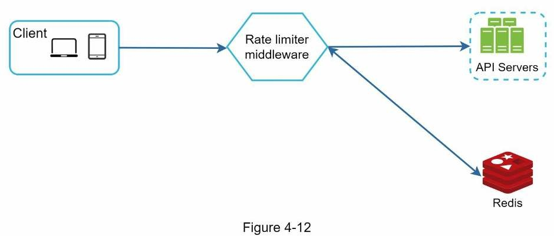

1. Client gửi một yêu cầu đến middleware giới hạn truy cập.
2. Middleware giới hạn truy cập tìm nạp counter tương ứng từ bucket trong Redis và kiểm tra có đến giới hạn hay không.
    + Nếu đến giới hạn yêu cầu bị từ chối.
    + Nếu chưa đến giới hạn, yêu cầu được gửi đến API server. Đồng nghĩa, hệ thống tăng bộ đếm và lưu nó vào Redis.

## 3. Đi sâu vào thiết kế

Ở thiết kế trên vẫn chưa trả lời hai cầu hỏi:
- Quy tắc giới hạn được tạo như thế nào? Và sẽ lưu ở đâu?
- Làm sao để xử lý yêu cầu vượt quá giới hạn truy cập?

Trong phần này, trước tiên chúng ta sẽ trả lời các câu hỏi liên quan đến quy tắc giới hạn truy cập và sau đó xem xét các chiến lược để xử lý các yêu cầu vượt quá giới hạn truy cập. Cuối cùng, chúng ta sẽ thảo luận về giới hạn truy cập trong môi trường phân tán, thiết kế chi tiết, tối ưu hóa hiệu suất và giám sát.

### Quy tắc giới hạn truy cập

Lyft [12] đã công khai mã nguồn của thành phần giới hạn truy cập của họ. Ta sẽ xem xét bên trong các thành phần này và một số ví dụ về quy tắc giới hạn truy cập:

```
domain: messaging
descriptors:
    - key: message_type
    Value: marketing
    rate_limit:
        unit: day
        requests_per_unit: 5
```

Trong ví dụ trên, hệ thống cấu hình cho phép tối đa 5 thông điệp marketing mỗi ngày. Một ví dụ khác:

```
domain: auth
descriptors:
    - key: auth_type
    Value: login
    rate_limit:
        unit: minute
        requests_per_unit: 5
```

Quy tắc này cho thấy rằng client không được phép đăng nhập quá 5 lần trong 1 phút. Các quy tắc thường được viết trong các file cấu hình và được lưu trên đĩa.

### Vượt quá giới hạn truy cập

Trong trường hợp yêu cầu đã quá hạn, API trả về HTTP status code 429 cho client. Tuỳ vào trường hợp mà ta có thể đưa các yêu cầu quá hạn vào một hàng đợi để xử lý sau đó. Ví dụ, nếu một số đơn đặt hàng bị giới hạn truy cập do hệ thống quá tải, chúng ta có thể giữ lại các đơn đặt hàng đó để xử lý sau.

#### Rate limiter headers

Làm thế nào để một client biết liệu nó có đang được điều tiết hay không? Và làm thế nào để client biết được số lượng yêu cầu còn lại được phép trước khi bị điều tiết?

Câu trả lời nằm trong header của phản hồi HTTP. Bộ giới hạn truy cập trả về các Header HTTP sau cho client:
- `X-Ratelimit-Remaining`: số lượng yêu cầu còn lại được cho phép trong cửa sổ.
- `X-Ratelimit-Limit`: nó biểu thị số lượng lần gọi client có thể thực hiện trên mỗi cửa sổ thời gian.
- `X-Ratelimit-Retry-After`: số lượng giây để đợi cho đến khi bạn có thể thực hiện yêu cầu lại, mà không bị điều tiết.

Khi người dùng gửi quá nhiều yêu cầu, lỗi 429 và header `X-Ratelimit-Retry-After` sẽ được trả về cho client.

### Thiết kế chi tiết

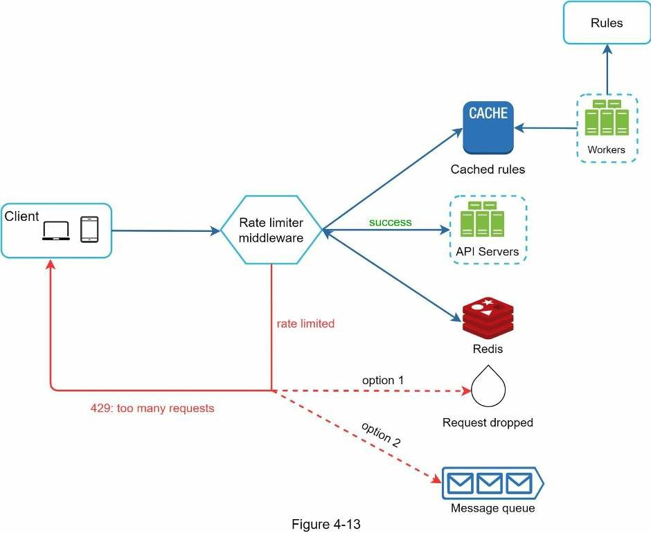

- Quy tắc được lưu trên ổ đĩa. Worker thường xuyên lấy quy tắc từ đĩa và lưu trữ chúng trong cache.
- Khi một client gửi yêu cầu đến server, yêu cầu đó sẽ được gửi đến middleware giới hạn truy cập trước.
- Middleware giới hạn truy cập tải quy tắc từ cache. Nó nạp bộ đếm và timestamp yêu cầu cuối cùng từ cache (Redis). Dựa vào phản hồi, bộ giới hạn truy cập quyết định:
    + Nếu yêu cầu không quá hạn, nó sẽ gửi đến API server.
    + Nếu yêu cầu quá hạn, sẽ trả về lỗi 429, đồng thời yêu cầu sẽ bị xoá bỏ hoặc đưa vào hàng đợi.

### Bộ giới hạn truy cập trong môi trường phân tán

Xây dựng bộ giới hạn truy cập hoạt động trong một môi trường server duy nhất không khó. Tuy nhiên việc mở rộng hệ thống để hỗ trợ nhiều server và luồng đồng thời là một câu chuyện khác. Nó có hai thứ thách:
- Race condition.
- Vấn đề đồng bộ.

#### Race condition

Như đã thảo luận trước, bộ giới hạn truy cập hoạt động ở high-level:
- Đọc bộ đếm từ Redis.
- Kiểm tra xem `(counter+1)` có vượt ngưỡng hay không.
- Nếu không, tăng bộ đếm lên một đơn vị trong Redis.

Nó xảy ra ở các môi trường đồng thời cao

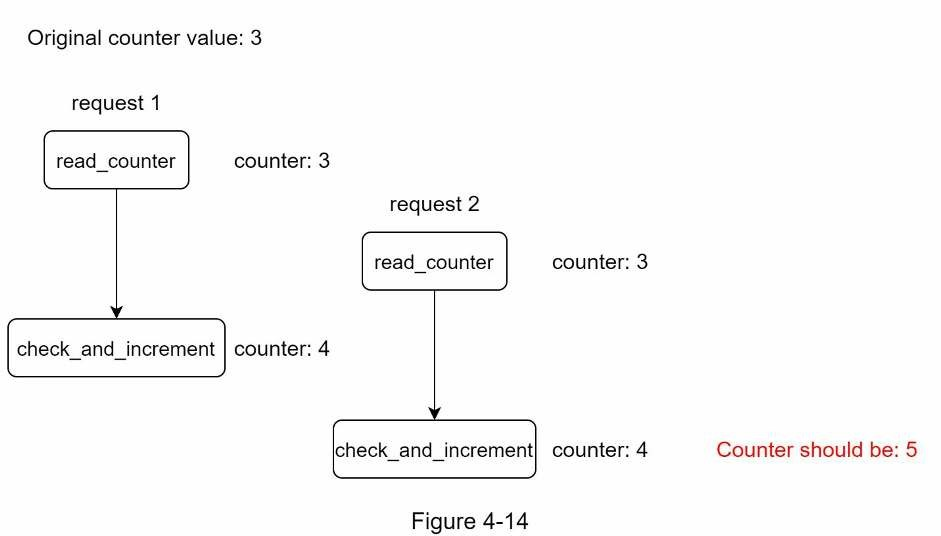

Giả sử giá trị bộ đếm trong Redis là 3. Nếu hai yêu cầu đồng thời đọc giá trị bộ đếm trước khi một trong hai yêu cầu ghi giá trị trở lại, mỗi yêu cầu sẽ tăng bộ đếm lên một và ghi nó trở lại mà không cần kiểm tra luồng kia. Cả hai yêu cầu (luồng) đều tin rằng chúng có giá trị bộ đếm chính xác là 4. Tuy nhiên, giá trị bộ đếm chính xác phải là 5.

Lock là giải pháp rõ ràng nhất để giải quyết tình trạng xung đột. Tuy nhiên, lock sẽ làm chậm hệ thống đáng kể. Hai chiến lược thường được sử dụng để giải quyết vấn đề là : Lua script [13] và cấu trúc dữ liệu set đã sắp xếp trong Redis [8]. Đối với độc giả quan tâm đến các chiến lược này, có thể tham khảo các tài liệu tham khảo tương ứng [8] [13].

#### Vấn đề đồng bộ

Đồng bộ hóa là một yếu tố quan trọng khác cần xem xét trong môi trường phân tán. Để hỗ trợ hàng triệu người dùng, một server giới hạn truy cập có thể không đủ để xử lý lưu lượng truy cập. Khi nhiều server giới hạn truy cập được sử dụng, cần phải đồng bộ hóa. Ví dụ: ở bên trái của hình bên dưới, client 1 gửi yêu cầu đến bộ giới hạn truy cập 1 và client 2 gửi yêu cầu tới bộ giới hạn truy cập 2. Vì web tier là stateless, client có thể gửi yêu cầu đến bộ giới hạn truy cập khác như hình minh họa ở phía bên phải. Nếu không có đồng bộ hóa xảy ra, bộ giới hạn truy cập 1 không chứa bất kỳ dữ liệu nào về client 2. Do đó, bộ giới hạn truy cập không thể hoạt động bình thường.

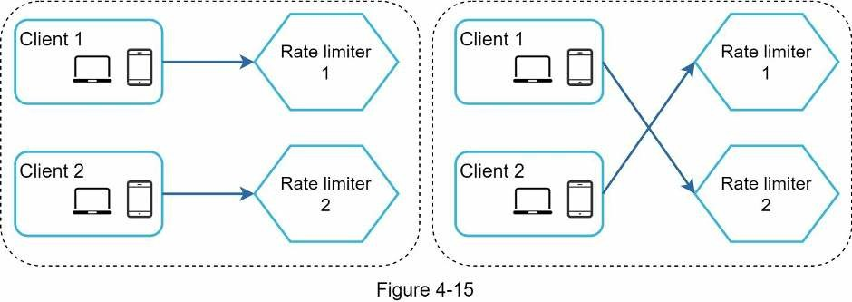

Một giải pháp khả thi là sử dụng các session cố định cho phép client gửi lưu lượng truy cập đến cùng một bộ giới hạn truy cập. Giải pháp này không được khuyến khích vì nó không có khả năng mở rộng cũng như không linh hoạt. Một cách tiếp cận tốt hơn là sử dụng các bộ dữ liệu tập trung như Redis. Thiết kế được thể hiện trong hình bên dưới.

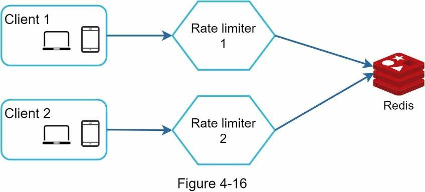

### Tối ưu hoá hiệu suất

Tối ưu hóa hiệu suất là một chủ đề phổ biến trong các cuộc phỏng vấn thiết kế hệ thống. Ở đây ta sẽ đề cập đến hai lĩnh vực cần cải thiện.

Đầu tiên, thiết lập đa trung tâm dữ liệu là rất quan trọng đối với bộ giới hạn truy cập vì độ trễ cao đối với những người dùng ở cách xa trung tâm dữ liệu. Hầu hết các nhà cung cấp dịch vụ đám mây đều xây dựng nhiều [edge server](https://www.stackpath.com/edge-academy/what-is-an-edge-server) trên khắp thế giới. Ví dụ: tính đến ngày 20 tháng 5 năm 2020, Cloudflare có 194 edge server được phân phối theo địa lý [14]. Lưu lượng truy cập được tự động chuyển đến edge server gần nhất để giảm độ trễ.

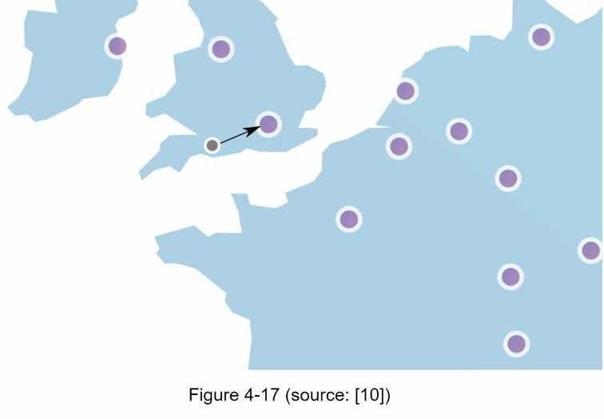

Thứ hai, đồng bộ hóa dữ liệu với một mô hình nhất quán cuối cùng. Nếu bạn không rõ về mô hình nhất quán cuối cùng, hãy tham khảo phần trong "Chương 6: Thiết kế bộ lưu trữ key-value".(Mình sẽ dịch sau)

### Giám sát

Sau khi đặt bộ giới hạn truy cập, điều quan trọng là phải thu thập dữ liệu phân tích để kiểm tra xem bộ giới hạn truy cập có hiệu quả hay không. Trước hết, chúng ta phải đảm bảo:
- Thuật toán giới hạn truy cập có hiệu quả.
- Các quy tắc giới hạn truy cập có hiệu lực.

Ví dụ: nếu các quy tắc giới hạn truy cập quá nghiêm ngặt, nhiều yêu cầu hợp lệ sẽ bị loại bỏ. Trong trường hợp này, chúng ta muốn nới lỏng các quy tắc một chút. Trong một ví dụ khác, chúng ta nhận thấy bộ giới hạn truy cập của ta trở nên vô hiệu khi có sự gia tăng đột ngột về lưu lượng truy cập như flash sales ở các trang bán hàng. Trong trường hợp này, chúng ta có thể thay thế thuật toán để hỗ trợ lưu lượng truy cập liên tục. Token bucket là một sự lựa chọn tốt ở đây.

## 4. Tổng kết

Trong bài viết này, chúng ta đã thảo luận về các thuật toán khác nhau về giới hạn truy cập và ưu/nhược điểm của chúng.

Các thuật toán được thảo luận bao gồm
- Token bucket
- Leaking bucket
- Fixed window
- Sliding window log
- Sliding window counter

Sau đó, chúng ta thảo luận về kiến ​​trúc hệ thống, bộ giới hạn truy cập trong môi trường phân tán, tối ưu hóa hiệu suất và giám sát. Tương tự như bất kỳ câu hỏi phỏng vấn thiết kế hệ thống nào, có những điểm cần nói thêm mà bạn có thể đề cập nếu thời gian cho phép:
- Giới hạn truy cập cứng và mềm:
    + Cứng (hard): Số lượng yêu cầu không được vượt quá ngưỡng.
    + Mềm  (soft): Yêu cầu có thể vượt quá ngưỡng trong một thời gian ngắn.
- Giới hạn truy cập ở các cấp độ khác nhau. Ở đây ta chỉ nói về giới hạn truy cập ở tầng ứng dụng (tầng 7: HTTP). Có thể giới hạn truy cập ở các tầng khác, ví dụ giới hạn truy cập theo địa chỉ IP bằng Iptables [15] (tầng 3).

    *Lưu ý*: Mô hình OSI có 7 tầng: 
    1. Physical layer
    2. Data link layer
    3. Network layer 
    4. Transport layer
    5. Session layer
    6. Presentation layer
    7. Application layer

- Tránh bị giới hạn truy cập. Thiết kế cho client của bạn bằng các phương pháp hay nhất:
    + Sử dụng bộ đệm ẩn của client để tránh thực hiện các lệnh gọi API thường xuyên.
    + Hiểu rõ giới hạn và không gửi quá nhiều yêu cầu trong một khung thời gian ngắn.
    + Bao gồm code để xử lý các ngoại lệ hoặc lỗi để client của bạn có thể khôi phục một cách gọn gàng khỏi các trường hợp ngoại lệ.
    + Thêm đủ thời gian tắt để thử lại logic.

Như vậy là ta đã hiểu cơ bản về thiết kế bộ giới hạn truy cập. Hẹn gặp lại ở các bài kế tiếp.

# Tham khảo

[1] Rate-limiting strategies and techniques: https://cloud.google.com/solutions/rate-limitingstrategies-techniques

[2] Twitter rate limits: https://developer.twitter.com/en/docs/basics/rate-limits

[3] Google docs usage limits: https://developers.google.com/docs/api/limits

[4] IBM microservices: https://www.ibm.com/cloud/learn/microservices

[5] Throttle API requests for better throughput:
https://docs.aws.amazon.com/apigateway/latest/developerguide/api-gateway-requestthrottling.html

[6] Stripe rate limiters: https://stripe.com/blog/rate-limiters

[7] Shopify REST Admin API rate limits: https://help.shopify.com/en/api/reference/restadmin-api-rate-limits

[8] Better Rate Limiting With Redis Sorted Sets:
https://engineering.classdojo.com/blog/2015/02/06/rolling-rate-limiter/

[9] System Design — Rate limiter and Data modelling:
https://medium.com/@saisandeepmopuri/system-design-rate-limiter-and-data-modelling9304b0d18250

[10] How we built rate limiting capable of scaling to millions of domains:
https://blog.cloudflare.com/counting-things-a-lot-of-different-things/

[11] Redis website: https://redis.io/

[12] Lyft rate limiting: https://github.com/lyft/ratelimit

[13] Scaling your API with rate limiters:
https://gist.github.com/ptarjan/e38f45f2dfe601419ca3af937fff574d#request-rate-limiter

[14] What is edge computing: https://www.cloudflare.com/learning/serverless/glossary/whatis-edge-computing/

[15] Rate Limit Requests with Iptables: https://blog.programster.org/rate-limit-requests-withiptables

[16] OSI model: https://en.wikipedia.org/wiki/OSI_model#Layer_architecture