# Chapter 5: Thiết Kế Hàm Băm Nhất Quán

Để có thể mở rộng theo chiều ngang, điều quan trọng là phải phân tán dữ liệu/yêu cầu hiệu quả qua các server. Hàm băm nhất quán là một kỹ thuật phổ biến để đạt được điều đó. Trước tiên, ta sẽ xem qua các yếu tố nằm sâu trong vấn đề.

**Vấn đề băm lại**

Nếu bạn có *n* server, một cách phổ biến để cân bằng tải là băm theo công thức sau:

> serverIndex = hash(key) % N

trong đó, N là kích cỡ của server pool.

Lấy ví dụ để minh hoạ điều này, ta có bảng bên dưới gồm 4 server và 8 chuỗi khoá với các code băm của nó.

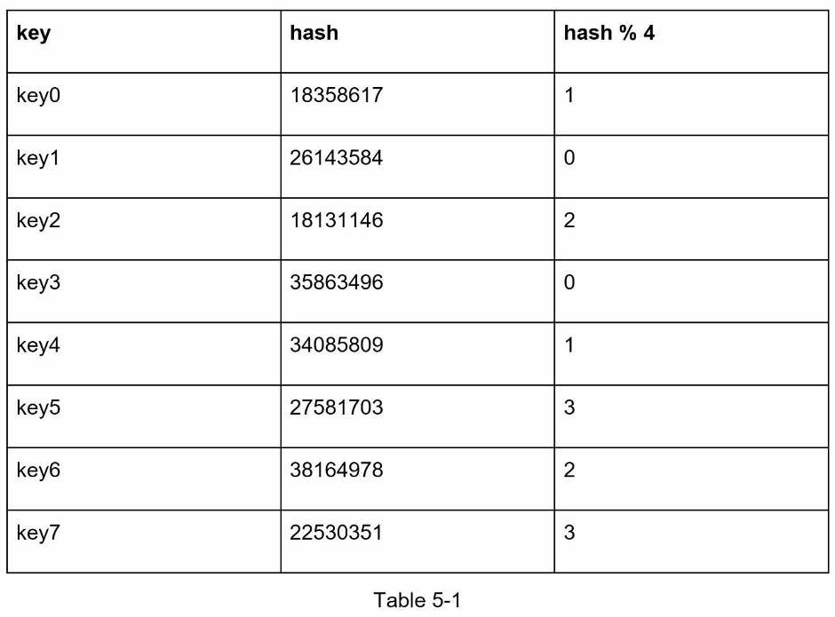

Bảng 5-1

Để tìm nạp server có khoá được lưu trữ, ta thực hiện phép chia lấy dư `f(key) % 4`. Ví dụ, `hash(key0) % 4 = 1` nghĩa là client phải liên hệ với server 1 để lấy dữ liệu được lưu trữ.

Ảnh 5-1, dưới mô tả sự phân tán khoá dựa vào bảng 5-1.

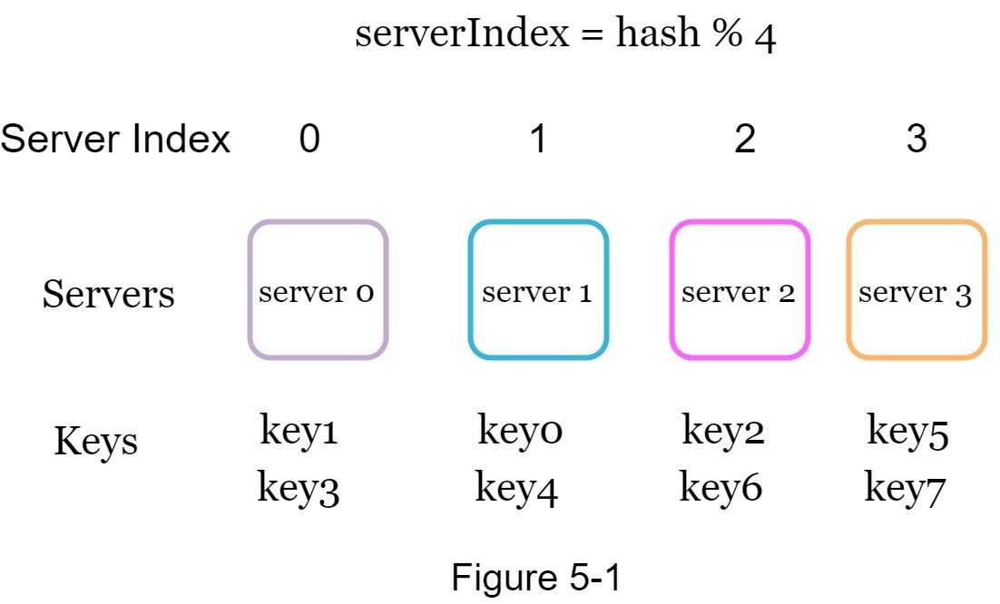

Cách tiếp cận này rất tốt khi kích cỡ server pool là cố định, và dữ liệu phân tán đồng nhất. Tuy nhiên, vấn đề nảy sinh khi một server mới được thêm vào hoặc một server đang tồn tại biến mất. Ví dụ, nếu server1 ngoại tuyến, kích cỡ server pool sẽ là 3. Sử dùng cùng hàm băm, ta nhận về cùng giá trị băm cho một khoá. Nhưng khi thực hiện chia lấy dư, ta nhận về chỉ mục server khác bởi vì số lượng server hiện tại đã giảm đi 1. Ta nhận được kết quả như sau khi thực hiện phép `hash%3`.

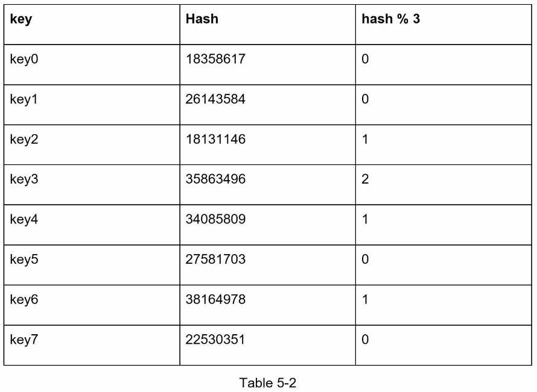

Bảng 5-2

Hình 5-2 là sự phân tán mới dựa trên bảng 5-2.

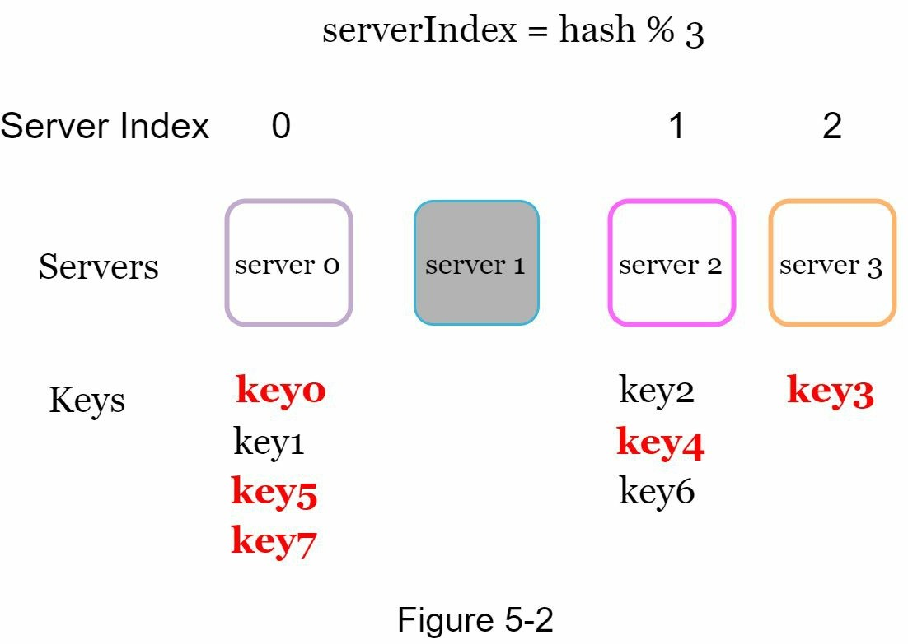

Như ảnh trên ta thấy không chỉ những khóa ban đầu được lưu trữ trong server ngoại tuyến (server 1) mà hầu hết các khoá đều được phân phối lại. Điều này có nghĩa là khi 1 server ngoại tuyến, hầu hết các bộ nhớ cache của client sẽ kết nối nhầm với các server khi tìm nạp dữ liệu. Điều này gây ra một cơn bão cho bộ nhớ cache. Hàm băm nhất quán là một kỹ thuật hiệu quả để giảm thiểu vấn đề này.

### Hàm băm nhất quán

> Hàm băm nhất quán là một kiểu băm mà khi bảng băm thay đổi kích thước thì chỉ có `k/n` khoá cần ánh xạ lại, trong đó k là số lượng khoá và n là số lượng suất. Ngược lại với bảng băm truyền thống, chỉ thay đổi số lượng suất dẫn đến tất cả các khoá bị ánh xạ lại.

## Không gian băm và vòng băm

Sau khi đã hiểu về định nghĩa hàm băm nhất quán ta cần tìm hiểu cách nó hoạt động. Ví dụ, hàm băm sử dụng SHA-1, và cho ra chuỗi output: x0, x1, x2, x3,... xn. Trong mật mã học, không gian băm của SHA-1 từ khoảng 0 đến 2^160-1. Có nghĩa là x0 ứng với 0 và xn ứng với 2^160-1, và tất cả giá trị băm khác trong khoảng giữa 0 đến 2^160-1.

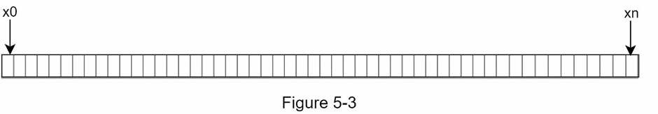

Cùng tập hợp trên, ta có biển diễn vòng băm như sau:

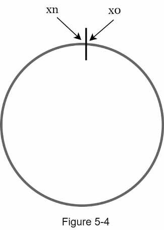

### Hash servers

Sử dụng cùng hàm băm, ta ánh xạ server dựa trên địa chỉ IP hoặc tên server lên trên vòng.

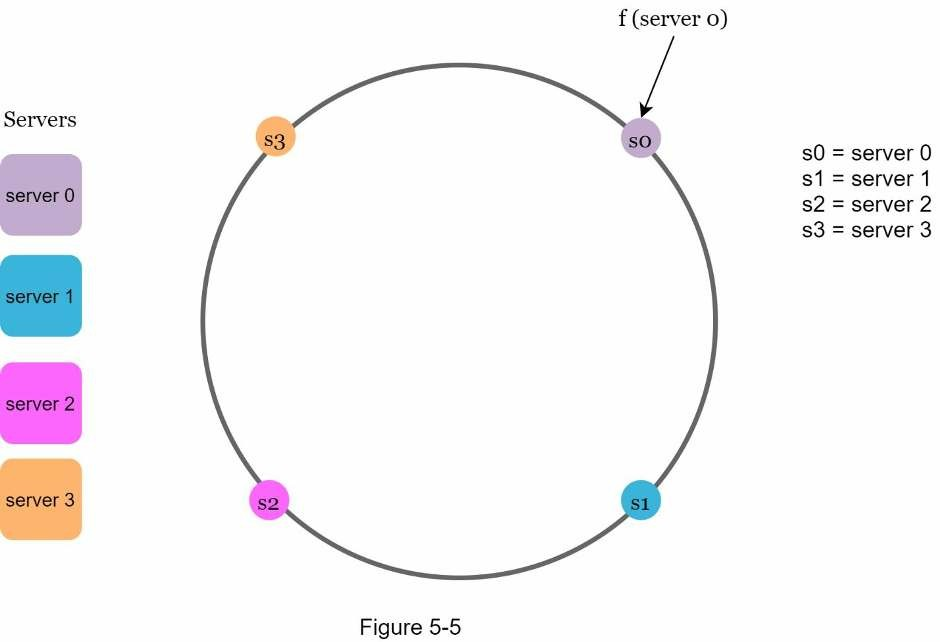

### Hash keys

Một điều đáng nói là hàm băm được sử dụng ở đây khác với hàm băm trong "vấn đề băm lại" và không có phép chia lấy dư. Như trong hình 5-6, 4 khóa bộ nhớ cache (key0, key1, key2 và key3) được băm vào.

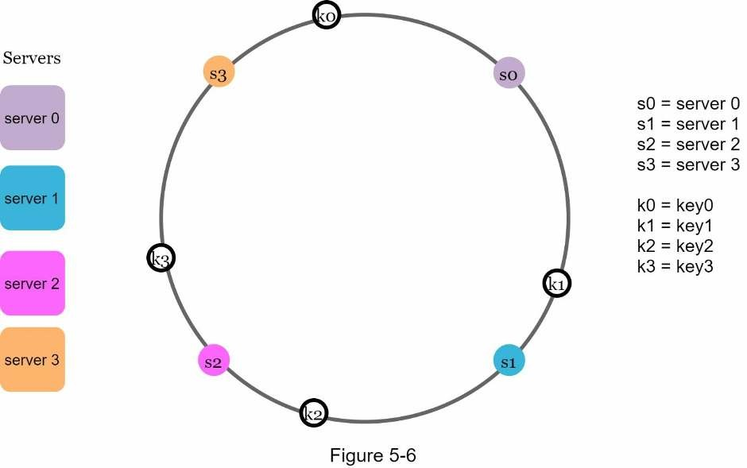

### Lưu vào server

Để xác định khóa sẽ được lưu trên server nào, chúng ta đi theo chiều kim đồng hồ từ vị trí khóa trên vòng cho đến khi tìm thấy server. Hình 5-7 giải thích quá trình này. Đi theo chiều kim đồng hồ, key0 được lưu trữ trên server 0; key1 được lưu trữ trên server 1; key2 được lưu trữ trên server 2 và key3 được lưu trữ trên server 3.

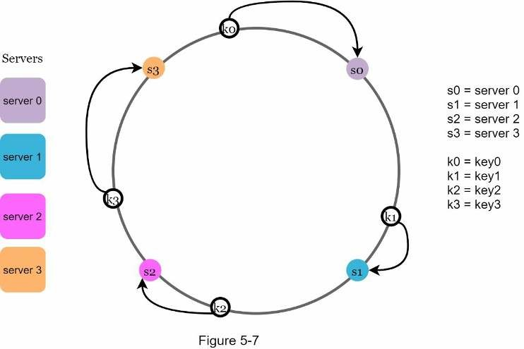

### Thêm server

Sử dụng logic được mô tả ở trên, việc thêm một server mới sẽ chỉ yêu cầu phân phối lại một phần nhỏ các khóa.

Trong hình 5-8 dưới đây, sau khi server 4 mới được thêm vào, chỉ cần phân phối lại key0. k1, k2 và k3 vẫn trên cùng một server. Hãy xem xét kỹ lưỡng logic. Trước khi server 4 được thêm, key0 được lưu trữ trên server 0. Bây giờ, key0 sẽ được lưu trữ trên server 4 vì server 4 là server đầu tiên nó gặp phải bằng cách đi theo chiều kim đồng hồ từ vị trí của key0 trên vòng. Các khóa khác không cần phân phối lại dựa trên thuật toán băm nhất quán.

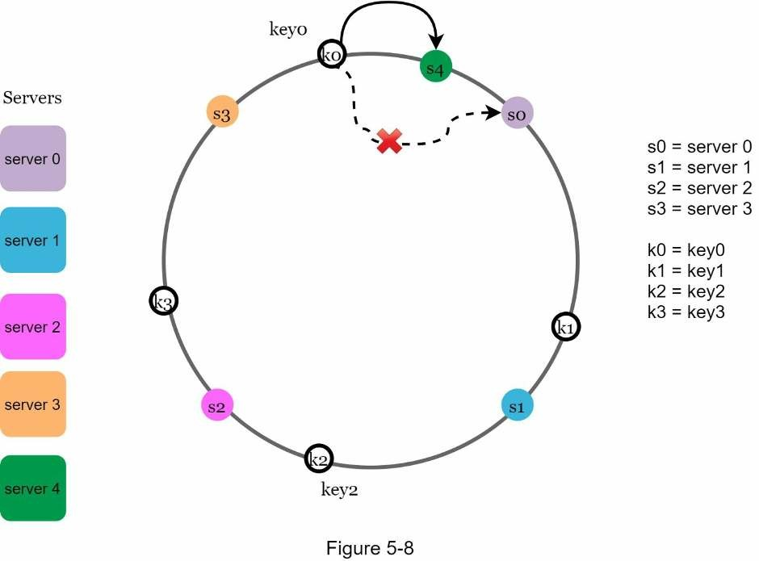

### Xoá server

Khi server bị xóa, chỉ một phần nhỏ các khóa yêu cầu phân phối lại với hàm băm nhất quán. Trong hình 5-9, khi server 1 bị loại bỏ, chỉ key1 được ánh xạ lại server 2. Phần còn lại của các khóa không bị ảnh hưởng.

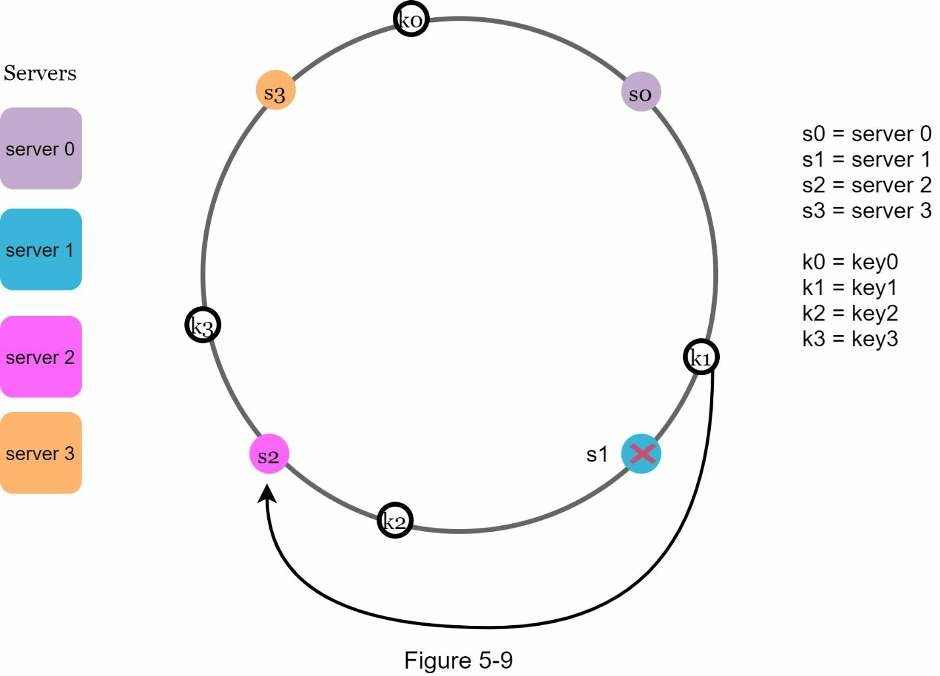

### Hai vấn đề trong giải pháp cơ bản

Thuật toán băm nhất quán được giới thiệu bởi Karger tại MIT [1] gồm hai bước cơ bản sau:
- Ánh xạ server và khoá lên vòng bằng cách sử dụng hàm băm phân phối đồng nhất.
- Tìm server và khoá được ánh xạ, đi theo chiều kim đồng hồ từ vị trị khoá cho đến khi tìm được server đầu tiên trên vòng.

Hai vấn đề được xác định với giải pháp này. Đầu tiên, là không thể giữ cùng kích thước phân đoạn trên vòng cho tất cả server khi mà chúng có thể được thêm vào hay xoá bỏ. Một phân đoạn là một không gian băm giữa hai server liền kề. Có thể các phân đoạn trên vòng cho từng server sẽ rất nhỏ hoặc rất lớn. Như hình 5-10 bên dưới, nếu s1 bị xoá, phân đoạn của s2 sẽ lớn gấp đôi so với phân đoạn của s0 và s3.

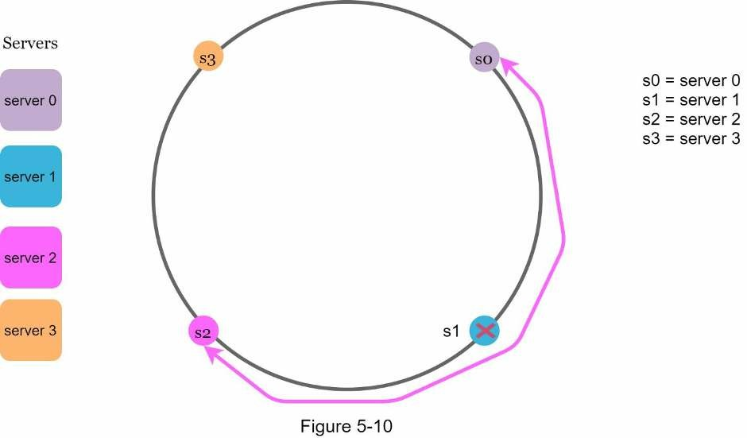

Thứ hai là có thể xảy ra phân phối khoá không đồng nhất trên vòng. Ví dụ, nếu server được ánh xạ đến các vị trí như hình 5-11, thì phần lớn khoá sẽ được lưu trữ trên server 2. Nhưng server 1 và 3 thì không có dữ liệu.

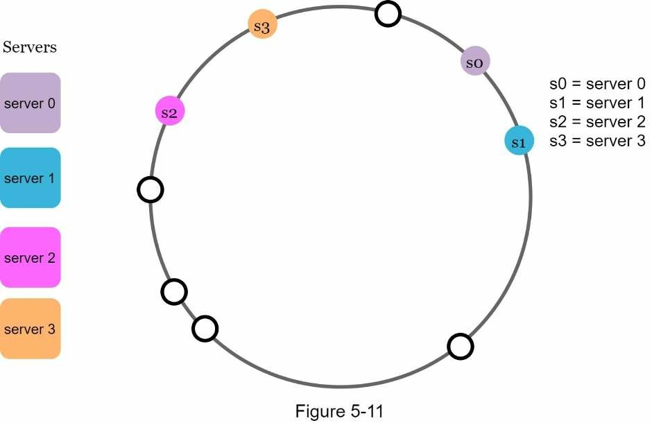

Một kỹ thuật gọi là *virtual nodes* hay bản sao để giải quyết các vấn đề này.

### Virtual nodes

Một virtual node - nút ảo đề cập đến một nút thật, và mỗi server được biểu diễn bằng nhiều virutal node trên vòng. Hình 5-12, cả server 0 và 1 đều có 3 virtual node. Con số 3 ở đây được chọn tùy ý; và trong các hệ thống thế giới thực số lượng các nút ảo lớn hơn nhiều.

Thay vì sử dụng s0, chúng ta có s0_0, s0_1 và s0_2 để đại diện cho server 0 trên vòng. Tương tự, s1_0, s1_1 và s1_2 đại diện cho server 1 trên vòng. Với các virtual node, mỗi server chịu trách nhiệm cho nhiều phân đoạn. Các phân đoạn (cạnh) có nhãn s0 được quản lý bởi server 0. Mặt khác, các phân đoạn có nhãn s1 được quản lý bởi server 1.

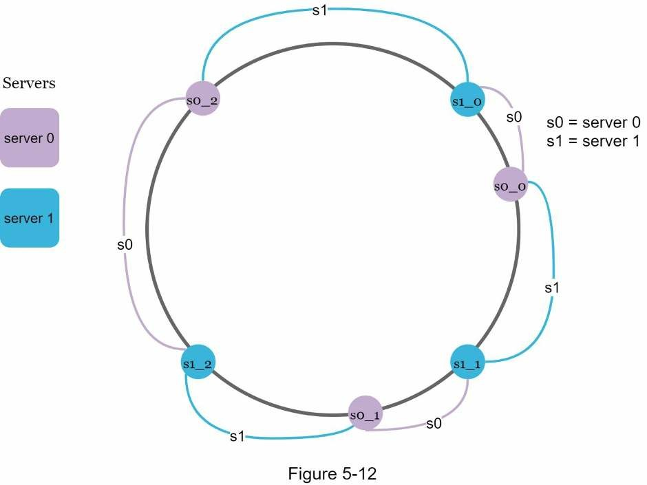

Để tìm server mà khoá được lưu, ta đi theo chiều kim đồng hồ từ vị trí khoá và tìm đến nút ảo đầu tiên trên vòng. Trong hình 5-13, để tìm server lưu khoá k0, ta đi từ vị trí k0 theo chiều kim đồng hồ đến nút ảo là s1_1, tức là server 1.

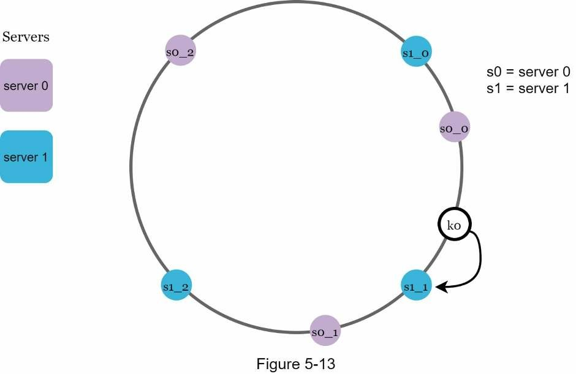

Khi số lượng các nút ảo tăng lên, sự phân bố các khóa trở nên cân bằng hơn.
Điều này là do độ lệch chuẩn nhỏ dần với nhiều nút ảo hơn, dẫn đến phân phối dữ liệu cân bằng. Độ lệch chuẩn được đo lường bằng các khảo sát dữ liệu. Kết quả của một thử nghiệm được thực hiện bởi nghiên cứu trực tuyến [2] cho thấy rằng với một hoặc hai trăm nút ảo, độ lệch chuẩn sẽ nằm giữa 5% (200 virtual node) và 10% (100 virtual node) của giá trị trung bình. Độ lệch chuẩn sẽ nhỏ hơn khi chúng ta tăng số lượng nút ảo. Tuy nhiên, điều này sẽ cần nhiều không gian hơn để lưu trữ dữ liệu về các nút ảo.

Đây là một sự cân bằng và chúng ta có thể điều chỉnh số lượng nút ảo để phù hợp với yêu cầu hệ thống.

### Tìm các khoá bị ảnh hưởng

Khi một server được thêm hoặc bị xoá, một phần dữ liệu cần phân phối lại. Vậy làm thế nào để ta tìm ra phạm vi khoá chịu ảnh hưởng để phân phối lại?

Trong hình 5-14, server 4 được thêm vào vòng. Phạm vi ảnh hưởng bắt đầu từ s4 (nút mới thêm vào) và đi ngược chiều kim đồng hồ cho đến khi thấy một server (s3). Do đó, khoá lưu trữ giữa s3 và s4 sẽ cần phân phối lại.

Khi server 1 bị xoá như hình 5-15, phạm vi ảnh hưởng từ s1 đi ngược chiều kim đồng hồ đến khi tìm thấy một server (s0). Do đó, khoá ở giữa s0 và s1 phải được phân phối lại đến s2.

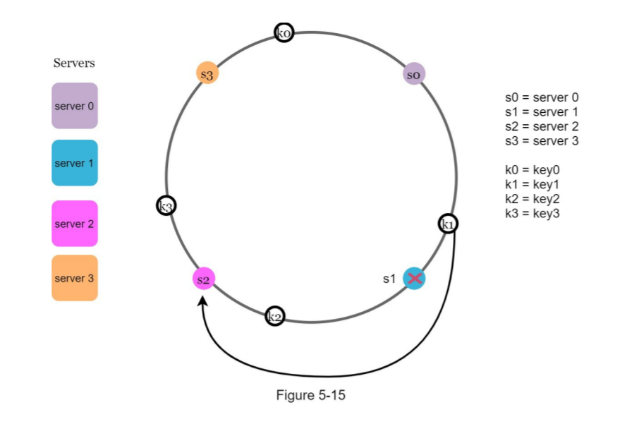

# Tổng kết

Trong chương này, chúng ta đã có một cuộc thảo luận chuyên sâu về băm nhất quán, bao gồm lý do tại sao cần nó và cách thức hoạt động của nó. Các lợi ích của băm nhất quán bao gồm:
- Các khóa thu nhỏ được phân phối lại khi server được thêm vào hoặc xóa.
- Dễ dàng mở rộng theo chiều ngang vì dữ liệu được phân bổ đồng đều hơn.
- Giảm thiểu sự cố hotspot key. Truy cập quá nhiều vào một phân đoạn cụ thể có thể gây ra tình trạng quá tải cho server. Hãy tưởng tượng dữ liệu của Katy Perry, Justin Bieber và Lady Gaga đều kết thúc trên cùng một phân đoạn. Hàm băm nhất quán giúp giảm thiểu vấn đề bằng cách phân phối dữ liệu đồng đều hơn.

Hàm băm nhất quán được sử dụng rộng rãi trong các hệ thống trong thế giới thực, bao gồm một số hệ thống đáng chú ý:
* Thành phần phân đoạn của cơ sở dữ liệu Amazon's Dynamo [3]
* Phân đoạn dữ liệu trên toàn bộ cụm trong Apache Cassandra [4]
* Ứng dụng trò chuyện Discord [5]
* Mạng phân phối nội dung Akamai [6]
* Bộ cân bằng tải mạng Maglev [7]

Chúc mừng bạn đã đạt được điều này đến nay! Bây giờ hãy tự vỗ về vai mình. Làm tốt lắm!

# Tham khảo

[1] Consistent hashing: https://en.wikipedia.org/wiki/Consistent_hashing

[2] Consistent Hashing: https://tom-e-white.com/2007/11/consistent-hashing.html

[3] Dynamo: Amazon’s Highly Available Key-value Store: https://www.allthingsdistributed.com/files/amazon-dynamo-sosp2007.pdf

[4] Cassandra - A Decentralized Structured Storage System: http://www.cs.cornell.edu/Projects/ladis2009/papers/Lakshman-ladis2009.PDF

[5] How Discord Scaled Elixir to 5,000,000 Concurrent Users: https://blog.discord.com/scaling-elixir-f9b8e1e7c29b

[6] CS168: The Modern Algorithmic Toolbox Lecture #1: Introduction and Consistent Hashing: http://theory.stanford.edu/~tim/s16/l/l1.pdf

[7] Maglev: A Fast and Reliable Software Network Load Balancer: https://static.googleusercontent.com/media/research.google.com/en//pubs/archive/44824.pdf
