# Chapter 6: Thiết Kế Bộ Lưu Trữ Key-Value

Bộ lưu trữ key-value, đề cập đến cơ sở dữ liệu key-value, là một loại cơ sở dữ liệu phi quan hệ. Mà mỗi định danh duy nhất được lưu trữ như một cặp khoá liên kết với một giá trị. Cặp dữ liệu này được biết đến là cặp "key-value".

Trong cặp "key-value", key (khoá) là duy nhất, và value (giá trị) liên kết với khoá có thể được truy cập thông qua khoá. Khoá có thể là dạng văn bản thuần hoặc được băm. Vì các vấn đề hiệu suất, nên khoá càng ngắn càng tốt. Ví dụ:
- Khoá dạng thuần: "last_logged_in_at"
- Khoá băm: 253DDEC4

Khoá có thể là chuỗi, danh sách, đối tượng,... Còn giá trị thường được xử lý như một đối tượng trong bộ lưu trữ key-value, như Amazon dynamo [1], Memcached [2], Redis [3],...
Đây là bảng dữ liệu mình hoạ trong bộ lưu trữ key-value:

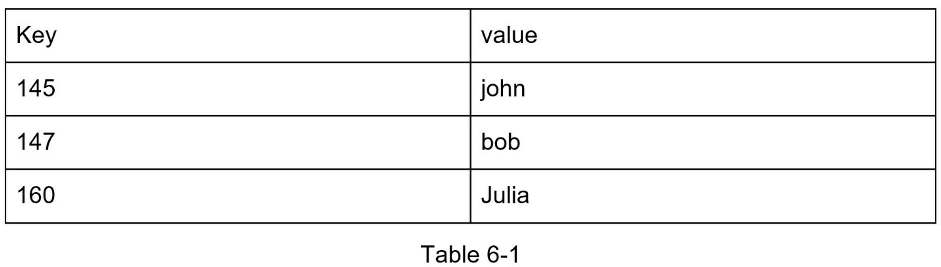

Ở chương này, ta sẽ tìm hiểu cách thiết kế bộ lưu trữ key-value, hỗ trợ các thao tác sau:
- put(key, value)   // chèn giá trị được liên kết với khoá
- get(key)          // lấy giá trị thông qua khoá

## 1. Hiểu vấn đề và thiết lập phạm vi

Không có thiết kế nào là hoàn hảo. Mỗi thiết kế đều có được sự cân bằng cụ thể về việc đọc, ghi và sử dụng bộ nhớ. Một sự cân bằng khác phải có được là sự cân bằng là giữa tính nhất quán và tính khả dụng. Trong chương này, chúng ta thiết kế một bộ lưu trữ key-value bao gồm các đặc điểm sau:
- Kích thước của cặp key-value nhỏ: dưới 10 KB.
- Khả năng lưu trữ dữ liệu lớn.
- Tính khả dụng cao: Hệ thống đáp ứng nhanh chóng, ngay cả khi có sự cố.
- Khả năng mở rộng cao: Hệ thống có thể được mở rộng để hỗ trợ tập dữ liệu lớn.
- Tự động mở rộng quy mô: Việc thêm/xóa các server phải tự động dựa trên lưu lượng truy cập.
- Tính nhất quán có thể điều chỉnh được.
- Độ trễ thấp.

### Server lưu trữ key-value duy nhất

Phát triển bộ lưu trữ key-value nằm trong một server duy nhất khá dễ dàng. Cách tiếp cận thông thường là lưu trữ cặp key-value trong một bảng băm, nó giữ mọi thứ trong bộ nhớ. Mặc dù truy cập bộ nhớ nhanh, nhưng việc đặt tất cả mọi thứ vào bộ nhớ có thể là bất khả thi vì không gian hạn chế. Hai cách tối ưu hoá có thể thực hiện để đặt vừa dữ liệu vào một server duy nhất là:
- Nén dữ liệu
- Chỉ lưu trữ dữ liệu thường xuyên dùng trong bộ nhớ phần còn lại lưu trên ổ đĩa.

### Bộ lưu trữ key-value phân tán

Một bộ lưu trữ key-value phân tán còn gọi là một bảng băm phân tán, nó phân tán các cặp key-value qua nhiều server. Khi thiết kế một hế thống phân tán, điều quan trọng là cần hiểu được định lý CAP.

#### Định lý CAP

Định lý CAP nói rằng không thể có hệ thống phân tán nào đồng thời cung cấp nhiều hơn hai trong ba tiêu chuẩn sau: tính nhất quán, tính khả dụng và dung sai phân vùng. Bây giờ ta sẽ đi thiết lập một vài định nghĩa.

- **Consistency:** tính nhất quán nghĩa là tất cả client xem cùng một dữ liệu tại cùng thời điểm bất kể họ kết nối với nút nào.
- **Availability:** tính khả dụng nghĩa là bất kỳ client nào yêu cầu dữ liệu cũng nhận về phản hồi kể cả khi một vài nút bị sập.
- **Partition Tolerance:** dung sai phân vùng biểu thị giao tiếp giữa các nút. Nó có nghĩa là hệ thống tiếp tục hoạt động bất chấp các phân vùng mạng.

Định lý CAP nói rằng phải hy sinh một trong ba thuộc tính phải để hỗ trợ 2 thuộc tính còn lại, Hình 6-1.

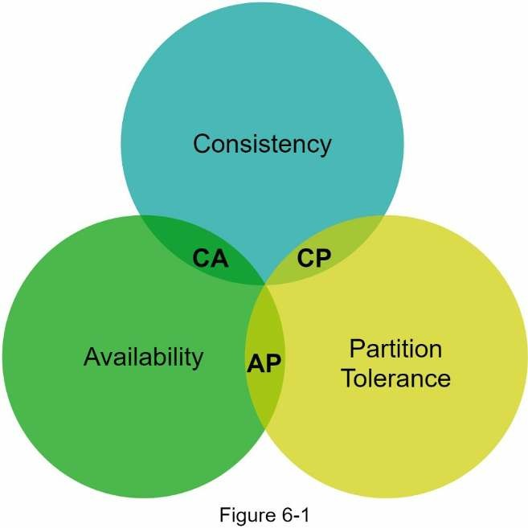

Ngày nay, các bộ lưu trữ key-value được phân loại dựa trên hai đặc trưng CAP mà chúng hỗ trợ:

- **Hệ thống CP:** bộ lưu trữ key-value CP hỗ trợ tính nhất quán và dung sai phân vùng trong khi hy sinh tính khả dụng.
- **Hệ thống AP:** bộ lưu trữ key-value AP hỗ trợ tính khả dụng và dung sai phân vùng trong khi hy sinh tính nhất quán.
- **Hệ thống CA:** bộ lưu trữ key-value CA hỗ trợ tính nhất quán và tính khả dụng trong khi hy sinh dung sai phân vùng.

Vì lỗi mạng là không thể tránh khỏi, một hệ thống phân tán phải chịu đựng được phân vùng mạng. Do đó, hệ thống CA không thể tồn tại trong các ứng dụng thế giới thực.
Những gì bạn đọc ở trên chủ yếu là phần định nghĩa. Để dễ hiểu hơn, chúng ta hãy xem qua một số ví dụ cụ thể. Trong hệ thống phân tán, dữ liệu thường được sao chép nhiều lần. Giả sử dữ liệu được sao chép trên ba nút bản sao, n1, n2 và n3 như trong Hình 6-2.

#### Tình huống lý tưởng

Trong thế giới lý tưởng, phân vùng mạng không bao giờ xảy ra. Dữ liệu được ghi vào n1 được tự động sao chép sang n2 và n3. Cả tính nhất quán và tính khả dụng đều đạt được.

#### Hệ thống phân tán thế giới thực

Trong hệ thống phân tán, không thể tránh khỏi phân vùng mạng, và khi phân vùng xảy ra, chúng ta phải lựa chọn giữa tính nhất quán và tính khả dụng. Trong hình 6-3, n3 đi xuống và không thể giao tiếp với n1 và n2. Nếu client ghi dữ liệu vào n1 hoặc n2, dữ liệu không thể được truyền tới n3. Nếu dữ liệu được ghi vào n3 nhưng chưa được truyền tới n1 và n2, n1 và n2 sẽ có dữ liệu cũ.

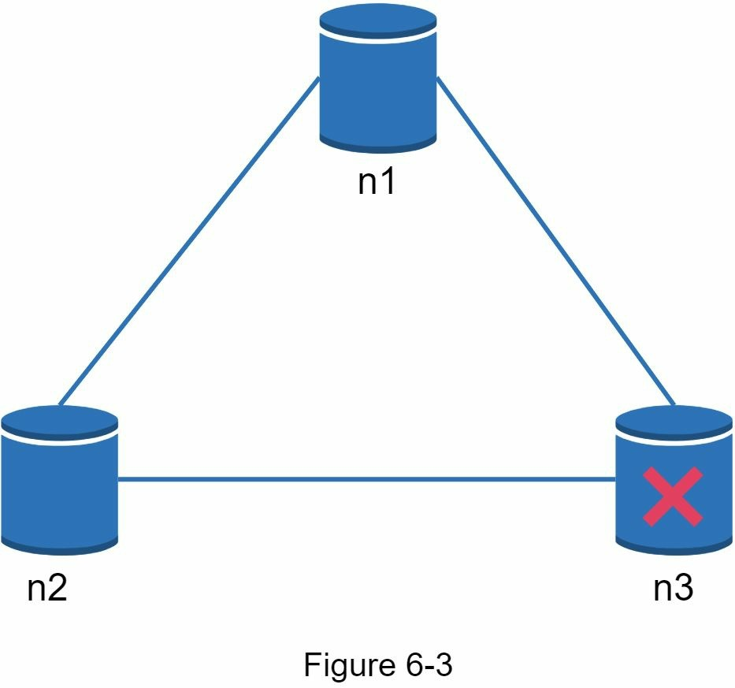

Nếu chúng ta chọn tính nhất quán so với tính khả dụng (hệ thống CP), chúng ta phải chặn tất cả các thao tác ghi vào n1 và n2 để tránh sự mâu thuẫn dữ liệu giữa ba server này, khiến hệ thống không khả dụng. Hệ thống ngân hàng thường có yêu cầu nhất quán rất cao. Ví dụ: điều quan trọng đối với hệ thống ngân hàng là hiển thị thông tin số dư cập nhật gần nhất. Nếu sự không nhất quán xảy ra do phân vùng mạng, hệ thống ngân hàng sẽ trả về lỗi trước khi sự không nhất quán được giải quyết.

Tuy nhiên, nếu chúng ta chọn tính khả dụng hơn tính nhất quán (hệ thống AP), hệ thống sẽ tiếp tục chấp nhận các lần đọc, mặc dù nó có thể trả về dữ liệu cũ. Để ghi, n1 và n2 sẽ tiếp tục chấp nhận ghi và dữ liệu sẽ được đồng bộ hóa với n3 khi phân vùng mạng được giải quyết.

Đảm bảo việc chọn đúng CAP phù hợp với trường hợp sử dụng của bạn là một bước quan trọng trong việc xây dựng một bộ lưu trữ key-value phân tán. Bạn có thể thảo luận vấn đề này với người phỏng vấn và thiết kế hệ thống cho phù hợp.

### Thành phần hệ thống

Ở chương này, ta sẽ thảo luận về các thành phần và kỹ thuật cốt lõi để xây dựng bộ lưu trữ key-value:
* Phân vùng dữ liệu
* Sao chép dữ liệu
* Tính nhất quán
* Giải pháp không nhất quán
* Xử lý thất bại
* Sơ đồ kiến trúc hệ thống
* Thao tác đọc
* Thao tác ghi

Nội dung bên dưới chủ yếu dựa trên các hệ thống bộ lưu trữ key-value phổ biến: Dynamo [4], Cassandra [5] và BigTable [6].

### Phân vùng dữ liệu

Đối với các ứng dụng lớn, không thể đặt vừa một tập dữ liệu hoàn chỉnh trong một server đơn. Cách đơn giản nhất để thực hiện điều này là chia dữ liệu thành các phân vùng nhỏ hơn và lưu trữ chúng trong nhiều server. Có hai thách thức khi phân vùng dữ liệu:
* Phân phối đồng đều dữ liệu trên nhiều server.
* Giảm thiểu sự di chuyển dữ liệu khi các nút được thêm vào hoặc loại bỏ.
Phép băm nhất quán được thảo luận trong chương 5 là một kỹ thuật tuyệt vời để giải quyết những vấn đề này. Bây giờ chúng ta sẽ xem lại cách hoạt động của băm nhất quán ở high-level.
- Đầu tiên, các server được đặt trên một vòng băm. Trong hình 6-4, tám server, được đại diện bởi s0, s1,…, s7, được đặt trên vòng băm.
- Tiếp theo, một khóa được băm vào cùng một vòng và nó được lưu trữ trên server đầu tiên mà nó gặp phải khi di chuyển theo chiều kim đồng hồ. Ví dụ, key0 được lưu trữ trong s1 bằng cách sử dụng logic này.

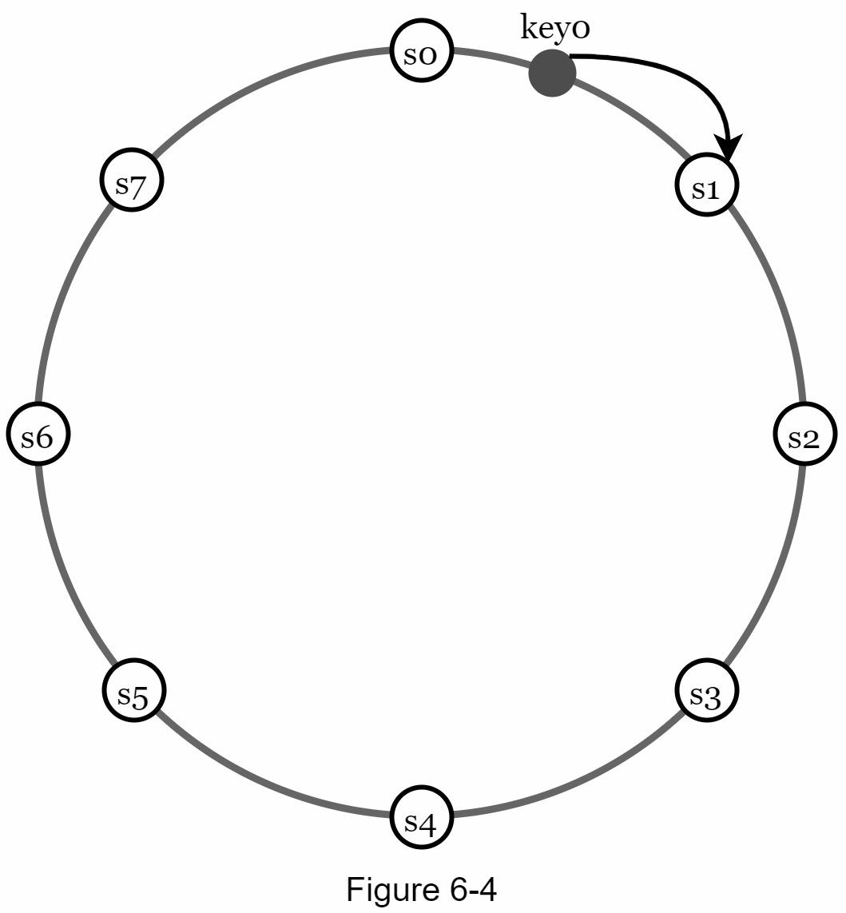

Sử dụng băm nhất quán để phân vùng dữ liệu có những ưu điểm sau:
- Tự động mở rộng quy mô: các server có thể được thêm và xóa tự động tùy thuộc vào tải.
- Tính không đồng nhất: số lượng nút ảo của một server tỷ lệ với khả năng của server.

Ví dụ, các server có dung lượng cao hơn được chỉ định với nhiều nút ảo hơn.

### Sao chép dữ liệu

Để đạt được tính khả dụng và độ tin cậy cao, dữ liệu phải được sao chép bất đồng bộ qua N server, trong đó N là tham số có thể cấu hình. N server này được chọn theo logic sau: sau khi một khóa được ánh xạ tới một vị trí trên vòng băm, từ vị trí đó đi theo chiều kim đồng hồ và chọn N server đầu tiên trên vòng để lưu trữ các bản sao dữ liệu. Trong Hình 6-5 (N = 3), key0 được sao chép tại s1, s2 và s3.

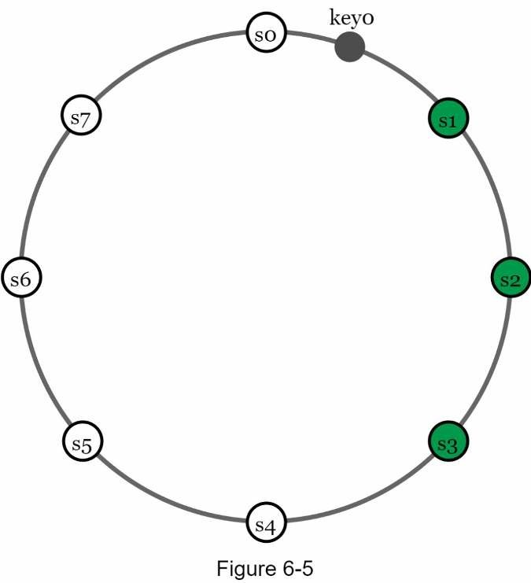

Với nút ảo, N nút đầu tiên trên vòng sẽ ít hơn N server thực. Để tránh điều này, ta chọn server không trùng khi thực hiện di chuyển theo chiều kim đồng hồ.

Các nút trong cùng một trung tâm dữ liệu thường bị lỗi đồng thời do mất điện, sự cố mạng, thiên tai,... Để có độ tin cậy tốt hơn, các bản sao nên được đặt trong các trung tâm dữ liệu riêng biệt và các trung tâm dữ liệu được kết nối thông qua mạng tốc độ cao.

### Tính nhất quán

Vì dữ liệu được sao chép tại nhiều nút, nên nó phải được đồng bộ hóa giữa các bản sao. Số lượng đồng thuận tối thiểu có thể đảm bảo tính nhất quán cho cả hoạt động đọc và ghi. Trước tiên, hãy thiết lập một vài định nghĩa.

- N = số lượng bản sao
- W = Một đại diện ghi có kích thước W. Để một thao tác ghi được coi là thành công, thao tác ghi phải được thừa nhận từ các bản sao W.
- R = Một đại diện đọc có kích thước R. Để một thao tác đọc được coi là thành công, thao tác ghi phải được thừa nhận từ các bản sao R.

Ví dụ với N = 3

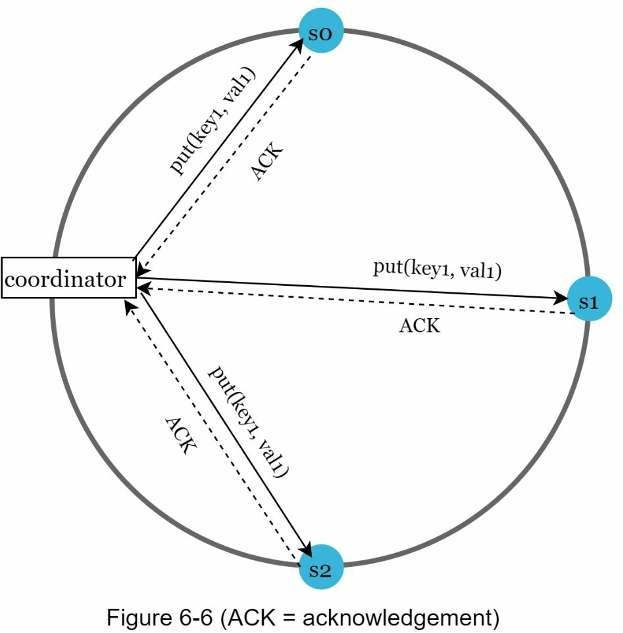

W = 1 không có nghĩa là dữ liệu sẽ được ghi trên một server. Ví dụ, với cấu hình trên (hình 6-6), dữ liệu được sao chép ở s0, s1 và s2. W = 1 nghĩa là `coordinator` phải nhận ít nhất một ACK trước khi thực hiện thao tác ghi thành công. Ví dụ, nếu ta nhận một ACK từ s1, ta không cần đợi ACK từ s0 và s2. `Coordinator` sẽ hành động như một proxy giữa client và nút.

Cấu hình của W, R và N là sự cân bằng điển hình giữa độ trễ và tính nhất quán. Nếu W = 1 hoặc R = 1, thao tác được trả về nhanh chóng vì một `coordinator` chỉ cần đợi phản hồi từ bất kỳ bản sao nào. 

Nếu W hoặc R > 1, hệ thống cung cấp tính nhất quán tốt hơn, tuy nhiên truy vấn sẽ chậm hơn vì `coordinator` phải đợi phản hồi từ một bản sao chậm nhất.

Nếu W + R > N, tính nhất quán được đảm bảo mạnh mẽ vì phải có ít nhất một nút chồng chéo có dữ liệu mới nhất để đảm bảo tính nhất quán.

Làm cách nào để cấu hình N, W và R phù hợp với trường hợp của ta? Ở đây ta có vài thiết lập khả thi:
- Nếu R = 1 và W = N, hệ thống được tối ưu hoá cho việc đọc nhanh.
- Nếu W = 1 và R = N, hệ thống được tối ưu hoá cho việc ghi nhanh.
- Nếu W + R > N, tính nhất quán mạnh mẽ (thường N = 3, W = R = 2).
- Nếu W + R <= N, tính nhất quán không mạnh mẽ.

Tùy theo yêu cầu, chúng ta có thể điều chỉnh các giá trị W, R, N để đạt được mức độ nhất quán mong muốn.

### Mô hình nhất quán

Mô hình nhất quán là một nhân tố khác cần xem xét khi thiết kế một bộ lưu trữ key-value. Một mô hình nhất quán định nghĩa mức độ nhất quán của dữ liệu, và tồn tại nhiều mô hình nhất quán có thể có:
- Tính nhất quán cao: bất kỳ thao tác đọc nào đều trả về một giá trị tương ứng với kết quả của mục dữ liệu ghi được cập nhật gần nhất. Client không bao giờ thấy dữ liệu lỗi thời/cũ.
- Tính nhất quán yếu: các thao tác đọc tiếp theo có thể không thấy giá trị cập nhật gần nhất.
- Tính nhất quán sau cùng: đây là một dạng cụ thể của tính nhất quán yếu. Cho đủ thời gian, tất cả các bản cập nhật sẽ được lan truyền và tất cả các bản sao đều nhất quán.

Tính nhất quán cao thường đạt được bằng cách buộc một bản sao không chấp nhận các lần đọc/ghi mới cho đến khi mọi bản sao đã đồng ý về việc ghi hiện tại. Cách tiếp cận này không lý tưởng cho các hệ thống có tính khả dụng cao vì nó có thể chặn các hoạt động mới. Dynamo và Cassandra áp dụng tính nhất quán sau cùng, đây là mô hình nhất quán được đề xuất cho bộ lưu trữ key-value của chúng ta. Từ việc ghi đồng thời, tính nhất quán sau cùng cho phép các giá trị không nhất quán xâm nhập vào hệ thống và buộc client phải đọc các giá trị để đối chiếu. Phần tiếp theo giải thích cách điều chỉnh hoạt động với versioning.

### Giải pháp không nhất quán: versioning

Sao chép mang lại tính khả dụng cao nhưng gây ra sự không nhất quán giữa các bản sao. Versioning và vector clock được sử dụng để giải quyết các vấn đề không nhất quán. Versioning có nghĩa là coi mỗi sửa đổi dữ liệu là một phiên bản dữ liệu bất biến mới. Trước khi nói về versioning, chúng ta hãy sử dụng một ví dụ để giải thích sự không nhất quán xảy ra như thế nào:

Trong hình 6-7, cả hai nút bản sao n1 và n2 có cùng giá trị. Ta gọi giá trị này là giá trị gốc. Server 1 và server 2 nhận cùng giá trị cho thao tác *get("name")*.

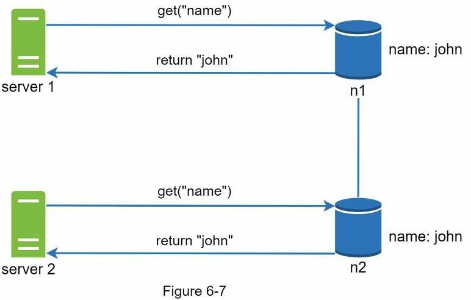

Kế tiếp, server 1 thay đổi tên thành "johnSanFrancisco", và server2 đổi tên thành "johnNewYork" như hình 6-8. Hai thay đổi này được thực hiện đồng thời. Bây giờ, chúng ta có các giá trị xung đột được gọi là phiên bản v1 và v2.

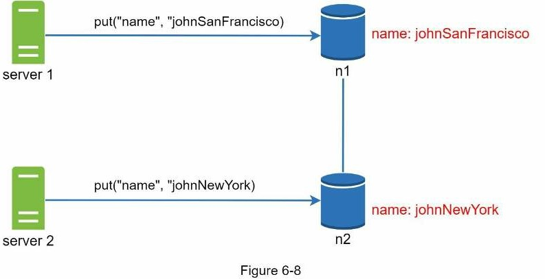

Trong ví dụ này, giá trị ban đầu có thể bị bỏ qua vì các sửa đổi dựa trên giá trị đó. Tuy nhiên, không có cách nào rõ ràng để giải quyết xung đột của hai phiên bản cuối cùng. Để giải quyết vấn đề này, chúng ta cần một hệ thống tạo lập phiên bản có thể phát hiện và giải quyết xung đột. Vector clock là một kỹ thuật phổ biến để giải quyết vấn đề này. Bây giờ hãy kiểm tra cách hoạt động của vector clock.

Một vector clock là một cặp **[server, version]** liên kết với một mục dữ liệu. Nó có thể dùng để kiểm tra nếu một phiên bản đi trước, thành công hoặc xung đột với phiên bản khác.

Giả sử vector clock được biểu diễn bằng `D([S1, v1], [S2, v2],…, [Sn, vn])`, trong đó *D* là mục dữ liệu, *v1* là bộ đếm phiên bản và *s1* là số server,... Nếu mục dữ liệu *D* được ghi vào server *Si*, hệ thống phải thực hiện một trong các tác vụ sau.
- Tăng `vi` nếu tồn tại `[Si, vi]`.
- Nếu không, hãy tạo một mục mới `[Si, 1]`.

Logic trừu tượng trên được giải thích bằng một ví dụ cụ thể như trong Hình 6-9.

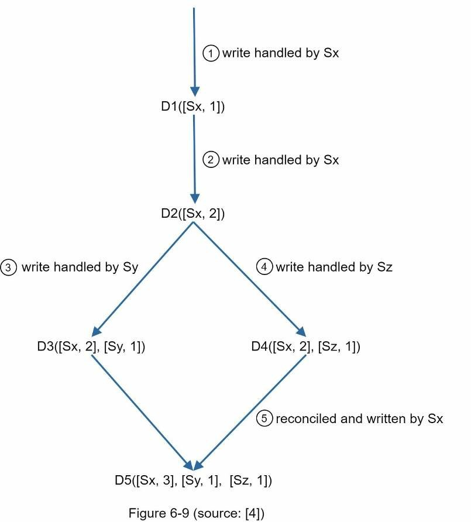

1. Một client ghi một mục dữ liệu D1 vào hệ thống và việc ghi được xử lý bởi server Sx, hiện có vector clock `D1[(Sx, 1)]`.
2. Một client khác đọc D1 mới nhất, cập nhật nó lên D2 và viết nó trở lại. D2 đi xuống từ D1 nên nó ghi đè lên D1. Giả sử việc ghi được xử lý bởi cùng một server Sx, hiện có vector clock `D2([Sx, 2])`.
3. Một client khác đọc D2 mới nhất, cập nhật nó lên D3 và viết nó trở lại. Giả sử việc ghi được xử lý bởi server Sy, hiện có vector clock `D3([Sx, 2], [Sy, 1]))`.
4. Một client khác đọc D2 mới nhất, cập nhật nó lên D4 và viết lại. Giả sử việc ghi được xử lý bởi server Sz, hiện có `D4([Sx, 2], [Sz, 1]))`.
5. Khi một client khác đọc D3 và D4, nó phát hiện ra xung đột, nguyên nhân là do mục dữ liệu D2 bị cả Sy và Sz sửa đổi. Xung đột được giải quyết bởi client và dữ liệu cập nhật được gửi đến server. Giả sử việc ghi được xử lý bởi Sx, bây giờ có
`D5([Sx, 3], [Sy, 1], [Sz, 1])`. Chúng ta sẽ giải thích cách phát hiện xung đột ngay sau đây.

Sử dụng vector clock, thật dễ dàng để nói rằng một phiên bản X là một tổ tiên (tức là không có xung đột) của phiên bản Y nếu các bộ đếm phiên bản(vi) cho mỗi thành phần tham gia trong vector clock của Y lớn hơn hoặc bằng với X. Ví dụ, vector clock `D([s0, 1], [s1, 1])]` là tổ tiên của `D([s0, 1], [s1, 2])`. Do đó, không có xung đột được ghi lại.

Tương tự, bạn có thể nói rằng một phiên bản X là anh chị em (tức là có tồn tại xung đột) của Y nếu có bất kỳ thành phần tham gia nào trong vector clock của Y có bộ đếm nhỏ hơn hoặc bằng so với X. Ví dụ: hai sau vector clock cho biết có xung đột: `D([S0, 1], [S1, 2])` và `D([S0, 2], [S1, 1])`.

Mặc dù vector clock có thể giải quyết xung đột, nhưng nó có hai nhược điểm đáng chú ý. Đầu tiên, vector clock thêm độ phức tạp cho client vì nó cần thực hiện logic giải quyết xung đột.

Thứ hai, các cặp *[server: version]* trong vector clock có thể phát triển nhanh chóng. Để khắc phục sự cố này, chúng ta đặt một ngưỡng cho độ dài và nếu nó vượt quá giới hạn, các cặp cũ nhất sẽ bị xóa. Điều này có thể dẫn đến sự thiếu hiệu quả trong việc giải quyết xung đột vì các mối quan hệ về sau không thể được xác định chính xác. Tuy nhiên, dựa trên Dynamo [4], Amazon vẫn chưa gặp phải vấn đề này trong thực tế. Do đó, nó có lẽ là một giải pháp được chấp nhận cho hầu hết các công ty.

### Xử lý thất bại

Khi một hệ thống lớn được mở rộng, thất bại là không thể tránh khỏi và nó còn rất phổ biến. Kịch bản cho xử lý thất bại là rất quan trọng, trong chương này ta sẽ giới thiệu kỹ thuật phát hiện thất bại và tìm giải pháp khác phục chung.

#### Phát hiện thất bại

Trong một hệ thống phân tán, không đủ để tin rằng một server không hoạt động vì một server khác nói như vậy. Thông thường, nó yêu cầu ít nhất hai nguồn thông tin độc lập để đánh dấu một server ngừng hoạt động.

Như thể hiện trong Hình 6-10, multicasting all-to-all là một giải pháp đơn giản. Tuy nhiên, điều này không hiệu quả khi có nhiều server trong hệ thống.

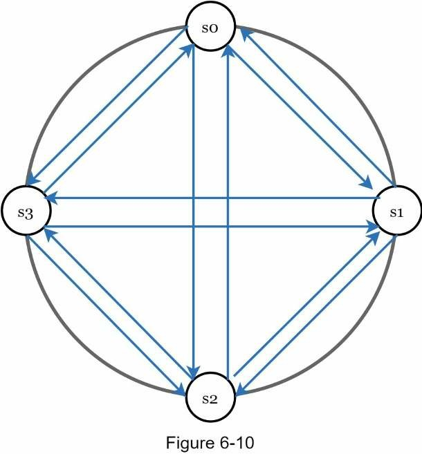

Một giải pháp tốt hơn là sử dụng các phương pháp phát hiện thất bại phi tập trung như giao thức Gossip.
Giao thức Gossip hoạt động như sau:
- Mỗi nút duy trì danh sách thành viên nút, chứa ID thành viên và bộ đếm heartbeat.
- Mỗi nút tăng định kỳ để tăng bộ đếm heartbeat của nó.
- Mỗi nút định kỳ gửi heartbeat đến một tập hợp các nút ngẫu nhiên, lần lượt truyền sang một tập nút khác.
- Khi các nút nhận được heartbeat, danh sách thành viên được cập nhật lên thông tin mới nhất.
- Nếu heartbeat không tăng lên so với các giai đoạn đã xác định trước, thành viên được coi là ngoại tuyến.

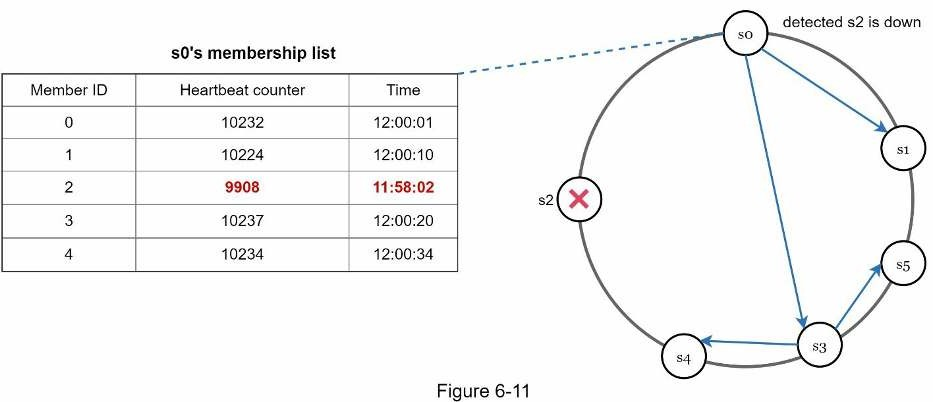

Như hình 6-11:
- Nút s0 duy trì một danh sách thành viên ở bên trái.
- Nút s0 thông báo với bộ đếm heartbeat của nút s2 (ID = 2) đã không tăng lên trong một thời gian dài.
- Nút s0 gửi heartbeat bao gồm thông tin s2 cho một tập hợp nút ngẫu nhiên. Sau khi các nút khác xác nhận heartbeat của nút s2 đã không được cập nhật trong thời gian dài, s2 được đánh dấu là sập, và thông tin được lan truyền cho các nút khác.

#### Xử lý thất bại tạm thời

Sau khi các lỗi được phát hiện thông qua giao thức Gossip, hệ thống cần triển khai các cơ chế nhất định để đảm bảo tính khả dụng. Trong phương pháp tiếp cận tối thiểu nghiêm ngặt, các thao tác đọc và ghi có thể bị chặn như được minh họa trong phần số lượng đồng thuận tối thiểu.

Một kỹ thuật được gọi là "sloppy quorum" [4] được sử dụng để cải thiện tính khả dụng. Thay vì thực thi yêu cầu số đại biểu, hệ thống chọn server W khỏe mạnh đầu tiên để ghi và server R khỏe mạnh đầu tiên để đọc trên vòng băm. Server ngoại tuyến bị bỏ qua.

Nếu một server không khả dụng do lỗi mạng hoặc sập, một server khác sẽ tạm thời xử lý các yêu cầu. Khi server hoạt động trở lại, các thay đổi sẽ được đẩy lùi để đạt được tính nhất quán của dữ liệu. Quá trình này được gọi là chuyển giao gợi ý. Vì s2 không có trong Hình 6-12 nên việc đọc và ghi sẽ do s3 tạm thời xử lý. Khi s2 trực tuyến trở lại, s3 sẽ giao lại dữ liệu cho s2.

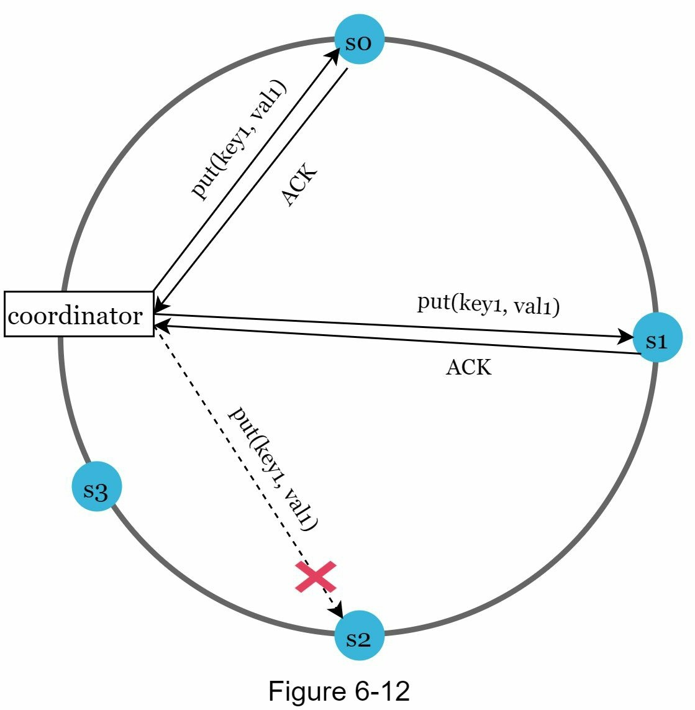

#### Xử lý các lỗi vĩnh viễn

Xử lý gợi ý được sử dụng để xử lý các lỗi tạm thời. Điều gì sẽ xảy ra nếu một bản sao vĩnh viễn không có sẵn? Để xử lý tình huống như vậy, chúng tôi triển khai một giao thức chống entropy để giữ cho các bản sao được đồng bộ hóa. Anti-entropy liên quan đến việc so sánh từng phần dữ liệu trên các bản sao và cập nhật từng bản sao lên phiên bản mới nhất. Cây Merkle được sử dụng để phát hiện sự không nhất quán và giảm thiểu lượng dữ liệu được truyền.

Trích dẫn từ Wikipedia [7]: "Cây băm hay cây Merkle là một cây trong đó mọi nút không phải là lá được gắn nhãn bằng băm của các nhãn hoặc giá trị (trong trường hợp là lá) của các nút con của nó. Cây băm cho phép xác minh hiệu quả và an toàn nội dung của cấu trúc dữ liệu lớn". Giả sử không gian chính là từ 1 đến 12, các bước sau đây trình bày cách xây dựng cây Merkle. Các hộp được đánh dấu cho biết sự không nhất quán.

Bước 1: Chia không gian khóa thành các nhóm (trong ví dụ của chúng ta là 4) như trong Hình 6-13. Một thùng được sử dụng làm nút cấp gốc để duy trì độ sâu giới hạn của cây.

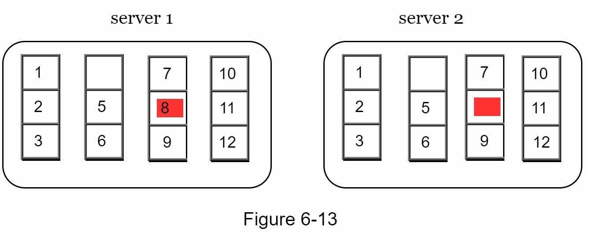

Bước 2: Sau khi các nhóm được tạo, hãy băm từng khóa trong một nhóm bằng phương pháp băm thống nhất (Hình 6-14).

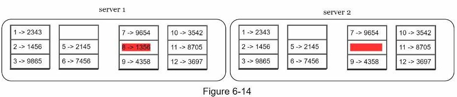

Bước 3: Tạo một nút băm duy nhất cho mỗi nhóm (Hình 6-15).

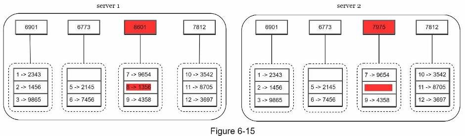

Bước 4: Xây dựng cây hướng lên phía trên cho đến gốc bằng cách tính số băm con (Hình 6-16).

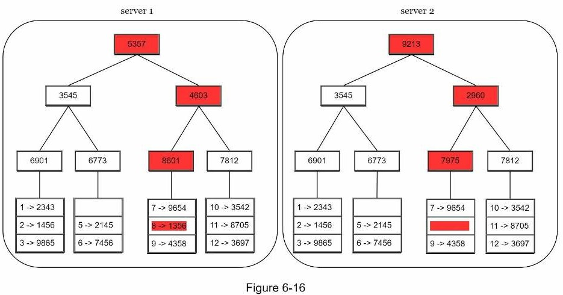

Để so sánh hai cây Merkle, hãy bắt đầu bằng cách so sánh các hàm băm gốc. Nếu hàm băm gốc khớp nhau, cả hai máy chủ đều có cùng dữ liệu. Nếu các hàm băm gốc không đồng ý, thì các hàm băm con bên trái được so sánh với các hàm băm con bên phải. Bạn có thể đi ngang qua cây để tìm nhóm nào không được đồng bộ hóa và chỉ đồng bộ hóa các nhóm đó.
 
Sử dụng cây Merkle, lượng dữ liệu cần được đồng bộ hóa tỷ lệ thuận với sự khác biệt giữa hai bản sao chứ không phải lượng dữ liệu mà chúng chứa. Trong các hệ thống thế giới thực, kích thước thùng khá lớn. Ví dụ: một cấu hình có thể là một triệu
nhóm trên một tỷ khóa, vì vậy mỗi nhóm chỉ chứa 1000 khóa.

#### Xử lý sự cố trung tâm dữ liệu.

Trung tâm dữ liệu ngừng hoạt động có thể xảy ra do mất điện, mất mạng, thiên tai, ... Để xây dựng một hệ thống có khả năng xử lý sự cố trung tâm dữ liệu, điều quan trọng là phải nhân rộng dữ liệu trên nhiều trung tâm dữ liệu. Ngay cả khi một trung tâm dữ liệu hoàn toàn ngoại tuyến, người dùng vẫn có thể truy cập dữ liệu thông qua các trung tâm dữ liệu khác.

### Sơ đồ kiến trúc hệ thống

Bây giờ chúng ta đã thảo luận về các cân nhắc kỹ thuật khác nhau trong việc thiết kế cửa hàng khóa-giá trị, chúng ta có thể chuyển trọng tâm sang sơ đồ kiến trúc, được thể hiện trong Hình 6-17.

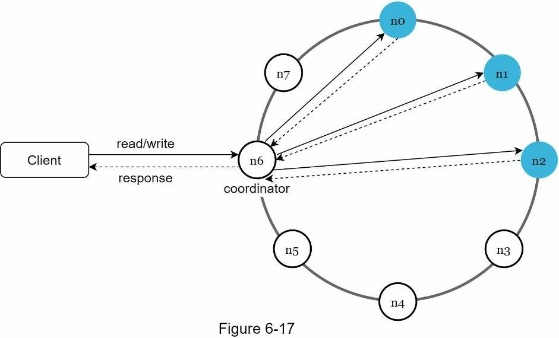

Các đặc điểm chính của kiến trúc được liệt kê như sau:
* Khách hàng giao tiếp với kho khóa-giá trị thông qua các API đơn giản: nhận (khóa) và đặt (khóa, giá trị).
* Bộ điều phối là một nút hoạt động như một proxy giữa máy khách và kho khóa-giá trị.
* Các nút được phân phối trên một vòng bằng cách sử dụng băm nhất quán.
* Hệ thống hoàn toàn phi tập trung nên việc thêm và di chuyển các nút có thể tự động.
* Dữ liệu được sao chép tại nhiều nút.
* Không có điểm lỗi nào vì mọi nút đều có cùng một bộ trách nhiệm.

Khi thiết kế được phân cấp, mỗi nút thực hiện nhiều nhiệm vụ như được trình bày trong Hình 6-18.

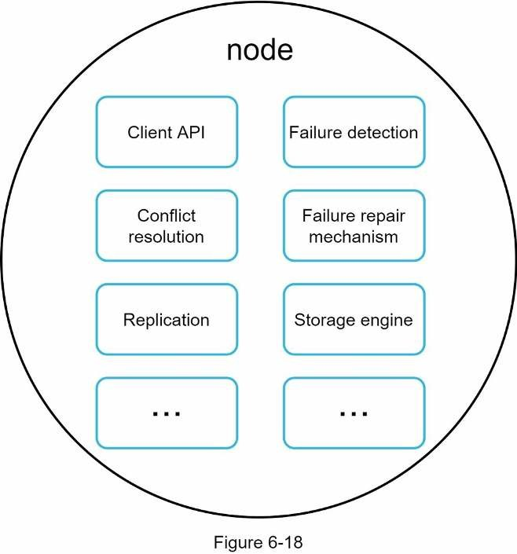

### Write path

Hình 6-19 giải thích những gì xảy ra sau khi một yêu cầu ghi được chuyển hướng đến một nút cụ thể. Xin lưu ý rằng các thiết kế được đề xuất cho các đường dẫn ghi / đọc là chính dựa trên kiến trúc của Cassandra [8].

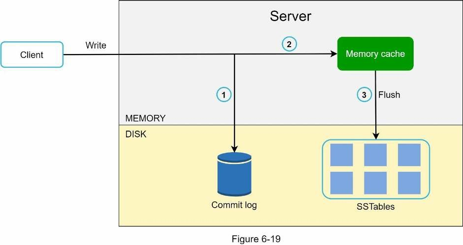

1. Yêu cầu ghi vẫn tồn tại trên tệp nhật ký cam kết.
2. Dữ liệu được lưu trong bộ nhớ đệm.
3. Khi bộ nhớ đệm đầy hoặc đạt đến ngưỡng xác định trước, dữ liệu sẽ được chuyển vào SSTable [9] trên đĩa. Lưu ý: Bảng chuỗi đã sắp xếp (SSTable) là danh sách các cặp `<key, value>` đã được sắp xếp. Để bạn đọc muốn tìm hiểu thêm về SStable, có thể tham khảo tài liệu tham khảo [9].

### Read path

Sau khi một yêu cầu đọc được chuyển hướng đến một nút cụ thể, trước tiên nó sẽ kiểm tra xem dữ liệu có trong bộ nhớ đệm của bộ nhớ hay không. Nếu vậy, dữ liệu được trả lại cho máy khách như trong Hình 6-20.

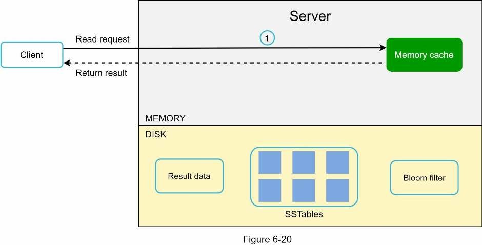

Nếu dữ liệu không có trong bộ nhớ, nó sẽ được truy xuất từ đĩa thay thế. Chúng tôi cần một cách hiệu quả để tìm ra SSTable nào chứa khóa. Bộ lọc Bloom [10] thường được sử dụng để giải quyết vấn đề này.
Đường dẫn đọc được thể hiện trong Hình 6-21 khi dữ liệu không có trong bộ nhớ.

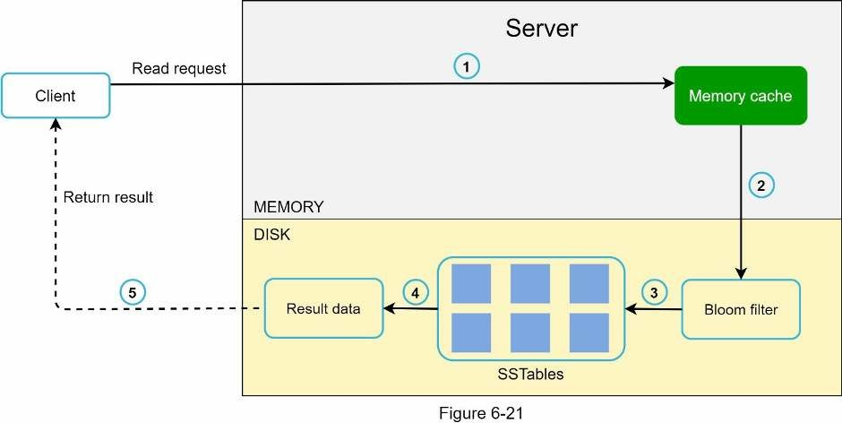

1. Trước tiên, hệ thống sẽ kiểm tra xem dữ liệu có trong bộ nhớ hay không. Nếu không, hãy chuyển sang bước 2.
2. Nếu dữ liệu không có trong bộ nhớ, hệ thống sẽ kiểm tra bộ lọc bloom.
3. Bộ lọc bloom được sử dụng để tìm ra các SSTables nào có thể chứa khóa.
4. SSTables trả về kết quả của tập dữ liệu.
5. Kết quả của tập dữ liệu được trả lại cho máy khách.

## 4. Tổng kết

Chương này bao gồm nhiều khái niệm và kỹ thuật. Để làm mới bộ nhớ của bạn, bảng sau đây tóm tắt các tính năng và kỹ thuật tương ứng được sử dụng cho một kho lưu trữ khóa-giá trị phân tán.

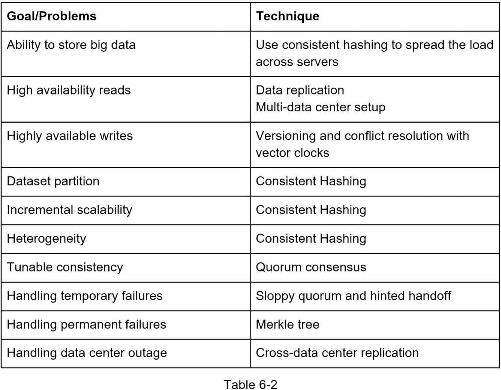

