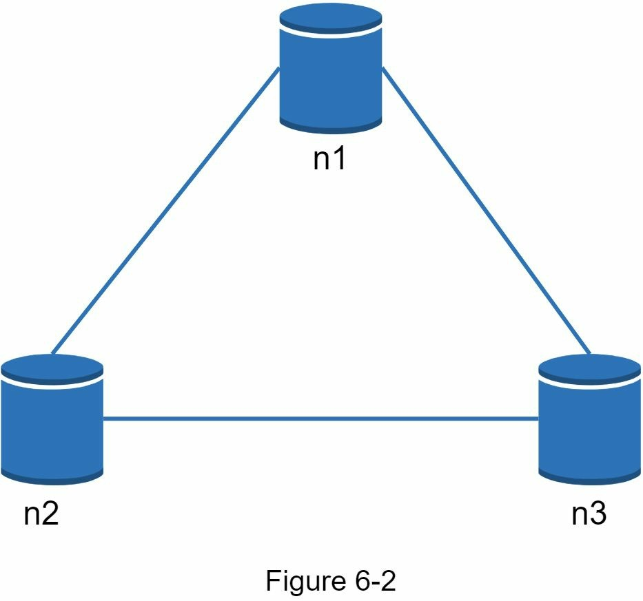

# Chapter 6: Thiết Kế Bộ Lưu Trữ Key-Value

Bộ lưu trữ key-value, đề cập đến cơ sở dữ liệu key-value, là một loại cơ sở dữ liệu phi quan hệ. Mà mỗi định danh duy nhất được lưu trữ như một cặp khoá liên kết với một giá trị. Cặp dữ liệu này được biết đến là cặp "key-value".

Trong cặp "key-value", key (khoá) là duy nhất, và value (giá trị) liên kết với khoá có thể được truy cập thông qua khoá. Khoá có thể là dạng văn bản thuần hoặc được băm. Vì các vấn đề hiệu suất, nên khoá càng ngắn càng tốt. Ví dụ:
- Khoá dạng thuần: "last_logged_in_at"
- Khoá băm: 253DDEC4

Giá trị của khoá có thể là chuỗi, danh sách, đối tượng,... Còn value thường được xử lý như một đối tượng trong bộ lưu trữ key-value, như Amazon dynamo [1], Memcached [2], Redis [3],..
Đây là bảng dữ liệu mình hoạ trong bộ lưu trữ key-value:

Ở chương này, ta sẽ tìm hiểu cách thiết kế bộ lưu trữ key-value, hỗ trợ các thao tác sau:
- put(key, value)   // chèn giá trị được liên kết với khoá
- get(key)          // lấy giá trị thông qua khoá

## 1. Hiểu vấn đề và thiết lập phạm vi

Không có thiết kế nào là hoàn hảo. Mỗi thiết kế đều có được sự cân bằng cụ thể về việc đọc, ghi và sử dụng bộ nhớ. Một sự cân bằng khác phải có được là sự cân bằng là giữa tính nhất quán và tính khả dụng. Trong chương này, chúng ta thiết kế một bộ lưu trữ key-value bao gồm các đặc điểm sau:
- Kích thước của cặp key-value nhỏ: dưới 10 KB.
- Khả năng lưu trữ dữ liệu lớn.
- Tính sẵn sàng cao: Hệ thống đáp ứng nhanh chóng, ngay cả khi có sự cố.
- Khả năng mở rộng cao: Hệ thống có thể được mở rộng để hỗ trợ tập dữ liệu lớn.
- Tự động mở rộng quy mô: Việc thêm/xóa các server phải tự động dựa trên lưu lượng truy cập.
- Tính nhất quán có thể điều chỉnh được.
- Độ trễ thấp.

### Server lưu trữ key-value duy nhất

Phát triển bộ lưu trữ key-value nằm trong một server duy nhất khá dễ dàng. Cách tiếp cận thông thường là lưu trữ cặp key-value trong một bảng băm, nó giữ mọi thứ trong bộ nhớ. Mặc dù truy cập bộ nhớ nhanh, nhưng việc đặt tất cả mọi thứ vào bộ nhớ có thể bất khả thi vì không gian hạn chế. Hai cách tối ưu hoá có thể thực hiện để đặt vừa dữ liệu vào một server duy nhất là:
- Nén dữ liệu
- Chỉ lưu trữ dữ liệu thường xuyên dùng trong bộ nhớ phần còn lại lưu trên ổ đĩa.

### Bộ lưu trữ key-value phân tán

Một bộ lưu trữ key-value phân tán còn gọi là một bảng băm phân tán, nó phân tán các cặp key-value qua nhiều server. Khi thiết kế một hế thống phân tán, điều quan trọng là cần hiểu được định lý CAP.

#### Định lý CAP

Định lý CAP nói rằng không thể có hệ thống phân tán nào đồng thời cung cấp nhiều hơn hai trong ba tiêu chuẩn sau: tính nhất quán, tính khả dụng và dung sai phân vùng. Bây giờ ta sẽ đi thiết lập một vài định nghĩa.

- **Consistency:** tính nhất quán nghĩa là tất cả client xem cùng một dữ liệu tại cùng thời điểm bất kể họ kết nối với nút nào.
- **Availability:** tính khả dụng nghĩa là bất kỳ client nào yêu cầu dữ liệu cũng nhận về phản hồi kể cả khi một vài nút bị sập.
- **Partition Tolerance:** dung sai phân vùng biểu thị giao tiếp giữa các nút. Nó có nghĩa là hệ thống tiếp tục hoạt động bất chấp các phân vùng mạng.

Định lý CAP nói rằng phải hy sinh một trong ba thuộc tính phải để hỗ trợ 2 thuộc tính còn lại, Hình 6-1.

Ngày nay, các bộ lưu trữ key-value được phân loại dựa trên hai đặc trưng CAP mà chúng hỗ trợ:

- **Hệ thống CP:** bộ lưu trữ key-value CP hỗ trợ tính nhất quán và dung sai phân vùng trong khi hy sinh tính khả dụng.
- **Hệ thống AP:** bộ lưu trữ key-value AP hỗ trợ tính khả dụng và dung sai phân vùng trong khi hy sinh tính nhất quán.
- **Hệ thống CA:** bộ lưu trữ key-value CA hỗ trợ tính nhất quán và tính khả dụng trong khi hy sinh dung sai phân vùng.

Vì lỗi mạng là không thể tránh khỏi, một hệ thống phân tán phải chịu đựng được phân vùng mạng. Do đó, hệ thống CA không thể tồn tại trong các ứng dụng thế giới thực.
Những gì bạn đọc ở trên chủ yếu là phần định nghĩa. Để dễ hiểu hơn, chúng ta hãy xem qua một số ví dụ cụ thể. Trong hệ thống phân tán, dữ liệu thường được sao chép nhiều lần. Giả sử dữ liệu được sao chép trên ba nút bản sao, n1, n2 và n3 như trong Hình 6-2.

#### Tình huống lý tưởng

Trong thế giới lý tưởng, phân vùng mạng không bao giờ xảy ra. Dữ liệu được ghi vào n1 được tự động sao chép sang n2 và n3. Cả tính nhất quán và tính khả dụng đều đạt được.

#### Hệ thống phân tán thế giới thực

Trong hệ thống phân tán, không thể tránh khỏi phân vùng mạng, và khi phân vùng xảy ra, chúng ta phải lựa chọn giữa tính nhất quán và tính khả dụng. Trong hình 6-3, n3 đi xuống và không thể giao tiếp với n1 và n2. Nếu client ghi dữ liệu vào n1 hoặc n2, dữ liệu không thể được truyền tới n3. Nếu dữ liệu được ghi vào n3 nhưng chưa được truyền tới n1 và n2, n1 và n2 sẽ có dữ liệu cũ.

Nếu chúng ta chọn tính nhất quán so với tính khả dụng (hệ thống CP), chúng ta phải chặn tất cả các thao tác ghi vào n1 và n2 để tránh sự mâu thuẫn dữ liệu giữa ba server này, khiến hệ thống không khả dụng. Hệ thống ngân hàng thường có yêu cầu nhất quán rất cao. Ví dụ: điều quan trọng đối với hệ thống ngân hàng là hiển thị thông tin số dư cập nhật gần nhất. Nếu sự không nhất quán xảy ra do phân vùng mạng, hệ thống ngân hàng sẽ trả về lỗi trước khi sự không nhất quán được giải quyết.

Tuy nhiên, nếu chúng ta chọn tính khả dụng hơn tính nhất quán (hệ thống AP), hệ thống sẽ tiếp tục chấp nhận các lần đọc, mặc dù nó có thể trả về dữ liệu cũ. Để ghi, n1 và n2 sẽ tiếp tục chấp nhận ghi và dữ liệu sẽ được đồng bộ hóa với n3 khi phân vùng mạng được giải quyết.

Đảm bảo việc chọn đúng CAP phù hợp với trường hợp sử dụng của bạn là một bước quan trọng trong việc xây dựng một bộ lưu trữ key-value phân tán. Bạn có thể thảo luận vấn đề này với người phỏng vấn và thiết kế hệ thống cho phù hợp.

### Thành phần hệ thống

Ở chương này, ta sẽ thảo luận về các thành phần cốt lõi và kỹ thuật để xây dựng bộ lưu trữ key-value:
* Phân vùng dữ liệu
* Sao chép dữ liệu
* Tính nhất quán
* Giải pháp không nhất quán
* Xử lý thất bại
* Sơ đồ kiến trúc hệ thống
* Thao tác đọc
* Thao tác ghi

Nội dung bên dưới chủ yếu dựa trên các hệ thống bộ lưu trữ key-value phổ biến: Dynamo [4], Cassandra [5] và BigTable [6].

### Phân vùng dữ liệu

Đối với các ứng dụng lớn, không thể đặt vừa một tập dữ liệu hoàn chỉnh trong một server đơn. Cách đơn giản nhất để thực hiện điều này là chia dữ liệu thành các phân vùng nhỏ hơn và lưu trữ chúng trong nhiều server. Có hai thách thức khi phân vùng dữ liệu:
* Phân phối đồng đều dữ liệu trên nhiều server.
* Giảm thiểu sự di chuyển dữ liệu khi các nút được thêm vào hoặc loại bỏ.
Phép băm nhất quán được thảo luận trong chương 5 là một kỹ thuật tuyệt vời để giải quyết những vấn đề này. Bây giờ chúng ta sẽ xem lại cách hoạt động của băm nhất quán ở high-level.
- Đầu tiên, các server được đặt trên một vòng băm. Trong hình 6-4, tám server, được đại diện bởi s0, s1,…, s7, được đặt trên vòng băm.
- Tiếp theo, một khóa được băm vào cùng một vòng và nó được lưu trữ trên server đầu tiên mà nó gặp phải khi di chuyển theo chiều kim đồng hồ. Ví dụ, key0 được lưu trữ trong s1 bằng cách sử dụng logic này.

Sử dụng băm nhất quán để phân vùng dữ liệu có những ưu điểm sau:
- Tự động mở rộng quy mô: các server có thể được thêm và xóa tự động tùy thuộc vào tải.
- Tính không đồng nhất: số lượng nút ảo của một server tỷ lệ với khả năng của server.

Ví dụ, các server có dung lượng cao hơn được chỉ định với nhiều nút ảo hơn.

### Sao chép dữ liệu

Để đạt được tính khả dụng và độ tin cậy cao, dữ liệu phải được sao chép không đồng bộ qua N server, trong đó N là tham số có thể cấu hình. N server này được chọn theo logic sau: sau khi một khóa được ánh xạ tới một vị trí trên vòng băm, đi theo chiều kim đồng hồ từ vị trí đó và chọn N server đầu tiên trên vòng để lưu trữ các bản sao dữ liệu. Trong Hình 6-5 (N = 3), key0 được sao chép tại s1, s2 và s3.

Với nút ảo, N nút đầu tiên trên vòng sẽ ít hơn N server thực. Để tránh điều này, ta chọn server không trùng khi thực hiện di chuyển theo chiều kim đồng hồ.

Các nút trong cùng một trung tâm dữ liệu thường bị lỗi đồng thời do mất điện, sự cố mạng, thiên tai,... Để có độ tin cậy tốt hơn, các bản sao được đặt trong các trung tâm dữ liệu riêng biệt và các trung tâm dữ liệu được kết nối thông qua mạng tốc độ cao.

### Tính nhất quán

Vì dữ liệu được sao chép tại nhiều nút, nên nó phải được đồng bộ hóa giữa các bản sao. Số lượng đồng thuận có thể đảm bảo tính nhất quán cho cả hoạt động đọc và ghi. Trước tiên, hãy thiết lập một vài định nghĩa.

- N = số lượng bản sao
- W = Một đại diện ghi có kích thước W. Để một thao tác ghi được coi là thành công, thao tác ghi phải được thừa nhận từ các bản sao W.
- R = Một đại diện đọc có kích thước R. Để một thao tác đọc được coi là thành công, thao tác ghi phải được thừa nhận từ các bản sao R.

Ví dụ với N = 3

