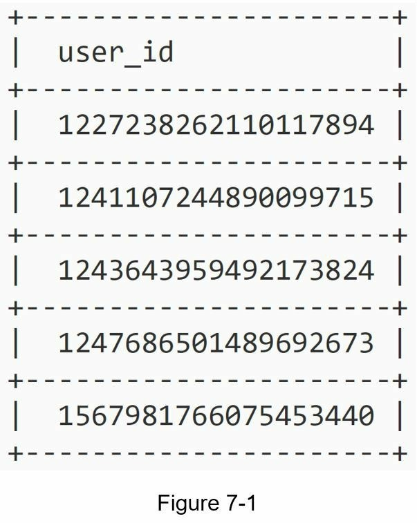
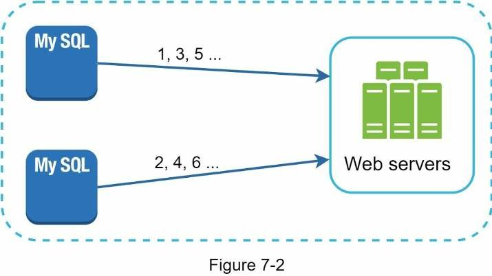
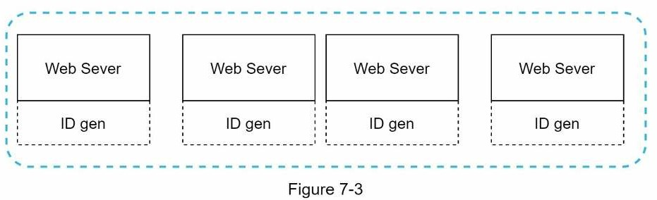
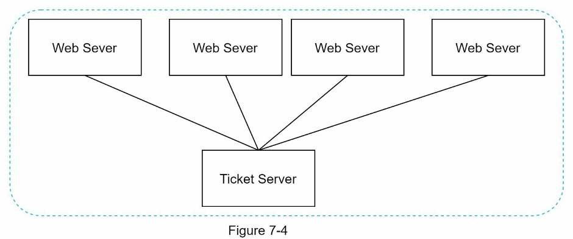
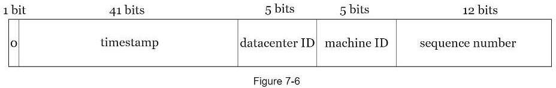
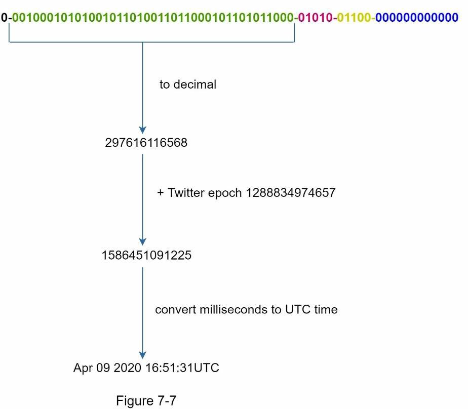

# Chapter 7: Thiết kế bộ tạo ID duy nhất trong các hệ thống phân tán

Trong bài viết này, sẽ trả lời câu hỏi thiết kế một bộ tạo ID duy nhất trong các hệ thống phân tán. Suy nghĩ đầu tiên mà ta nghĩa đến là dùng một khoá chính với thuộc tính *auto_increment* trong các cơ sở dữ liệu truyền thống. Tuy nhiên, *auto_increment* lại không hoạt động trong các hệ thống phân tán, vì một server cơ sơ dữ liệu là không đủ để tạo ID cho rất nhiều cơ sở dữ liệu khác với độ trễ thấp là một thử thách.

Ở đây ta có ví dụ về các ID duy nhất:

## 1. Hiểu vấn đề và thiết lập phạm vi

Đặt câu hỏi là bước đầu tiên để giải quyết bất kỳ câu hỏi phỏng vấn thiết kế hệ thống nào. Dưới đây là một ví dụ về tương tác giữa ứng viên và người phỏng vấn:

- **Ứng viên:** Đặc điểm của ID duy nhất là gì?
- **Người phỏng vấn:** ID phải là duy nhất và có thể sắp xếp.

- **Ứng viên:** Với mỗi bản ghi mới, ID có tăng thêm 1 không?
- **Người phỏng vấn:** ID tăng theo thời gian nhưng không nhất thiết chỉ tăng 1. ID được tạo vào buổi tối lớn hơn ID được tạo vào buổi sáng cùng ngày.

- **Ứng viên:** Có phải ID chỉ chứa các giá trị số không?
- **Người phỏng vấn:** Chính xác.

- **Ứng viên:** Yêu cầu về độ dài ID là gì?
- **Người phỏng vấn:** ID phải vừa với 64-bit.

- **Ứng viên:** Quy mô của hệ thống là gì?
- **Người phỏng vấn:** Hệ thống sẽ có thể tạo 10.000 ID mỗi giây.

Trên đây là một số câu hỏi mẫu mà bạn có thể hỏi người phỏng vấn của mình. Điều quan trọng là phải hiểu các yêu cầu và làm rõ những điều còn mơ hồ. Đối với câu hỏi phỏng vấn này, các yêu cầu được liệt kê như sau:

- ID phải là duy nhất.
- ID chỉ là giá trị số.
- ID phù hợp với 64-bit.
- ID được sắp xếp theo ngày.
- Khả năng tạo hơn 10.000 ID duy nhất mỗi giây.

## 2. Đề xuất thiết kế

Có nhiều lựa chọn có thể dùng cho tạo ID duy nhất trong hệ thống phân tán. Chúng bao gồm:
- Multi-master replication
- Universally unique identifier (UUID)
- Ticket server
- Twitter snowflake

### Multi-master replication

Cách tiếp cận này sử dụng tính năng *auto_increment* của cơ sở dữ liệu. Nhưng thay vì tăng lên 1, chúng ta tăng lên *k*, trong đó k là số lượng server cơ sở dữ liệu được sử dụng. Ảnh 7-2 minh hoạ điều này, các ID kế tiếp bằng với ID trước đó trên cùng server + 2. Điều này giải quyết một số vấn đề về khả năng mở rộng vì ID có thể mở rộng theo số lượng server cơ sở dữ liệu. Tuy nhiên, nó có các hạn chế sau:
- Khó mở rộng với nhiều trung tâm dữ liệu.
- ID không tăng theo thời gian trên nhiều server.
- Nó không mở rộng quy mô tốt khi một server được thêm vào hoặc xóa bỏ.

### UUID

UUID là một cách dễ dàng khác để có được các ID duy nhất. UUID là một số 128 bit được sử dụng để xác định thông tin trong hệ thống máy tính. UUID có xác suất xung đột rất thấp.

Trích dẫn từ Wikipedia:

> Sau khi tạo 1 tỷ UUID mỗi giây trong khoảng 100 năm, xác suất tạo ra một bản sao sẽ là 50% [1].

Đây là một ví dụ về UUID: 09c93e62-50b4-468d-bf8a-c07e1040bfb2. UUID có thể được tạo độc lập mà không cần sự phối hợp giữa các server. Hình 7-3 trình bày thiết kế UUID.

Trong thiết kế này, mỗi web server bao gồm một bộ tạo ID và web server có trách nhiệm tạo ID một cách độc lập.

Ưu điểm:
- Việc tạo UUID rất đơn giản. Không cần phối hợp giữa các server vì vậy sẽ không có bất kỳ vấn đề đồng bộ hóa nào.
- Hệ thống dễ mở rộng quy mô vì mỗi web server chịu trách nhiệm tạo ra các ID mà chúng sử dụng. Trình tạo ID có thể dễ dàng mở rộng quy mô với các web server.

Nhược điểm:

- ID dài 128 bit, nhưng yêu cầu của chúng ta là 64 bit.
- ID không tăng theo thời gian.
- ID có thể không phải là số.

### Ticket server

Ticket server là một giải pháp hấp dẫn khác cho tạo ID duy nhất. Flicker đã phát triển các ticket server để tạo các khoá chính phân tán [2]. Điều đáng quan tâm là hệ thống sẽ hoạt động như thế nào?

Ý tưởng là sử dụng tính năng *auto_increment* tập trung trong một server cơ sở dữ liệu duy nhất (Ticket Server). Để tìm hiểu thêm về điều này, hãy tham khảo bài viết blog về kỹ thuật của flicker [2].

Ưu điểm:
* ID dạng số.
* Nó dễ thực hiện và phù hợp với các ứng dụng quy mô vừa và nhỏ.

Nhược điểm:
* Ticket server đơn có nghĩa là nếu server chính gặp sự cố, tất cả các hệ thống phụ thuộc vào nó sẽ gặp sự cố. Để tránh SOF duy nhất, chúng ta có thể thiết lập nhiều ticket server. Tuy nhiên, điều này sẽ đưa ra những thách thức mới như đồng bộ hóa dữ liệu.

### Giải pháp twitter snowflake

Các cách tiếp cận được đề cập ở trên cung cấp cho chúng ta một số ý tưởng về cách hoạt động của các hệ thống tạo ID khác nhau. Tuy nhiên, không ai trong số họ đáp ứng các yêu cầu cụ thể của chúng ta; do đó, chúng ta cần một cách tiếp cận khác. Hệ thống tạo ID duy nhất của Twitter có tên là "snowflake" [3] đang truyền cảm hứng và có thể đáp ứng các yêu cầu của ta.

Chia để trị là ý tưởng của chúng ta. Thay vì tạo ID trực tiếp, chúng ta chia ID thành các phần khác nhau. Hình 7-5 cho thấy cách bố trí của một ID 64-bit.

Mỗi phần được giải thích như sau.
- **Sign bit:** 1 bit. Nó sẽ luôn là 0. Cái này được dành cho những lần sử dụng sau. Nó có thể được sử dụng để phân biệt giữa số có dấu và không có dấu.
- **Timestamp:** 41 bit. Mili giây từ một epoch hoặc epoch tùy chỉnh. Chúng ta sử dụng epoch mặc định của Twitter 1288834974657, tương đương với ngày 04 tháng 11 năm 2010, 01:42:54 UTC.
- **Datacenter ID:** 5 bit, cho chúng ta 2 ^ 5 = 32 trung tâm dữ liệu.
- **Machine ID:** 5 bit, cho chúng ta 2 ^ 5 = 32 máy trên mỗi trung tâm dữ liệu.
- **Sequence number:** 12 bit. Đối với mỗi ID được tạo trên máy/tiến trình đó, số thứ tự được tăng thêm 1. Số được đặt lại thành 0 sau mỗi mili giây.

## 3. Đi sâu vào thiết kế

Trong thiết kế high-level, chúng ta đã thảo luận về các tùy chọn khác nhau để thiết kế một trình tạo ID duy nhất trong các hệ thống phân tán. Chúng ta giải quyết theo cách tiếp cận dựa trên trình tạo ID snowflake của Twitter. Hãy đi sâu vào thiết kế. Để làm mới bộ nhớ của chúng ta, sơ đồ thiết kế được dựa vào bên dưới:

Datacenter ID và Machine ID được chọn tại thời điểm khởi động, thường được cố định là sau khi hệ thống đang chạy. Bất kỳ thay đổi nào trong Datacenter ID và Machine ID yêu cầu đánh giá cần thận vì một sự cố thay đổi giá trị có thể dẫn đến xung đột ID. Timestamp và sequence number được tạo khi bộ tạo ID đang chạy.

### Timestamp

41 bit quan trọng tạo nhất nên phần timestamp. Khi timestamp phát triển theo thời gian, các ID có thể sắp xếp theo thời gian. Hình 7-7 cho thấy một ví dụ về cách biểu diễn nhị phân được chuyển đổi thành UTC. Bạn cũng có thể chuyển đổi UTC trở lại biểu diễn nhị phân bằng phương pháp tương tự.

Giá trị tối đa timestamp có thể biểu diễn trong 41 bít là:

> 2 ^ 41 - 1 = 2199023255551 (ms)

nó cho ta: ~ 69 năm = 2199023255551 (ms) / 1000 (s) / 365 (ngày) / 24 (giờ)/ 3600 (s).

Điều này có nghĩa là trình tạo ID sẽ hoạt động trong 69 năm và có thời gian epoch tùy chỉnh gần với ngày hôm nay trì hoãn thời gian bổ sung. Sau 69 năm, chúng ta sẽ cần một epoch mới hoặc áp dụng các kỹ thuật khác để migrate ID.

### Sequence number

Sequence number là 12 bits, ta có 2 ^ 12 = 4096 kết hợp. Số thứ tự là 12 bit, cho chúng ta 2 ^ 12 = 4096 kết hợp. Trường này là 0 trừ khi có nhiều hơn một ID được tạo trong một phần nghìn giây trên cùng một server. Về lý thuyết, một máy có thể hỗ trợ tối đa 4096 ID mới mỗi mili giây.

## 4. Tổng kết

Trong chương này, chúng ta đã thảo luận về các cách tiếp cận khác nhau để thiết kế trình tạo ID duy nhất: multi-master replication, UUID, ticket server và trình tạo ID duy nhất giống Twitter snowflake. Chúng ta dùng snowflake vì nó hỗ trợ tất cả các trường hợp sử dụng của ta và có thể mở rộng trong môi trường phân tán.

Nếu có thêm thời gian vào cuối cuộc phỏng vấn, đây là một số điểm cần nói thêm:
- Đồng bộ hóa thời gian. Trong thiết kế của chúng ta, giả định rằng các server tạo ID có cùng thời gian. Giả định này có thể không đúng khi một server đang chạy trên nhiều lõi. Thử thách tương tự cũng tồn tại trong các kịch bản nhiều máy. Các giải pháp để đồng bộ hóa thời gian là ngoài phạm vi của cuốn sách này; tuy nhiên, điều quan trọng là phải hiểu vấn đề vẫn tồn tại. Network Time Protocol là giải pháp phổ biến nhất cho vấn đề này. Bạn đọc quan tâm có thể tham khảo tài liệu tham khảo [4].
- Điều chỉnh độ dài phần. Ví dụ, ít bit sequence number hơn nhưng nhiều bit timestamp hơn có hiệu quả cho các ứng dụng đồng thời thấp và dài hạn.
- Tính sẵn sàng cao. Vì trình tạo ID là một hệ thống quan trọng, nó phải có tính sẵn sàng cao.

Chúc mừng bạn đã đạt được điều này đến nay! Bây giờ hãy tự vỗ về lưng mình. Làm tốt lắm!