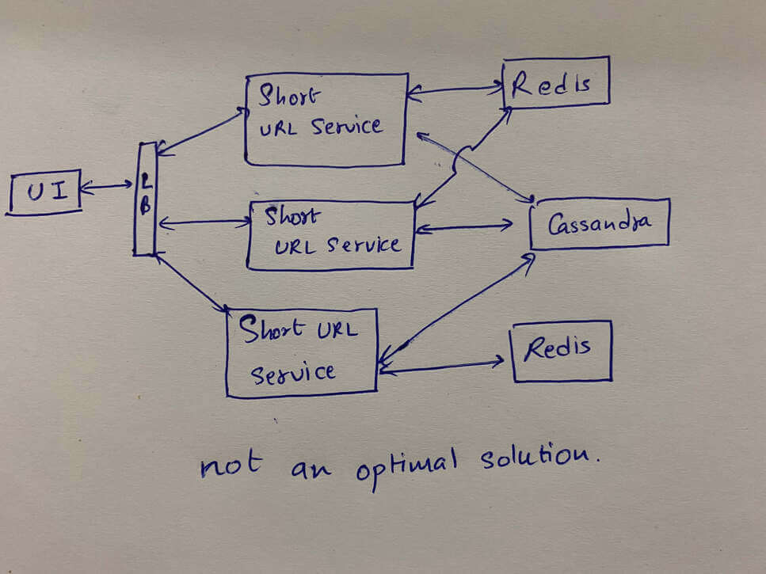
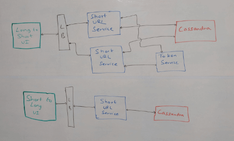

# Thiết Kế Hệ Thống TinyURL

TinyURL được sử dụng cho tạo một tên định danh URL ngắn thay cho URL quá dài. Ví dụ `goo.gl` được dùng thay cho `https://developers.googleblog.com/2018/03/transitioning-google-url-shortener.html`. Vậy các hệ thống URL shorting này hoạt động như thế nào?. Hôm nay ta sẽ thiết kế một hệ thống tương tự như vậy.

Trước khi bắt đầu, ta cần liệt kê các yêu cầu cơ bản cần có.

## Yêu cầu chính
- Tạo URl ngắn gọn từ một URL rất dài
- Điều hướng tới URL dài khi người dùng truy cập vào URL ngắn.

## Yêu cầu phụ
- Độ trễ thấp
- Tính khả dụng cao

Đây là những điều mà ta cần biết trước khi thiết kế hệ thống này.

## Độ dài của URL nên là bao nhiêu?

Điều này phụ thuộc vào quy mô mà hệ thống của chúng ta sẽ hoạt động. Với khoảng vài trăm URL, 2-3 ký tự là đủ nhưng với những hệ thống lớn như Google hay Facebook, ta sẽ cần các URL dài hơn. Ta cũng có thể chỉnh sửa độ dài URL mà hệ thống đã tạo hoặc ta có thể bắt đầu với một độ dài ban đầu sau đó tăng nó lên theo yêu cầu. Bây giờ ta sẽ thử cách tiếp cận với độ dài cố định.

### Nhân tố nào ảnh hưởng đến độ dài của URL?
- Lưu lượng truy cập dự kiến - chúng ta phải rút ngắn bao nhiêu URL mỗi giây
- Chúng ta cần hỗ trợ các URL này trong bao lâu

Let us look at it mathematically. Say we get X requests in a second, and we need to support these URLs for, let’s say, ten years, then we need to be able to store Y unique URLs at a time where,

Bây giờ hãy nhìn dưới góc độ toán học. Ta có X yêu cầu trên một giây, và cần hỗ trợ các URL này trong 10 năm. Như vậy là ta cần lưu trữ Y URL khác nhau, tại một thời điểm nào đó.

`Y = X * 60 * 60 * 24 * 365 * 10`

### Các ký tự mà ta có thể đưa vào URL?

Thông thường, phần lớn hệ thống sẽ cung cấp URL với tập ký tự A-Z, a-z, 0-9, thế nên ta sẽ xây dựng dựa trên các tập ký tự này. Tuy nhiên, trong một cuộc phỏng vấn, bạn nên xác nhận trước khi tiếp tục giải pháp của mình.

Như vậy ta có 62 phần tử trong tập ký tự, có nghĩa là ta cần nghĩ ra một độ dài có thể hỗ trợ Y URL với 62 ký tự.

- Nếu độ dài là 1, ta có 62 URL.
- Nếu độ dài là 2, ta có 622 URL.

Tổng kết lại, nếu độ dài là `l` ta sẽ có `62l` URL.

Bây giờ chúng ta hãy xem xét một kiến trúc cơ bản có thể giải quyết vấn đề này.

## Kiến trúc hệ thống

Ta sẽ có một giao diện người dùng nhận vào một URL dài bằng `input`, gọi đến dịch vụ **Short URL** nơi sẽ tạo ra URL ngắn gọn và lưu trữ nó vào cơ sở dữ liệu sau đó trả về URL ngắn đó. Tương tự khi ta truy cập vào URL ngắn, dịch vụ **Short URL** sẽ tìm nạp URL dài từ cơ sở dữ liệu sau đó điều hướng người dùng sang URL dài đó.

### Nhưng mà làm thế nào để tạo ra URL ngắn?

Mặc dù ta có 62 ký tự, nhưng để dễ hiểu hãy giả sử rằng ta sẽ tạo số thay vì URL. Có nghĩa là khi nói đến URL duy nhất là ta đang nói đến số duy nhất (chỉ trong phạm vi bài viết này). Giả sử rằng ta có thể chạy nhiều dịch vụ **Short URL** như SUS1, SUS2, SUS3,... Bây giờ có khả năng nhiều hơn một trong số chúng sẽ tạo ra cùng một số, có nghĩa là một URL ngắn sẽ bây giờ trỏ đến hai URL dài, điều này không thể xảy ra. Đây được gọi là một *collision* trong khoa học máy tính.

Một cách để tránh điều này là kiểm tra cơ sở dữ liệu trước khi rút gọn URL, để đảm bảo sẽ không bị trùng với URL đã tồn tại và thử lại nếu có. Nhưng đây là một giải pháp tệ, giải pháp tốt hơn là sử dụng Redis. Redis sẽ bắt đầu đếm từ 1 và tăng lên với từng yêu cầu trước khi phản hồi lại. Với số duy nhất này ta có thể tạo ra URL duy nhất bằng cách chuyển đổi sang cơ số 62. Đây là một cách đơn giản để tránh xung đột, nhưng nó là đặt ra những vấn đề mới với hệ thống.

Trước hết, tất cả máy sẽ phải tương tác với Redis, nó làm tăng tải trên Redis. Trong trường hơp Redis bị sập thì nó sẽ rất tệ, vì ta không có cách nào để phục hồi. Một vấn đề khác là nếu tải vượt quả khả năng xử lý của Redis, cả hệ thống sẽ bị chậm theo nó.

Điều gì sẽ xảy ra nếu ta sử dụng nhiều hơn một Redis? Điều này sẽ mang lại cho ta hiệu suất tốt hơn và tính khả dụng cao hơn! Cho đến khi cả hai hệ thống bắt đầu tạo URL trùng nhau. Chúng ta có thể tránh điều này bằng cách gán một chuỗi cho mỗi Redis, nhưng điều gì sẽ xảy ra khi chúng ta muốn thêm một Redis khác? Trong trường hợp này, chúng ta cần một thành phần quản lý để theo dõi Redis có serie nào. Vì ta đang thêm thành phần quản lý, nên ta cũng có thể xem xét các lựa chọn thay thế cho Redis.

**Vì vậy, hãy xem xét một số giải pháp không yêu cầu Redis.**

Yêu cầu của chúng ta là đảm bảo dịch vụ **Short URL** là tạo ra các số duy nhất sao cho ngay cả các phiên bản khác nhau của dịch vụ cũng không thể trả về cùng một số. Bằng cách đó, mỗi dịch vụ tạo ra một số duy nhất sẽ chuyển đổi nó thành cơ số 62 và trả về. Cách đơn giản nhất là triển khai một phạm vi nhất định với mỗi dịch vụ, nó đảm bảo các dịch vụ này sẽ có phạm vi khác nhau, ta sử dụng một thứ gọi là **Token Service** để quản lý các thành phần trong hệ thống của ta. **Token Service** sẽ chạy trên mô hình đơn luồng và chỉ phục vụ cho một máy tại một thời điểm để mỗi máy có một phạm vi khác nhau. Các dịch vụ sẽ chỉ tương tác với **Token Service** này khi khởi động và khi chúng sắp chạy hết phạm vị, **Token Service** có thể đơn giản như một MySQL Service vì nó sẽ xử lý rất ít tải. Tất nhiên, chúng ta sẽ đảm bảo rằng dịch vụ MySQL này được phân phối trên các khu vực địa lý để giảm độ trễ và cũng để đảm bảo rằng nó không có một điểm lỗi nào.

Lấy ví dụ, ta có 3 dịch vụ **Short URL** là SUS1, SUS2 và SUS3. Khi khởi động SUS1 có phạm vi là 1-1000, SUS2 là 1001-2000 và SUS3 là 2001-3000. Khi SUS1 chạy hết phạm vi của nó, Token Service sẽ đảm bảo rằng nó nhận được một phạm vi chưa được gán cho máy khác. Một cách để đảm bảo điều này là duy trì các phạm vi này dưới dạng bản ghi và giữ một flag "assigned" chống lại chúng. Khi một phạm vi được chỉ định cho một dịch vụ, cờ "assigned" có thể được đặt thành true. Có thể có nhiều cách khác để làm điều đó, đây chỉ là một cách tiếp cận có thể được làm theo.

### Làm thế nào để mở rộng quy mô nó?

Bây giờ chúng ta đã đề cập đến việc sử dụng dịch vụ MySQL xử lý tải rất thấp. Nhưng điều gì sẽ xảy ra nếu hệ thống của chúng tôi bị tấn công bởi các yêu cầu? Chà, chúng ta có thể tạo nhiều bản sao của các bản MySQL và phân phối chúng trên bản đồ, như đã đề cập trước đây, hoặc chúng ta có thể chỉ cần tăng độ dài phạm vi của mình. Điều đó có nghĩa là máy móc sẽ tiếp cận dịch vụ mã thông báo với tần suất thấp hơn nhiều.

### Thiếu phạm vi
Vì vậy, chúng tôi hiện có một giải pháp cung cấp cho chúng tôi những con số duy nhất, được phân phối trên khắp thế giới để giảm độ trễ và không có một điểm lỗi nào. Nhưng điều gì sẽ xảy ra nếu một trong những dịch vụ chưa sử dụng hết phạm vi hoàn chỉnh bị tắt? Làm thế nào chúng ta sẽ theo dõi phần nào trong phạm vi của nó không được sử dụng? Chúng tôi sẽ không! Việc theo dõi các phạm vi bị thiếu này sẽ làm tăng thêm mức độ phức tạp cho giải pháp của chúng tôi. Bây giờ, hãy nhớ rằng chúng ta có hơn 3,5 nghìn tỷ số duy nhất có thể có, đây là một con số khổng lồ so với vài nghìn số duy nhất mà chúng ta đang đánh mất. Một vài nghìn con số không đủ quan trọng để làm phức tạp hệ thống của chúng tôi và có thể ảnh hưởng đến hiệu suất. Vì vậy, chúng tôi sẽ để chúng đi và khi dịch vụ bắt đầu sao lưu, chúng tôi sẽ gán cho nó một phạm vi mới.

### Làm thế nào chúng ta sẽ chuyển hướng một URL ngắn đến một URL dài hơn?
Khi có yêu cầu chuyển hướng URL ngắn đến URL dài hơn, chúng tôi sẽ tìm nạp URL dài từ cơ sở dữ liệu, dịch vụ thực hiện chuyển hướng và người dùng đến đúng trang. Bây giờ nếu bạn nhìn lại sơ đồ, chúng tôi đã sử dụng Cassandra làm cơ sở dữ liệu của mình. Chúng tôi có thể đã sử dụng bất kỳ cơ sở dữ liệu nào có khả năng hỗ trợ 3,5 nghìn tỷ điểm dữ liệu, nó cũng có thể được thực hiện với cơ sở dữ liệu MySQL với một chút sharding. Nó chỉ có thể dễ dàng hơn với Cassandra vì vậy đó là những gì chúng tôi đã sử dụng, nhưng bạn có thể sử dụng bất kỳ giải pháp thay thế nào khác mà bạn thấy thuận tiện hơn. Chúng tôi đã thảo luận thêm về các giải pháp cơ sở dữ liệu cho các tình huống khác nhau trong bài viết này, bạn có thể kiểm tra nó để được giải thích chi tiết.

### Yếu tố phân tích ở đây nằm ở đâu?
Bây giờ chúng ta hãy cố gắng cải thiện hệ thống này một chút. Bởi vì chúng tôi có thể trích xuất nhiều dữ liệu có thể được sử dụng để đưa ra các quyết định kinh doanh sau này, chúng ta hãy thử thêm một thành phần phân tích vào hệ thống của mình. Mỗi khi chúng tôi nhận được yêu cầu tạo một URL ngắn, chúng tôi sẽ nhận được một số thuộc tính cùng với nó, như nền tảng mà nó đang sử dụng - có thể là Facebook hoặc Twitter, tác nhân người dùng đó đến từ - iOS, Android, trình duyệt web , v.v., chúng tôi cũng sẽ nhận được địa chỉ IP của người gửi. Những thuộc tính này có thể cung cấp cho chúng tôi rất nhiều thông tin như công ty nào đang sử dụng hệ thống của chúng tôi - đây là những khách hàng của chúng tôi, nơi mà hầu hết các yêu cầu đến từ thế giới - chúng tôi có thể giữ một phiên bản của dịch vụ mã thông báo ở đó để giảm độ trễ, v.v. Vì vậy khi chúng tôi nhận được yêu cầu, thay vì ngay lập tức trả lời lại bằng URL dài hơn, trước tiên chúng tôi sẽ lưu thông tin này vào một Kafka có thể được sử dụng để cung cấp năng lượng cho phân tích. Nhưng điều này thêm một bước bổ sung trong quy trình của chúng tôi và điều đó làm tăng độ trễ. Vì vậy, thay vì thực hiện điều này theo cách tuần tự, chúng ta có thể thực hiện việc này ghi vào Kafka một hoạt động song song không đồng bộ chạy trên một luồng riêng biệt.

Thách thức duy nhất ở đây là nếu vì lý do nào đó mà thao tác ghi không thành công, chúng tôi sẽ không có dữ liệu đó nữa và dữ liệu đó sẽ bị mất. Nhưng vì nó không phải là thông tin quan trọng, chỉ là thông tin cơ bản nhất về người dùng, mất một số dữ liệu này sẽ không phải là một tổn thất lớn.

### Tối ưu hóa Tối ưu hóa Tối ưu hóa
Được rồi, chúng tôi cũng đã tích hợp sẵn số liệu phân tích vào hệ thống của mình. Chúng tôi vẫn có thể tối ưu hóa nó hơn nữa chứ? Chà, còn nhớ Kafka-viết sau mỗi lần yêu cầu chứ? Chúng tôi không nhất thiết phải làm chúng thường xuyên. Thay vì gửi các sự kiện này đến Kafka với mọi yêu cầu, chúng tôi có thể duy trì thông tin này trong cấu trúc dữ liệu cục bộ như với kích thước ngưỡng, hàng đợi chẳng hạn và khi cấu trúc dữ liệu sắp tràn, chúng tôi có thể ghi hàng loạt cho Kafka và làm trống hàng đợi. Hoặc chúng tôi cũng có thể đặt nó thành một hoạt động được lên lịch, chẳng hạn như thực hiện ghi hàng loạt sau mỗi 30 giây và làm trống hàng đợi. Vì việc sử dụng CPU và băng thông bị giảm, chúng tôi có thể thúc đẩy hiệu suất nhiều hơn từ máy giúp độ trễ thấp và tính sẵn sàng cao. Một lần nữa, đây sẽ là một hoạt động không đồng bộ và hạn chế của việc duy trì dữ liệu cục bộ là nếu máy đột ngột tắt và hoạt động ghi không thành công, chúng tôi sẽ mất nhiều thông tin hơn chúng tôi mất khi ghi một lần, nhưng bạn có thể thảo luận về những đánh đổi này với người phỏng vấn để đưa ra giải pháp phù hợp nhất với yêu cầu của bạn.